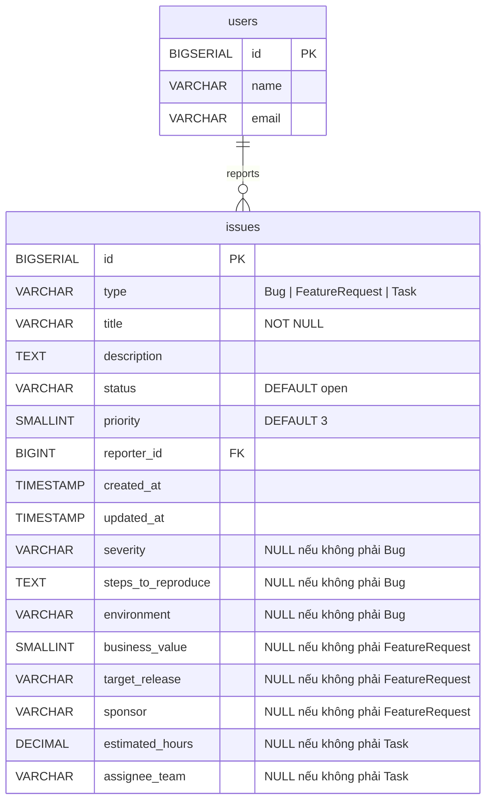
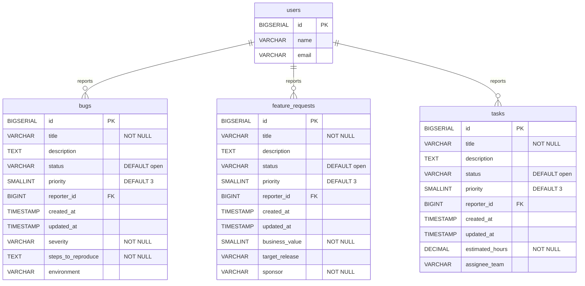
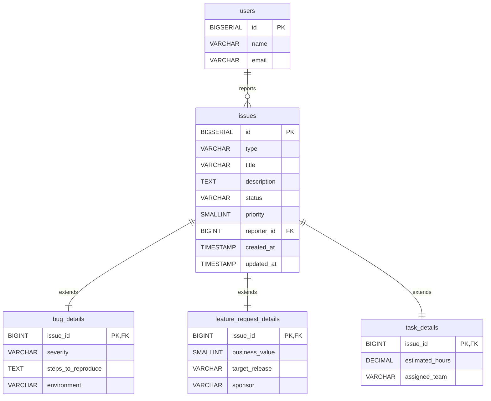

# Database Inheritance Patterns
> *Bạn có một hệ thống issue tracker. Có `Bug`, có `FeatureRequest`, có `Task`. Chúng chia sẻ vài trường chung như `title`, `status`, `created_at` — nhưng mỗi loại lại có dữ liệu riêng. Câu hỏi đặt ra: thiết kế database thế nào?*


## Bối cảnh bài toán

Giả sử chúng ta đang xây dựng một hệ thống quản lý issue cho một dự án phần mềm. Có 3 loại issue:

- **Bug** — có thêm `severity`, `steps_to_reproduce`, `environment`
- **FeatureRequest** — có thêm `business_value`, `target_release`, `sponsor`
- **Task** — có thêm `estimated_hours`, `assignee_team`

Cả 3 đều chia sẻ các trường chung: `id`, `title`, `description`, `status`, `priority`, `reporter_id`, `created_at`, `updated_at`.

Vậy làm sao để ánh xạ mô hình kế thừa này xuống cơ sở dữ liệu quan hệ — nơi vốn không có khái niệm "kế thừa"?


## 1. Single Table Inheritance (STI)

### Ý tưởng

Gom tất cả vào **một bảng duy nhất**. Thêm một cột `type` để phân biệt loại. Các cột không áp dụng cho một loại cụ thể sẽ mang giá trị `NULL`.

### Sơ đồ ER



### Schema

```sql
CREATE TABLE issues (
    id            BIGSERIAL PRIMARY KEY,
    type          VARCHAR(20) NOT NULL,  -- 'Bug', 'FeatureRequest', 'Task'
    
    -- Trường chung
    title         VARCHAR(255) NOT NULL,
    description   TEXT,
    status        VARCHAR(20) NOT NULL DEFAULT 'open',
    priority      SMALLINT NOT NULL DEFAULT 3,
    reporter_id   BIGINT REFERENCES users(id),
    created_at    TIMESTAMP DEFAULT now(),
    updated_at    TIMESTAMP DEFAULT now(),
    
    -- Trường riêng của Bug
    severity           VARCHAR(20),     -- NULL nếu không phải Bug
    steps_to_reproduce TEXT,            -- NULL nếu không phải Bug
    environment        VARCHAR(100),    -- NULL nếu không phải Bug
    
    -- Trường riêng của FeatureRequest
    business_value     SMALLINT,        -- NULL nếu không phải FeatureRequest
    target_release     VARCHAR(50),     -- NULL nếu không phải FeatureRequest
    sponsor            VARCHAR(100),    -- NULL nếu không phải FeatureRequest
    
    -- Trường riêng của Task
    estimated_hours    DECIMAL(6,2),    -- NULL nếu không phải Task
    assignee_team      VARCHAR(100)     -- NULL nếu không phải Task
);

CREATE INDEX idx_issues_type ON issues(type);
CREATE INDEX idx_issues_status ON issues(status);
```

### Truy vấn minh họa

```sql
-- Lấy tất cả issue, không phân biệt loại
SELECT * FROM issues WHERE status = 'open' ORDER BY created_at DESC;

-- Lấy riêng Bug có severity cao
SELECT * FROM issues WHERE type = 'Bug' AND severity = 'critical';

-- Đếm số lượng theo loại
SELECT type, COUNT(*) FROM issues GROUP BY type;
```

### Ưu điểm

- **Đơn giản tuyệt đối** — chỉ một bảng, không cần JOIN, không cần quản lý quan hệ phức tạp.
- **Query đa hình dễ dàng** — muốn lấy "tất cả issue đang mở" chỉ cần `WHERE status = 'open'`, không cần UNION hay JOIN.
- **Hiệu năng đọc tốt** — mọi dữ liệu nằm trên cùng một bảng, database optimizer làm việc hiệu quả.
- **Thêm loại mới nhanh** — chỉ cần `ALTER TABLE ADD COLUMN`, không cần tạo bảng mới hay sửa logic JOIN.
- **ORM hỗ trợ tốt** — Rails ActiveRecord, Django (django-polymorphic), Laravel đều hỗ trợ STI ngay từ đầu.

### Nhược điểm

- **NULL tràn lan** — với 3 loại, mỗi record có ~30-50% cột là NULL. Với 10 loại, con số này lên 80-90%. Bảng trở nên khó đọc khi nhìn trực tiếp vào data.
- **Không thể dùng NOT NULL constraint cho trường riêng** — `severity` bắt buộc với Bug nhưng phải cho phép NULL vì FeatureRequest không có trường này. Bạn phải chuyển validation lên tầng application.
- **Bảng phình to** — khi số loại tăng, bảng có thể có hàng chục cột mà phần lớn là rỗng.
- **Index kém hiệu quả** — index trên `severity` sẽ bao gồm cả các record không phải Bug (nơi giá trị là NULL), gây lãng phí.
- **Khó maintain** — khi nhìn vào schema, không rõ trường nào thuộc loại nào nếu không có documentation tốt.

### Khi nào nên dùng?

STI phù hợp khi số loại ít (2-5 loại), các loại chia sẻ phần lớn trường chung, và sự khác biệt giữa các loại chỉ là vài cột. Nếu bạn đang dùng framework hỗ trợ STI tốt như Rails, đây thường là lựa chọn mặc định để bắt đầu.

---

## 2. Concrete Table Inheritance (CTI)

### Ý tưởng

Mỗi loại có **bảng riêng hoàn toàn**. Không có bảng chung. Mỗi bảng chứa cả trường chung lẫn trường riêng, dẫn đến sự lặp lại cấu trúc giữa các bảng.

### Sơ đồ ER



### Schema

```sql
CREATE TABLE bugs (
    id                 BIGSERIAL PRIMARY KEY,
    -- Trường chung (lặp lại ở mỗi bảng)
    title              VARCHAR(255) NOT NULL,
    description        TEXT,
    status             VARCHAR(20) NOT NULL DEFAULT 'open',
    priority           SMALLINT NOT NULL DEFAULT 3,
    reporter_id        BIGINT REFERENCES users(id),
    created_at         TIMESTAMP DEFAULT now(),
    updated_at         TIMESTAMP DEFAULT now(),
    -- Trường riêng của Bug
    severity           VARCHAR(20) NOT NULL,
    steps_to_reproduce TEXT NOT NULL,
    environment        VARCHAR(100)
);

CREATE TABLE feature_requests (
    id                 BIGSERIAL PRIMARY KEY,
    -- Trường chung (lặp lại)
    title              VARCHAR(255) NOT NULL,
    description        TEXT,
    status             VARCHAR(20) NOT NULL DEFAULT 'open',
    priority           SMALLINT NOT NULL DEFAULT 3,
    reporter_id        BIGINT REFERENCES users(id),
    created_at         TIMESTAMP DEFAULT now(),
    updated_at         TIMESTAMP DEFAULT now(),
    -- Trường riêng của FeatureRequest
    business_value     SMALLINT NOT NULL,
    target_release     VARCHAR(50),
    sponsor            VARCHAR(100) NOT NULL
);

CREATE TABLE tasks (
    id                 BIGSERIAL PRIMARY KEY,
    -- Trường chung (lặp lại)
    title              VARCHAR(255) NOT NULL,
    description        TEXT,
    status             VARCHAR(20) NOT NULL DEFAULT 'open',
    priority           SMALLINT NOT NULL DEFAULT 3,
    reporter_id        BIGINT REFERENCES users(id),
    created_at         TIMESTAMP DEFAULT now(),
    updated_at         TIMESTAMP DEFAULT now(),
    -- Trường riêng của Task
    estimated_hours    DECIMAL(6,2) NOT NULL,
    assignee_team      VARCHAR(100)
);
```

### Truy vấn minh họa

```sql
-- Lấy tất cả Bug có severity critical
SELECT * FROM bugs WHERE severity = 'critical';

-- Lấy TẤT CẢ issue đang mở — phải dùng UNION
SELECT id, 'Bug' AS type, title, status, priority, created_at
FROM bugs WHERE status = 'open'
UNION ALL
SELECT id, 'FeatureRequest', title, status, priority, created_at
FROM feature_requests WHERE status = 'open'
UNION ALL
SELECT id, 'Task', title, status, priority, created_at
FROM tasks WHERE status = 'open'
ORDER BY created_at DESC;

-- Đếm tổng số issue — cũng phải UNION
SELECT 'Bug' AS type, COUNT(*) AS cnt FROM bugs
UNION ALL
SELECT 'FeatureRequest', COUNT(*) FROM feature_requests
UNION ALL
SELECT 'Task', COUNT(*) FROM tasks;
```

### Ưu điểm

- **Không có NULL thừa** — mỗi bảng chỉ chứa đúng những cột cần thiết. Schema sạch sẽ, dễ đọc.
- **Constraint chặt chẽ** — `severity NOT NULL` áp dụng đúng cho Bug mà không ảnh hưởng các loại khác. Database tự enforce tính toàn vẹn dữ liệu.
- **Hiệu năng truy vấn theo loại rất tốt** — mỗi bảng nhỏ gọn, index hoạt động hiệu quả tối đa vì không có record "ngoại lai".
- **Độc lập hoàn toàn** — có thể thay đổi schema của Bug mà không ảnh hưởng FeatureRequest. Phù hợp khi các team khác nhau quản lý các loại khác nhau.
- **Dễ partition và scale** — mỗi bảng có thể nằm trên server riêng, có chiến lược archival riêng.

### Nhược điểm

- **Truy vấn đa hình rất đau đớn** — mỗi lần cần "lấy tất cả issue", bạn phải viết UNION ALL qua tất cả các bảng. Thêm loại mới là phải sửa tất cả các query kiểu này.
- **Trùng lặp schema** — thay đổi trường chung (ví dụ thêm `closed_at`) phải ALTER TABLE trên tất cả các bảng. Dễ quên, dễ sai.
- **Foreign key từ bảng khác rất khó** — nếu bảng `comments` cần tham chiếu đến "bất kỳ issue nào", bạn không thể dùng một foreign key đơn giản. Phải dùng polymorphic association hoặc nhiều cột FK nullable.
- **ID có thể trùng** — Bug #42 và Task #42 là hai record khác nhau. Nếu cần ID duy nhất toàn hệ thống, phải dùng UUID hoặc sequence chung.
- **Báo cáo tổng hợp phức tạp** — mọi thống kê cross-type đều cần UNION, khiến query dài và khó maintain.

### Khi nào nên dùng?

CTI phù hợp khi các loại rất khác nhau về cấu trúc (ít trường chung, nhiều trường riêng), hiếm khi cần truy vấn xuyên loại, và mỗi loại có vòng đời quản lý riêng biệt. Thường thấy trong các hệ thống microservice nơi mỗi bounded context quản lý một loại entity.

---

## 3. Class Table Inheritance (CTI — hay còn gọi Table-per-Type)

### Ý tưởng

Tạo một **bảng cơ sở** chứa các trường chung, sau đó mỗi loại có **bảng con riêng** chỉ chứa trường đặc thù. Bảng con liên kết với bảng cha thông qua foreign key (thường dùng chung primary key).

### Sơ đồ ER



### Schema

```sql
-- Bảng cha: chứa mọi thuộc tính chung
CREATE TABLE issues (
    id            BIGSERIAL PRIMARY KEY,
    type          VARCHAR(20) NOT NULL,
    title         VARCHAR(255) NOT NULL,
    description   TEXT,
    status        VARCHAR(20) NOT NULL DEFAULT 'open',
    priority      SMALLINT NOT NULL DEFAULT 3,
    reporter_id   BIGINT REFERENCES users(id),
    created_at    TIMESTAMP DEFAULT now(),
    updated_at    TIMESTAMP DEFAULT now()
);

-- Bảng con: chỉ chứa trường riêng, PK đồng thời là FK
CREATE TABLE bug_details (
    issue_id           BIGINT PRIMARY KEY REFERENCES issues(id) ON DELETE CASCADE,
    severity           VARCHAR(20) NOT NULL,
    steps_to_reproduce TEXT NOT NULL,
    environment        VARCHAR(100)
);

CREATE TABLE feature_request_details (
    issue_id           BIGINT PRIMARY KEY REFERENCES issues(id) ON DELETE CASCADE,
    business_value     SMALLINT NOT NULL,
    target_release     VARCHAR(50),
    sponsor            VARCHAR(100) NOT NULL
);

CREATE TABLE task_details (
    issue_id           BIGINT PRIMARY KEY REFERENCES issues(id) ON DELETE CASCADE,
    estimated_hours    DECIMAL(6,2) NOT NULL,
    assignee_team      VARCHAR(100)
);

CREATE INDEX idx_issues_type ON issues(type);
CREATE INDEX idx_issues_status ON issues(status);
```

### Truy vấn minh họa

```sql
-- Lấy tất cả issue đang mở (chỉ trường chung — KHÔNG cần JOIN)
SELECT * FROM issues WHERE status = 'open' ORDER BY created_at DESC;

-- Lấy Bug kèm chi tiết riêng
SELECT i.*, b.*
FROM issues i
JOIN bug_details b ON b.issue_id = i.id
WHERE i.type = 'Bug' AND b.severity = 'critical';

-- Lấy tất cả issue kèm đầy đủ chi tiết (dùng LEFT JOIN)
SELECT i.*,
       b.severity, b.steps_to_reproduce,
       f.business_value, f.sponsor,
       t.estimated_hours, t.assignee_team
FROM issues i
LEFT JOIN bug_details b ON b.issue_id = i.id
LEFT JOIN feature_request_details f ON f.issue_id = i.id
LEFT JOIN task_details t ON t.issue_id = i.id
WHERE i.status = 'open';
```

### Ưu điểm

- **Không NULL thừa, không trùng lặp** — trường chung nằm ở một chỗ duy nhất, trường riêng nằm ở bảng con. Đây là thiết kế "chuẩn hóa" nhất trong 3 pattern.
- **Constraint chặt chẽ** — `severity NOT NULL` trong `bug_details` chỉ áp dụng cho Bug. Database enforce đúng.
- **Truy vấn chung dễ dàng** — "tất cả issue đang mở" chỉ cần query bảng `issues`, không cần JOIN hay UNION.
- **Foreign key rõ ràng** — bảng `comments` chỉ cần `REFERENCES issues(id)` là có thể trỏ đến bất kỳ loại issue nào.
- **ID duy nhất toàn hệ thống** — mọi issue đều có ID từ bảng `issues`, không lo trùng.
- **Dễ mở rộng** — thêm loại mới chỉ cần thêm bảng con, không sửa bảng cha.

### Nhược điểm

- **Cần JOIN khi lấy đầy đủ thông tin** — truy vấn chi tiết một Bug luôn cần `JOIN bug_details`. Với 10 loại, query "lấy tất cả kèm chi tiết" phải LEFT JOIN 10 bảng.
- **Insert/Update phức tạp hơn** — tạo mới một Bug cần INSERT vào 2 bảng trong cùng một transaction.
- **Hiệu năng có thể giảm** — mỗi lần JOIN là thêm chi phí. Với dữ liệu lớn và nhiều loại, điều này có thể trở thành bottleneck.
- **ORM mapping phức tạp hơn** — cần cấu hình cẩn thận để ORM hiểu mối quan hệ cha-con giữa các bảng.
- **Integrity phức tạp** — cần đảm bảo rằng một issue có `type = 'Bug'` thì phải có record trong `bug_details` và chỉ ở bảng đó. Database không tự enforce điều này, cần trigger hoặc application logic.

### Khi nào nên dùng?

Class Table Inheritance phù hợp khi các loại chia sẻ nhiều trường chung, bạn thường xuyên cần truy vấn xuyên loại, nhưng mỗi loại cũng có khá nhiều trường riêng. Đây là lựa chọn cân bằng nhất và thường được ưu tiên trong các hệ thống enterprise phức tạp.


## Kết luận

Ba pattern trên giải quyết cùng một bài toán theo ba hướng khác nhau, mỗi hướng tối ưu cho một tập ràng buộc nhất định:

| | STI | Concrete Table | Class Table |
|---|---|---|---|
| Query đa hình | Dễ | Rất khó (UNION) | Dễ |
| Constraint DB | Yếu | Mạnh | Mạnh |
| NULL thừa | Nhiều | Không | Không |
| Trùng lặp schema | Không | Nhiều | Không |
| JOIN khi đọc chi tiết | Không cần | Không cần | Cần |
| Thêm loại mới | Nhanh | Trung bình | Nhanh |

**Quy tắc thực tế:**

- **Bắt đầu với STI** nếu số loại ít và trường chung chiếm đa số. Đơn giản là lợi thế, đừng over-engineer sớm.
- **Chuyển sang Class Table Inheritance** khi bảng STI bắt đầu phình to, NULL vượt 40-50%, hoặc bạn cần enforce constraint ở tầng database.
- **Dùng Concrete Table** chỉ khi các loại thực sự tách biệt về domain — ví dụ mỗi loại do một team độc lập quản lý, hoặc cần scale riêng biệt.

Điểm mấu chốt không nằm ở việc chọn đúng ngay từ đầu. Nó nằm ở chỗ bạn **hiểu rõ khi nào pattern hiện tại đang trở thành gánh nặng** — và có lộ trình migrate rõ ràng trước khi pain point đó thực sự xảy ra trong production.

---
