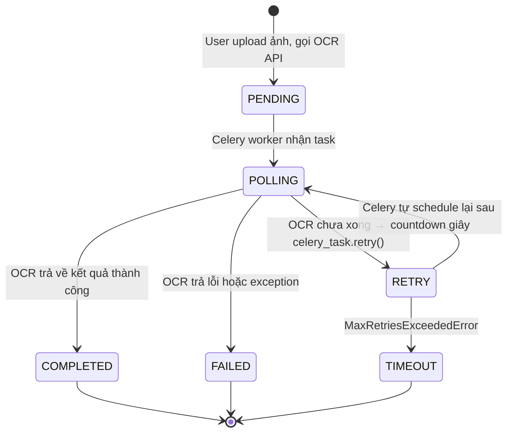
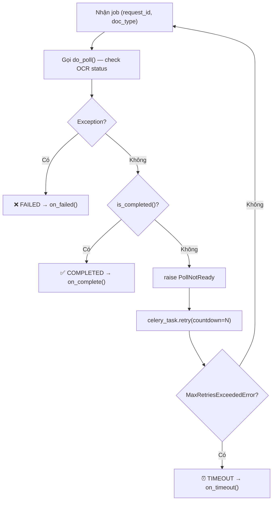
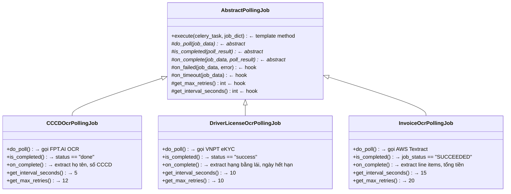
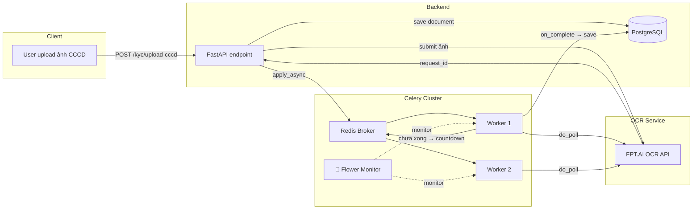

# Designing a Polling Lifecycle with Celery: State Machines and Template Method

## 1. Đặt vấn đề

Bạn xây dựng hệ thống **OCR** (Optical Character Recognition) — người dùng upload ảnh CMND/CCCD, hệ thống gọi sang một OCR service (Google Vision, AWS Textract, FPT.AI, VNPT eKYC...) để nhận diện thông tin. Vấn đề là: **OCR service không trả kết quả ngay**.

Flow thực tế trông thế này:

```
User upload ảnh CCCD
        │
        ▼
Backend gọi OCR API ──▶ OCR trả về: { "request_id": "abc123", "status": "processing" }
        │
        ▼
   Giờ phải làm gì?
   Chờ? Poll? Callback?
```

OCR service thường mất **3–30 giây** tuỳ chất lượng ảnh, tải hệ thống, loại giấy tờ. Một số service hỗ trợ webhook callback, nhưng nhiều service chỉ cung cấp **polling endpoint**: bạn phải tự gọi lại để hỏi "xong chưa?".

Cách tiếp cận đầu tiên ai cũng nghĩ tới: **viết một vòng `while` loop để poll liên tục**:

```python
# ❌ Cách làm naive — đừng làm thế này
import time

def wait_for_ocr(request_id):
    while True:
        result = ocr_client.get_result(request_id)
        if result["status"] == "done":
            return result["data"]
        time.sleep(5)
```

**Vấn đề gặp phải:**

| Vấn đề | Hậu quả |
|---|---|
| Worker restart → mất hết polling job | User upload xong nhưng không bao giờ nhận kết quả |
| Không có giới hạn retry | Spam OCR API, bị rate-limit, tốn tiền API call |
| Ảnh bị lỗi → poll vĩnh viễn | Thread bị block, worker cạn resource |
| Nhiều loại giấy tờ, nhiều OCR provider | Copy-paste code, sửa một chỗ quên chỗ kia |
| Không track được trạng thái | User hỏi "ảnh tôi xử lý đến đâu rồi?" → không biết trả lời |

Bài toán này không chỉ riêng OCR — bất kỳ hệ thống nào gọi **async external API** đều gặp: export report, AI video processing, payment verification... Chúng ta cần một giải pháp **persistent, có trạng thái rõ ràng, và dễ mở rộng**.

---

## 2. Giải pháp: State Machine + Template Method

### 2.1 State Machine — Biết rõ request OCR đang ở đâu

Thay vì để job chạy "vô hình", ta định nghĩa rõ ràng các trạng thái:



Mỗi lần poll, job chỉ có thể chuyển sang **một trạng thái hợp lệ**. User hỏi "ảnh tôi đang xử lý đến đâu?" → query state là biết ngay. State machine đảm bảo tính đúng đắn (correctness) của toàn bộ flow.

### 2.2 Template Method — Viết một lần, dùng cho mọi loại giấy tờ

Dù là OCR căn cước công dân, bằng lái xe hay hoá đơn, flow polling đều giống nhau:



**Phần chung (skeleton)** thì giữ nguyên. **Phần khác nhau** (gọi OCR API nào, parse response ra sao, lưu kết quả ở đâu) thì để lớp con override. Đây chính là **Template Method Pattern**.



---

## 3. Implementation với Celery

### Tại sao Celery?

**Celery** là distributed task queue phổ biến nhất trong hệ sinh thái Python. Dùng Redis hoặc RabbitMQ làm broker, nó giải quyết gọn gàng vấn đề "worker restart mất job":

- Task được lưu trong broker → restart không mất
- Hỗ trợ `countdown`, `eta`, `retry` native
- Concurrency control, rate limiting built-in
- Tích hợp tốt với Django, FastAPI, Flask

### 3.1 Cài đặt

```bash
pip install celery redis requests
```

### 3.2 Celery config

```python
# celery_app.py

from celery import Celery

app = Celery(
    "ocr_worker",
    broker="redis://localhost:6379/0",
    backend="redis://localhost:6379/1",
)

app.conf.update(
    task_serializer="json",
    accept_content=["json"],
    result_serializer="json",
    timezone="Asia/Ho_Chi_Minh",
    task_track_started=True,
    task_acks_late=True,              # Task không mất khi worker crash
    worker_prefetch_multiplier=1,
)
```

### 3.3 Polling State

```python
# polling/state.py

from enum import Enum
from dataclasses import dataclass, field, asdict
from typing import Optional


class PollingState(str, Enum):
    PENDING   = "PENDING"
    POLLING   = "POLLING"
    COMPLETED = "COMPLETED"
    FAILED    = "FAILED"
    TIMEOUT   = "TIMEOUT"


@dataclass
class PollingJobData:
    """Dữ liệu đi kèm mỗi polling job — serialize qua JSON."""
    job_id: str
    state: str = PollingState.PENDING
    retry_count: int = 0
    last_polled_at: Optional[str] = None
    completed_at: Optional[str] = None
    error: Optional[str] = None
    payload: dict = field(default_factory=dict)

    def to_dict(self):
        return asdict(self)

    @classmethod
    def from_dict(cls, d: dict):
        return cls(**d)
```

### 3.4 Abstract Polling Job — Template Method

```python
# polling/base.py

from abc import ABC, abstractmethod
from datetime import datetime
from typing import Any
from celery.utils.log import get_task_logger
from celery.exceptions import MaxRetriesExceededError

from .state import PollingState, PollingJobData

logger = get_task_logger(__name__)


class PollNotReady(Exception):
    """Raised khi OCR chưa xong — trigger Celery retry."""
    pass


class AbstractPollingJob(ABC):
    """
    Template Method Pattern cho polling.

    Subclass chỉ cần implement:
      - do_poll(job_data) → poll_result
      - is_completed(poll_result) → bool
      - on_complete(job_data, poll_result)
    """

    # ─── Abstract — Subclass PHẢI implement ───

    @abstractmethod
    def do_poll(self, job_data: PollingJobData) -> Any:
        """Gọi OCR API kiểm tra trạng thái."""
        ...

    @abstractmethod
    def is_completed(self, poll_result) -> bool:
        """Kết quả OCR đã sẵn sàng chưa?"""
        ...

    @abstractmethod
    def on_complete(self, job_data: PollingJobData, poll_result) -> None:
        """Xử lý khi OCR hoàn thành — parse và lưu dữ liệu."""
        ...

    # ─── Hooks — Override nếu cần ───

    def on_failed(self, job_data: PollingJobData, error: Exception) -> None:
        logger.error(f"[{self.job_name}] Job {job_data.job_id} failed: {error}")

    def on_timeout(self, job_data: PollingJobData) -> None:
        logger.warning(
            f"[{self.job_name}] Job {job_data.job_id} timed out "
            f"after {self.get_max_retries()} retries"
        )

    def get_max_retries(self) -> int:
        return 10

    def get_interval_seconds(self) -> int:
        return 30

    @property
    def job_name(self) -> str:
        return self.__class__.__name__

    # ─── TEMPLATE METHOD — Skeleton không đổi ───

    def execute(self, celery_task, job_dict: dict) -> dict:
        """
        Template method — KHÔNG override.

        Dùng celery_task.retry() thay vì apply_async():
        - Celery tự track retry count (celery_task.request.retries)
        - Celery tự raise MaxRetriesExceededError khi vượt max
        - Task state (PENDING/RETRY/STARTED/...) được Celery quản lý native
        """
        data = PollingJobData.from_dict(job_dict)

        # --- State: POLLING ---
        data.state = PollingState.POLLING
        data.retry_count = celery_task.request.retries  # Celery tự đếm
        data.last_polled_at = datetime.utcnow().isoformat()

        try:
            poll_result = self.do_poll(data)

            if self.is_completed(poll_result):
                # --- State: COMPLETED ---
                data.state = PollingState.COMPLETED
                data.completed_at = datetime.utcnow().isoformat()
                self.on_complete(data, poll_result)
                return data.to_dict()

            # Chưa xong → raise để trigger Celery retry
            raise PollNotReady(
                f"Poll #{data.retry_count + 1}: chưa hoàn thành, retry sau "
                f"{self.get_interval_seconds()}s"
            )

        except PollNotReady as exc:
            try:
                # ─── Celery retry ───
                # Celery tự đếm retries, tự raise MaxRetriesExceededError
                raise celery_task.retry(
                    exc=exc,
                    countdown=self.get_interval_seconds(),
                    max_retries=self.get_max_retries(),
                    args=[data.to_dict()],  # Truyền lại state mới nhất
                )
            except MaxRetriesExceededError:
                # --- State: TIMEOUT ---
                data.state = PollingState.TIMEOUT
                self.on_timeout(data)
                return data.to_dict()

        except Exception as error:
            # --- State: FAILED ---
            data.state = PollingState.FAILED
            data.error = str(error)
            self.on_failed(data, error)
            return data.to_dict()
```

### 3.5 Concrete Jobs — Mỗi loại giấy tờ một class

**OCR Căn cước công dân (CCCD) — dùng FPT.AI**

```python
# polling/cccd_ocr.py

import requests
from .base import AbstractPollingJob
from .state import PollingJobData

FPT_AI_BASE = "https://api.fpt.ai/vision/idr/vnm"
FPT_API_KEY = "your-api-key"


class CCCDOcrPollingJob(AbstractPollingJob):
    """
    Poll kết quả OCR căn cước công dân từ FPT.AI.
    Response mẫu: { "status": "done", "data": [{ "id": "07920100xxxx", ... }] }
    """

    def do_poll(self, job_data: PollingJobData):
        resp = requests.get(
            f"{FPT_AI_BASE}/status/{job_data.payload['request_id']}",
            headers={"api-key": FPT_API_KEY},
            timeout=10,
        )
        resp.raise_for_status()
        return resp.json()

    def is_completed(self, result) -> bool:
        return result.get("status") == "done"

    def on_complete(self, job_data: PollingJobData, result):
        ocr_data = result["data"][0]

        # Extract thông tin từ CCCD
        extracted = {
            "id_number":    ocr_data.get("id"),
            "full_name":    ocr_data.get("name"),
            "date_of_birth": ocr_data.get("dob"),
            "gender":       ocr_data.get("sex"),
            "nationality":  ocr_data.get("nationality"),
            "home_town":    ocr_data.get("home"),
            "address":      ocr_data.get("address"),
            "expiry_date":  ocr_data.get("doe"),
        }

        # Lưu vào DB
        from services.kyc_service import save_cccd_result
        save_cccd_result(
            user_id=job_data.payload["user_id"],
            document_id=job_data.payload["document_id"],
            extracted_data=extracted,
        )

    # CCCD thường xử lý nhanh → poll mỗi 5 giây, tối đa 12 lần (1 phút)
    def get_interval_seconds(self) -> int:
        return 5

    def get_max_retries(self) -> int:
        return 12
```

**OCR Hoá đơn — dùng AWS Textract**

```python
# polling/invoice_ocr.py

import boto3
from .base import AbstractPollingJob
from .state import PollingJobData

textract = boto3.client("textract", region_name="ap-southeast-1")


class InvoiceOcrPollingJob(AbstractPollingJob):
    """
    Poll kết quả OCR hoá đơn từ AWS Textract.
    Textract async: start_expense_analysis → get_expense_analysis
    """

    def do_poll(self, job_data: PollingJobData):
        resp = textract.get_expense_analysis(
            JobId=job_data.payload["textract_job_id"]
        )
        return resp

    def is_completed(self, result) -> bool:
        status = result["JobStatus"]
        if status == "FAILED":
            raise Exception(f"Textract failed: {result.get('StatusMessage')}")
        return status == "SUCCEEDED"

    def on_complete(self, job_data: PollingJobData, result):
        # Parse Textract expense documents
        line_items = []
        total_amount = None

        for doc in result.get("ExpenseDocuments", []):
            for group in doc.get("LineItemGroups", []):
                for item in group.get("LineItems", []):
                    fields = {}
                    for field in item.get("LineItemExpenseFields", []):
                        key = field["Type"]["Text"]
                        val = field["ValueDetection"]["Text"]
                        fields[key] = val
                    line_items.append(fields)

            for field in doc.get("SummaryFields", []):
                if field["Type"]["Text"] == "TOTAL":
                    total_amount = field["ValueDetection"]["Text"]

        from services.invoice_service import save_invoice_result
        save_invoice_result(
            invoice_id=job_data.payload["invoice_id"],
            line_items=line_items,
            total_amount=total_amount,
        )

    def on_failed(self, job_data: PollingJobData, error: Exception):
        from services.notification_service import notify_user
        notify_user(job_data.payload["user_id"], {
            "title": "OCR hoá đơn thất bại",
            "message": str(error),
        })

    # Textract chậm hơn → poll mỗi 15 giây, tối đa 20 lần (5 phút)
    def get_interval_seconds(self) -> int:
        return 15

    def get_max_retries(self) -> int:
        return 20
```

### 3.6 Đăng ký Celery Tasks

```python
# polling/tasks.py

from celery_app import app
from .cccd_ocr import CCCDOcrPollingJob
from .invoice_ocr import InvoiceOcrPollingJob

_cccd_poller = CCCDOcrPollingJob()
_invoice_poller = InvoiceOcrPollingJob()


@app.task(bind=True, name="poll.cccd_ocr")
def poll_cccd_ocr(self, job_dict: dict):
    return _cccd_poller.execute(self, job_dict)


@app.task(bind=True, name="poll.invoice_ocr")
def poll_invoice_ocr(self, job_dict: dict):
    return _invoice_poller.execute(self, job_dict)
```

### 3.7 Gọi từ API endpoint

```python
# api/views.py — FastAPI example

import uuid
from fastapi import APIRouter, UploadFile
from polling.tasks import poll_cccd_ocr
from polling.state import PollingJobData
from services.ocr_client import submit_cccd_image

router = APIRouter()


@router.post("/kyc/upload-cccd")
async def upload_cccd(user_id: str, file: UploadFile):
    # Bước 1: Gửi ảnh sang OCR service
    ocr_response = await submit_cccd_image(file)
    # → { "request_id": "abc123", "status": "processing" }

    # Bước 2: Lưu document record
    document_id = str(uuid.uuid4())

    # Bước 3: Schedule polling job
    job_data = PollingJobData(
        job_id=str(uuid.uuid4()),
        payload={
            "user_id": user_id,
            "document_id": document_id,
            "request_id": ocr_response["request_id"],
        },
    )

    poll_cccd_ocr.apply_async(
        args=[job_data.to_dict()],
        countdown=5,  # Poll lần đầu sau 5 giây
    )

    return {
        "document_id": document_id,
        "status": "processing",
        "message": "Đang xử lý OCR, kết quả sẽ sẵn sàng trong vài giây.",
    }
```

### 3.8 Chạy worker

```bash
celery -A celery_app worker --loglevel=info --concurrency=10
```

---

## 4. Kiến trúc tổng thể




Thêm OCR cho bằng lái xe? **Chỉ cần 1 class mới:**

```python
class DriverLicenseOcrPollingJob(AbstractPollingJob):
    def do_poll(self, data):        # gọi VNPT eKYC API
    def is_completed(self, result):  # check status
    def on_complete(self, data, r):  # extract hạng bằng lái, ngày hết hạn
```

Không sửa một dòng nào ở `AbstractPollingJob`, không sửa template method. **Open/Closed Principle.**

---

## Kết luận

OCR là một ví dụ điển hình cho bài toán polling async API. Kết hợp **State Machine** (biết rõ request đang ở đâu, user có thể track) với **Template Method** (skeleton chung cho mọi loại giấy tờ, mỗi loại chỉ implement phần khác biệt) và **Celery** (persistent task queue, retry, monitoring), bạn có một hệ thống OCR processing production-ready mà đội mới onboard đọc 5 phút là hiểu flow.

> *"Đừng viết code thông minh. Hãy viết code mà lúc 2 giờ sáng, khi production cháy, bạn vẫn đọc hiểu được."*