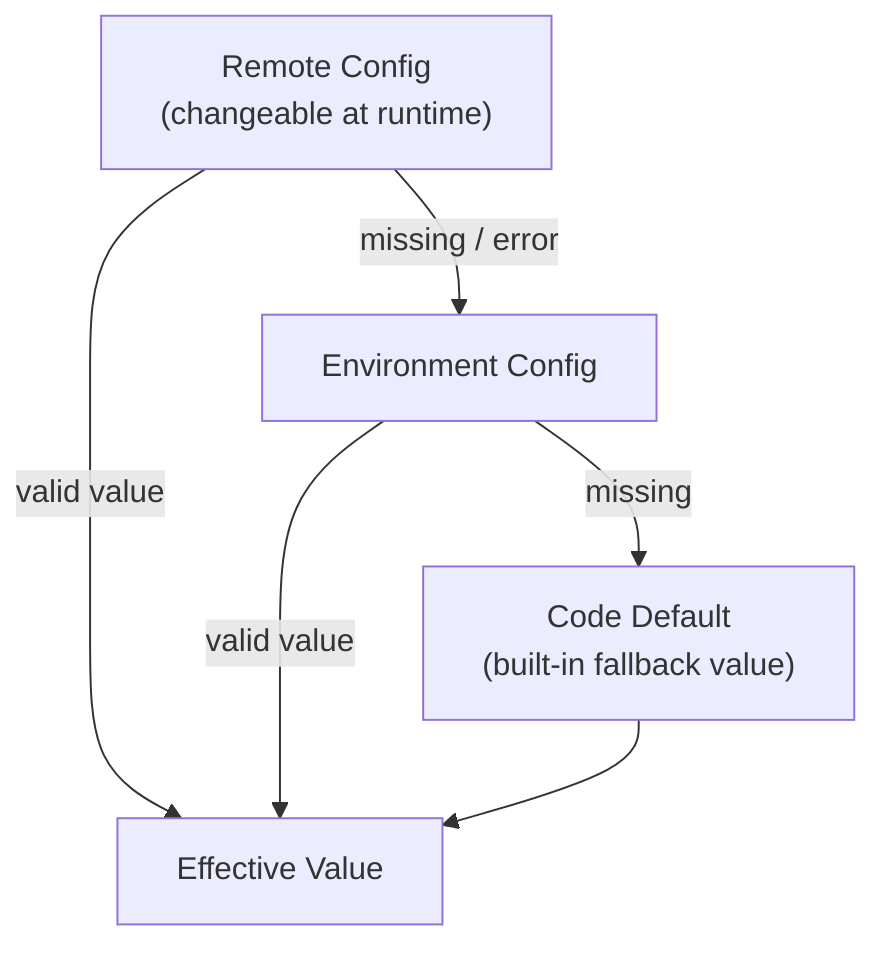
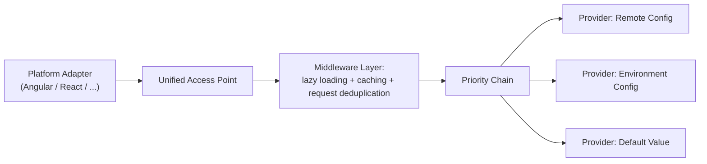
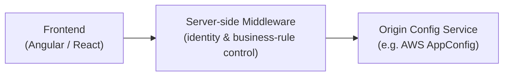
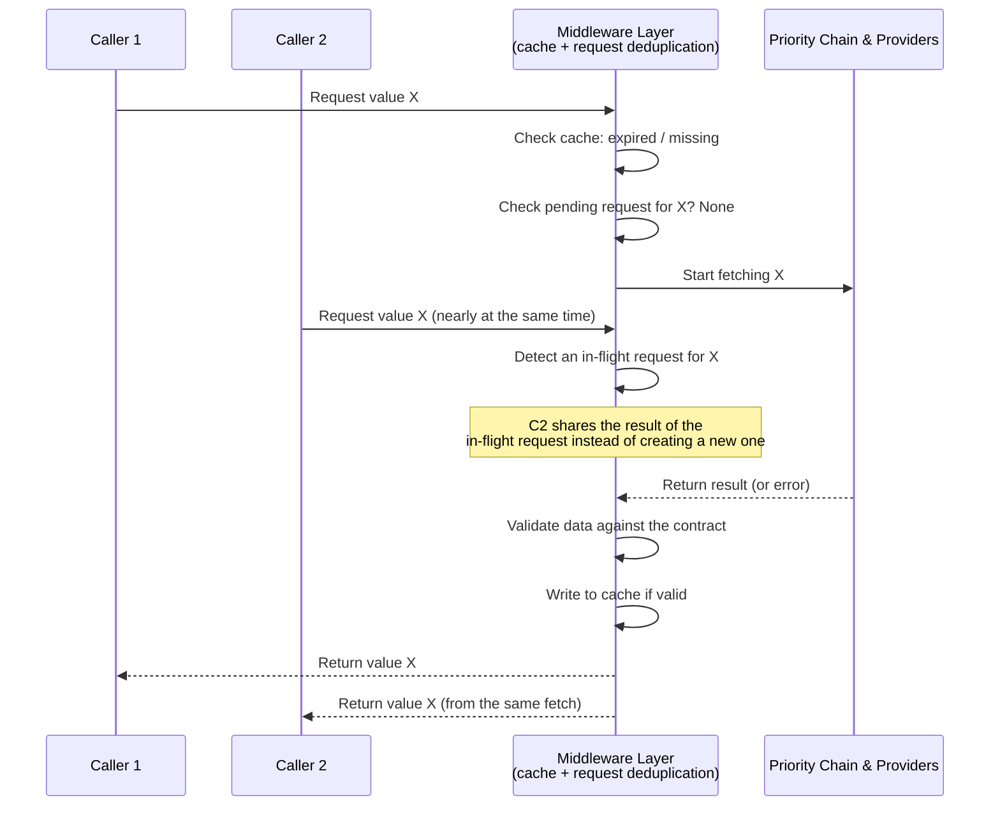
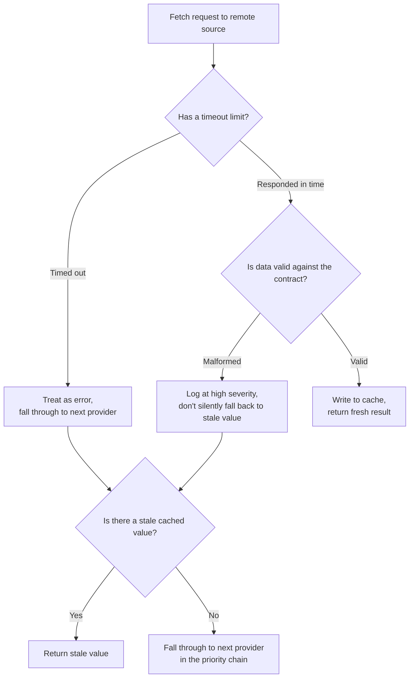

# Standardizing Configuration Management
## 1. Đặt vấn đề

Hệ thống có nhiều frontend, nhiều backend service và nhiều môi trường triển khai. Theo thời gian, cách quản lý cấu hình bộc lộ những vấn đề mang tính kiến trúc, không chỉ là chi tiết kỹ thuật:

- **Không có điểm truy cập cấu hình tập trung.** Mỗi nơi tự đọc thẳng từ nguồn của riêng nó, không qua một lớp trung gian nào. Muốn biết một giá trị đang thực sự đến từ đâu — code default, biến môi trường hay dịch vụ cấu hình từ xa — phải lần theo từng nơi sử dụng.
- **Không có hợp đồng dữ liệu rõ ràng giữa các phía.** Không có schema, không có kiểu dữ liệu thống nhất, dẫn đến việc mỗi service tự diễn giải cùng một giá trị theo một cách khác nhau.
- **Thay đổi vận hành bị ràng buộc vào chu kỳ triển khai.** Một điều chỉnh nhỏ, mang tính tạm thời (tăng giới hạn, bật kill-switch khẩn cấp) vẫn phải đi qua toàn bộ quy trình build và deploy — quá chậm so với tốc độ cần có khi xử lý sự cố.
- **Không phân định giữa cấu hình vận hành và quyết định phát hành tính năng.** Hai loại quyết định có vòng đời, mức độ rủi ro và người chịu trách nhiệm khác nhau, nhưng lại bị xử lý như cùng một khái niệm.
- **Tải cấu hình không theo nhu cầu thực tế.** Toàn bộ cấu hình được lấy về ngay khi khởi động, kể cả phần không bao giờ được dùng đến trong phiên làm việc đó — tạo chi phí không cần thiết cả về thời gian khởi động lẫn tải lên hệ thống cấu hình phía sau.
- **Ranh giới tin cậy giữa frontend và hạ tầng cấu hình gốc bị mờ.** Khi phía hiển thị có xu hướng truy cập trực tiếp vào dịch vụ cấu hình gốc, hệ thống mất đi một lớp kiểm soát quan trọng về danh tính truy cập và quy tắc nghiệp vụ.

Bản chất của vấn đề: cấu hình đang được đối xử như một chi tiết phụ trợ, trong khi nó cần được nhìn nhận như **một thành phần kiến trúc độc lập**, với ranh giới trách nhiệm, hợp đồng dữ liệu và vòng đời rõ ràng — tương đương với bất kỳ domain cốt lõi nào khác của hệ thống.

## 2. Giải pháp

Giải pháp dựa trên hai nguyên lý thiết kế, độc lập với bất kỳ công nghệ hay framework cụ thể nào.

### 2.1. Một mô hình phân giải cấu hình theo tầng, có thứ tự ưu tiên cố định

Thay vì để từng nơi tự quyết định cách kết hợp các nguồn cấu hình, hệ thống định nghĩa một **chuỗi ưu tiên duy nhất**, áp dụng nhất quán cho mọi loại giá trị:

Nguyên tắc phân vai: những gì gắn liền với **bản chất của một lần triển khai** (địa chỉ dịch vụ, năng lực hạ tầng, giá trị cần khởi động lại mới có hiệu lực) thuộc về tầng môi trường triển khai. Những gì cần **thay đổi ngay tại thời điểm hệ thống đang vận hành** (ngưỡng, công tắc khẩn cấp, tỷ lệ triển khai dần) thuộc về tầng cấu hình từ xa.

### 2.2. Một lõi xử lý cấu hình độc lập nền tảng, được ghép từ các thành phần có trách nhiệm tách bạch

Mỗi trách nhiệm được cô lập vào một vai trò riêng, để có thể thay đổi một phần mà không ảnh hưởng các phần còn lại:

| Vai trò | Trách nhiệm | Vì sao cần tách riêng |
|---|---|---|
| Điểm truy cập thống nhất | Là nơi duy nhất phần còn lại của hệ thống gọi đến để lấy một giá trị cấu hình | Che giấu toàn bộ độ phức tạp phía sau, cho phép thay đổi cách vận hành bên trong mà không phá vỡ nơi sử dụng |
| Nguồn cấu hình có thể thay thế cho nhau | Nhiều nguồn khác nhau cùng tuân theo một hợp đồng chung | Cho phép thêm/bớt/thay nguồn mà không sửa logic nghiệp vụ đang dùng cấu hình |
| Chuỗi quyết định theo thứ tự ưu tiên | Thử lần lượt các nguồn theo đúng thứ tự đã định nghĩa, dừng lại ở nguồn đầu tiên hợp lệ | Tách riêng "thứ tự ưu tiên là gì" khỏi "từng nguồn hoạt động ra sao" |
| Cơ chế trì hoãn việc tải | Chỉ thực sự lấy dữ liệu khi có nhu cầu sử dụng lần đầu | Tránh chi phí cho phần cấu hình không bao giờ được dùng đến trong một phiên |
| Lớp lưu tạm có thời hạn | Giữ lại kết quả đã lấy được trong một khoảng thời gian hợp lý | Giảm số lần phải hỏi lại nguồn gốc cho cùng một giá trị |
| Cơ chế gộp yêu cầu trùng lặp | Nhiều nơi cùng hỏi một giá trị tại cùng thời điểm chỉ tạo ra một lượt lấy dữ liệu thực sự | Tránh nhân bản chi phí khi nhiều phần của hệ thống cùng cần một giá trị cùng lúc |
| Lớp thích ứng theo nền tảng hiển thị | Là phần duy nhất biết về nền tảng cụ thể (loại giao diện, cách cung cấp phụ thuộc) | Giữ phần lõi hoàn toàn không biết gì về nền tảng hiển thị, có thể tái sử dụng ở bất kỳ đâu |

Cờ tính năng (feature flag) được xem là **một biến thể chuyên biệt** của cấu hình động: dùng chung hạ tầng lấy dữ liệu, lưu tạm và dự phòng, nhưng được bộc lộ qua một giao diện riêng — vì bản chất câu hỏi nó trả lời ("ai được trải nghiệm gì") khác với câu hỏi mà cấu hình vận hành trả lời ("hệ thống nên hành xử với ngưỡng nào").

Về ranh giới truy cập: phía hiển thị không truy cập trực tiếp vào dịch vụ cấu hình gốc. Nó đi qua một lớp trung gian phía máy chủ, nơi có thể áp dụng kiểm soát danh tính, quy tắc nghiệp vụ và giới hạn truy cập một cách tập trung.

## 3. Thực hiện

Việc hiện thực hóa mô hình trên xoay quanh bốn quyết định thiết kế cốt lõi.

### 3.1. Định nghĩa hợp đồng trước khi viết bất kỳ nguồn cấu hình nào

Trước khi có nguồn cấu hình đầu tiên, cần thống nhất: mỗi giá trị cấu hình có kiểu dữ liệu gì, giá trị mặc định là gì, thời hạn lưu tạm bao lâu là hợp lý, và quy tắc nào dùng để xác nhận một giá trị nhận về là hợp lệ. Kết quả trả về không chỉ là giá trị, mà còn kèm theo **nguồn gốc** và **thời điểm lấy được** — đây là phần siêu dữ liệu quan trọng để quan sát và gỡ lỗi sau này, không phải chi tiết phụ.

### 3.2. Mỗi nguồn cấu hình là một cài đặt độc lập của cùng một vai trò

Nguồn từ xa, nguồn theo môi trường triển khai, và nguồn mặc định đều triển khai chung một hợp đồng: nhận vào một khóa cấu hình, trả về một kết quả hoặc báo không có. Nhờ vậy, việc bổ sung một nguồn mới trong tương lai không đòi hỏi thay đổi bất kỳ phần nào đang sử dụng cấu hình — chỉ cần thêm một cài đặt mới tuân theo cùng hợp đồng.

Ở nguồn từ xa, một nguyên tắc quan trọng cần giữ: **phía hiển thị không gọi thẳng đến hạ tầng cấu hình gốc**. Việc đó thuộc về lớp trung gian phía máy chủ.

### 3.3. Chuỗi ưu tiên là một thành phần riêng, tách khỏi từng nguồn cụ thể

Thành phần này chỉ biết "thử lần lượt theo danh sách, dừng ở kết quả hợp lệ đầu tiên" — nó không quan tâm từng nguồn hoạt động ra sao. Một nguồn gặp lỗi chỉ được ghi nhận cảnh báo, không làm gián đoạn việc thử các nguồn tiếp theo. Nhờ tách riêng, thứ tự ưu tiên có thể thay đổi mà không đụng đến logic bên trong từng nguồn.

### 3.4. Một lớp trung gian gộp ba trách nhiệm: trì hoãn, lưu tạm, và gộp yêu cầu trùng lặp

Đây là điểm phức tạp nhất về mặt thiết kế, vì ba trách nhiệm này tương tác chặt với nhau: chỉ tải khi có nhu cầu lần đầu; nếu còn trong thời hạn lưu tạm thì trả kết quả cũ ngay, không hỏi lại nguồn gốc; nếu nhiều nơi cùng hỏi một giá trị trong lúc một yêu cầu khác đang được xử lý, tất cả dùng chung kết quả của yêu cầu đó thay vì tạo thêm yêu cầu mới.

Lớp này cũng là nơi hợp lý nhất để đặt bước xác nhận dữ liệu theo hợp đồng đã định nghĩa ở bước 3.1, trước khi đưa vào lưu tạm — vì đây là điểm duy nhất mọi giá trị đi qua trước khi được xem là "đáng tin cậy". Khi việc lấy dữ liệu mới thất bại nhưng vẫn còn kết quả cũ (dù đã hết hạn), nên ưu tiên trả kết quả cũ thay vì để lỗi lan ra phía sử dụng — đây là một quyết định thiết kế có chủ đích, đánh đổi độ mới của dữ liệu để lấy sự ổn định.

### 3.5. Những rủi ro cần được xử lý ở tầng thiết kế trước khi đưa vào vận hành

Một số hành vi không sai về mặt logic nhưng cần được cân nhắc rõ ràng ở tầng thiết kế, vì chúng chỉ bộc lộ khi hệ thống chịu tải thực tế hoặc khi phần phụ thuộc bên ngoài gặp sự cố:

- **Phân biệt rõ giữa "nguồn không phản hồi được" và "nguồn phản hồi nhưng sai định dạng".** Hai loại lỗi này cần được xử lý và ghi nhận khác nhau — loại thứ hai thường là dấu hiệu của một thay đổi phá vỡ tương thích ở phía cung cấp dữ liệu, cần được phát hiện sớm thay vì âm thầm rơi về giá trị cũ.
- **Có giới hạn thời gian chờ cho một lượt lấy dữ liệu.** Nếu không, một yêu cầu bị treo có thể khiến toàn bộ các yêu cầu đang gộp chung với nó cũng bị treo theo.
- **Tính đến ngữ cảnh vận hành không có sẵn phía hiển thị** (ví dụ khi giao diện được dựng sẵn phía máy chủ) — phần phụ thuộc vào ngữ cảnh trình duyệt cần được cô lập, không để làm gián đoạn toàn bộ luồng khi ngữ cảnh đó không tồn tại.
- **Có chiến lược giảm tải khi nguồn từ xa gặp sự cố kéo dài**, để tránh việc mỗi lượt hết hạn lưu tạm đều tạo thêm áp lực lên một nguồn vốn đã đang gặp vấn đề.
- **Đảm bảo việc chủ động làm mới cấu hình không xung đột với một yêu cầu đang chạy dở** — nếu không, kết quả cũ có thể "sống lại" ngay sau khi vừa được yêu cầu loại bỏ.
- **Hạn chế truyền thông tin định danh nhạy cảm qua các kênh dễ bị ghi log**, ưu tiên kênh ít lộ diện hơn.
- **Có khả năng quan sát tỷ lệ giải quyết cấu hình theo từng nguồn.** Đây là tín hiệu sớm cho biết nguồn từ xa có đang suy giảm chất lượng hay không, thay vì chỉ phát hiện khi người dùng cuối gặp ảnh hưởng.

### 3.6. Tích hợp nền tảng hiển thị chỉ qua một lớp mỏng

Phần lõi không biết gì về nền tảng hiển thị cụ thể. Mỗi nền tảng chỉ cần một lớp thích ứng rất mỏng để: cung cấp giá trị môi trường theo cách riêng của nền tảng đó, và đăng ký điểm truy cập cấu hình theo cơ chế quản lý phụ thuộc của nền tảng đó. Việc khởi tạo lớp thích ứng này **không kéo theo bất kỳ lượt lấy dữ liệu nào** — điều đó chỉ xảy ra khi có nơi thực sự gọi đến điểm truy cập cấu hình.

## 4. Kết quả

Sau khi áp dụng mô hình thiết kế này:

- **Cấu hình có một điểm truy cập duy nhất, thay vì rải rác khắp hệ thống.** Nơi sử dụng không còn cần biết giá trị đến từ đâu — điều đó được che giấu hoàn toàn phía sau điểm truy cập thống nhất.
- **Chi phí tải cấu hình gắn liền với nhu cầu sử dụng thực tế.** Phần cấu hình không được dùng đến trong một phiên không còn tạo ra chi phí, nhờ cơ chế trì hoãn và gộp yêu cầu trùng lặp.
- **Thay đổi vận hành không còn phụ thuộc vào chu kỳ triển khai.** Một điều chỉnh mang tính tạm thời có thể có hiệu lực trong khoảng thời gian tính bằng thời hạn lưu tạm, thay vì phải chờ một chu trình build – deploy đầy đủ.
- **Một thay đổi sai định dạng ở nguồn cấu hình không còn lan thành lỗi khó truy vết ở nhiều nơi sử dụng khác nhau**, nhờ bước xác nhận dữ liệu được đặt tại đúng một điểm duy nhất trước khi dữ liệu được xem là đáng tin cậy.
- **Hệ thống có khả năng chịu lỗi khi nguồn cấu hình từ xa gián đoạn tạm thời**, nhờ chuỗi ưu tiên rõ ràng kết hợp với việc giữ lại kết quả cũ trong tình huống bất khả kháng.
- **Cấu hình vận hành và quyết định phát hành tính năng được nhìn nhận là hai khái niệm khác nhau**, dù dùng chung hạ tầng — giảm nhầm lẫn về vòng đời và mức độ rủi ro giữa hai loại quyết định.
- **Hệ thống có thể tự quan sát sức khỏe của chính nó** thông qua tỷ lệ giải quyết cấu hình theo từng nguồn, cho phép phát hiện sớm suy giảm chất lượng thay vì chờ phản hồi từ người dùng cuối.
- **Phần lõi có thể tái sử dụng cho bất kỳ nền tảng hiển thị nào**, vì toàn bộ logic quan trọng (thứ tự ưu tiên, xác nhận dữ liệu, lưu tạm, gộp yêu cầu) không phụ thuộc vào một nền tảng cụ thể — mỗi nền tảng chỉ cần một lớp thích ứng mỏng.

Kết quả cuối cùng không nằm ở việc dùng đúng tên các pattern, mà ở việc cấu hình được nâng lên thành **một thành phần kiến trúc có ranh giới trách nhiệm rõ ràng, có khả năng quan sát, và đủ ổn định để hệ thống dựa vào trong những tình huống cần phản ứng nhanh**.

## Nguồn tham khảo

- Martin Fowler — bài viết nền tảng phân loại các loại cờ tính năng (release, ops, experiment, permissioning) và khuyến nghị quản lý riêng biệt theo vòng đời: [martinfowler.com/bliki/FeatureFlag.html](https://martinfowler.com/bliki/FeatureFlag.html)

*(Đây là các nguồn tổng quát về từng khái niệm/pattern được nhắc đến; phần thiết kế cụ thể trong bài là tổng hợp và tùy biến riêng cho bài toán configuration management đã trình bày, không sao chép từ nguồn nào ở trên.)*