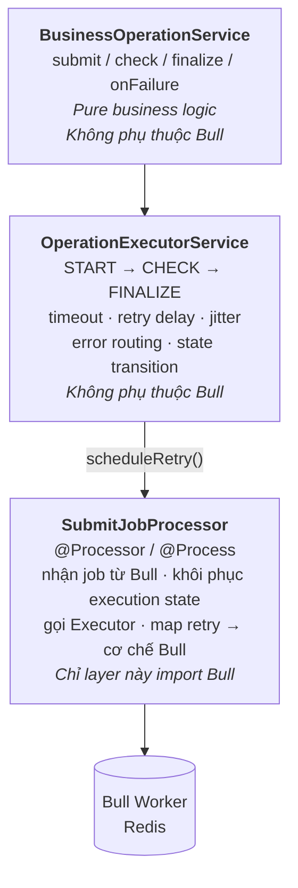
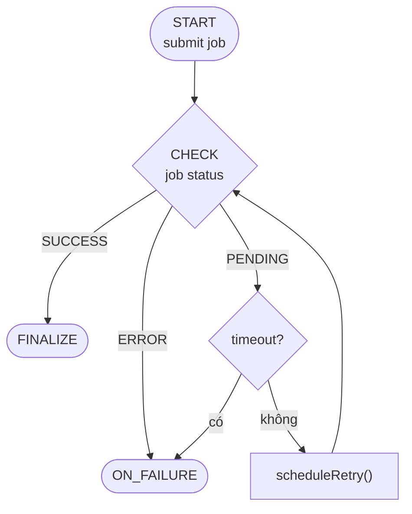

# Decoupling Business Logic from the Queue: A 3-Layer Architecture for Async Job Retries (NestJS + Bull)

## Problem

Khi xây dựng một tác vụ bất đồng bộ có khả năng retry — ví dụ: gửi job sang một hệ thống bên thứ ba, chờ kết quả, rồi hoàn tất — ta thường thấy code kiểu này ngay trong processor:

```ts
@Process()
async handle(job: Job) {
  try {
    const result = await this.externalService.submit(job.data);
    if (result.status === 'PENDING') {
      throw new Error('retry'); // để Bull tự retry
    }
    await this.finalize(result);
  } catch (err) {
    await this.handleFailure(err);
    throw err; // Bull retry tiếp theo cấu hình attempts/backoff
  }
}
```

Vấn đề nằm ở chỗ **business logic** (gửi job, kiểm tra trạng thái, hoàn tất, xử lý lỗi) và **cơ chế retry của hàng đợi** (delay, jitter, số lần thử, timeout, backoff) bị trộn lẫn trong cùng một hàm.

Hệ quả cụ thể:

- Muốn unit test logic nghiệp vụ, buộc phải mock cả `Job`, cả Bull, hoặc dựng Redis thật.
- Muốn thay đổi chiến lược retry (ví dụ thêm timeout tổng, thêm jitter riêng), phải sửa vào đúng chỗ đang gọi external service — dễ vỡ.
- Muốn đổi từ Bull sang một hàng đợi khác, phải viết lại toàn bộ, vì logic nghiệp vụ và logic hạ tầng nằm chung một khối.

Câu hỏi đặt ra: làm sao tách 3 mối quan tâm này — **nghiệp vụ thuần**, **quy tắc điều phối retry**, và **cơ chế hàng đợi cụ thể** — thành các đơn vị độc lập, test được riêng, và chỉ phụ thuộc một chiều?

## Solution

Chia kiến trúc thành 3 layer, phụ thuộc chỉ chảy một chiều từ trên xuống:



**Nguyên tắc cốt lõi**: `BusinessOperationService` không biết `Executor` tồn tại. `Executor` không biết mình đang chạy trên Bull, BullMQ hay SQS. Chỉ có `SubmitJobProcessor` là "bẩn" — nơi duy nhất `import` từ `bull`/`@nestjs/bull`.

Điểm hay nhất nằm ở cách nối layer 2 và layer 3: `Executor` không tự gọi lại chính nó để retry. Nó nhận một hàm `scheduleRetry` được **truyền từ bên ngoài vào**, và hàm đó có nghĩa vụ ngắt luồng thực thi hiện tại bằng cách `throw`. Đây là một **control-flow boundary** tường minh: tại điểm gọi `scheduleRetry`, ta biết chắc luồng thực thi hiện tại kết thúc ngay, và một lần thực thi mới sẽ được lên lịch ở layer bên ngoài — không phải một side-effect ẩn nấp trong logic nghiệp vụ.

Vòng đời một job minh họa quan hệ này:



## Implementation (NestJS + `@nestjs/bull`)

### Setup & Module

```bash
npm install @nestjs/bull bull
```

```ts
// app.module.ts
import { Module } from '@nestjs/common';
import { BullModule } from '@nestjs/bull';
import { SubmitJobModule } from './submit-job/submit-job.module';

@Module({
  imports: [
    BullModule.forRoot({ redis: { host: 'localhost', port: 6379 } }),
    SubmitJobModule,
  ],
})
export class AppModule {}
```

```ts
// submit-job.module.ts
import { Module } from '@nestjs/common';
import { BullModule } from '@nestjs/bull';
import { BusinessOperationService } from './business-operation.service';
import { OperationExecutorService } from './operation-executor.service';
import { SubmitJobProcessor } from './submit-job.processor';
import { SubmitJobController } from './submit-job.controller';
import { RetryScheduled } from './operation-executor.service';

@Module({
  imports: [
    BullModule.registerQueue({
      name: 'submit-job',
      defaultJobOptions: {
        attempts: 20,
        backoff: { type: 'custom' }, // bắt buộc khai báo để Bull dùng backoffStrategies.custom bên dưới
      },
      settings: {
        backoffStrategies: {
          // Bull gọi hàm này mỗi lần job fail để tính delay trước lần thử tiếp theo.
          // err chính là exception mà processor throw ra bên dưới.
          custom: (attemptsMade: number, err: unknown) => {
            if (err instanceof RetryScheduled) {
              return err.delayMs; // dùng đúng jitter đã tính trong OperationExecutorService
            }
            return 1000 * attemptsMade; // fallback cho lỗi không lường trước
          },
        },
        // Chống "ma job": nếu worker crash/bị kill giữa lúc đang xử lý,
        // Bull tự phát hiện job "stalled" sau lockDuration và đưa lại vào hàng đợi,
        // thay vì để nó kẹt ở trạng thái active vĩnh viễn.
        lockDuration: 60_000,    // phải > callTimeoutMs của Executor để không tự đá job đang chạy bình thường
        stalledInterval: 30_000, // chu kỳ Bull quét job stalled
        maxStalledCount: 2,      // stalled quá số lần này -> Bull coi là failed hẳn
      },
    }),
  ],
  controllers: [SubmitJobController],
  providers: [BusinessOperationService, OperationExecutorService, SubmitJobProcessor],
})
export class SubmitJobModule {}
```

### Layer 1 — `BusinessOperationService`: pure provider

```ts
// business-operation.service.ts
import { Injectable } from '@nestjs/common';
import { ExternalService } from './external.service';
import { JobRepository } from './job.repository';

export enum JobStatus {
  PENDING = 'PENDING',
  SUCCESS = 'SUCCESS',
  ERROR = 'ERROR',
}

@Injectable()
export class BusinessOperationService {
  constructor(
    private readonly externalService: ExternalService,
    private readonly jobRepository: JobRepository,
  ) {}

  async submit(payload: Record<string, unknown>) {
    const externalId = await this.externalService.submit(payload);
    return { externalId, status: JobStatus.PENDING };
  }

  async check(externalId: string) {
    return this.externalService.getStatus(externalId);
  }

  async finalize(result: { jobId: string; status: JobStatus }) {
    await this.jobRepository.markCompleted(result.jobId);
  }

  async onFailure(error: Error, context: { jobId: string }) {
    await this.jobRepository.markFailed(context.jobId, error.message);
  }
}
```

### Layer 2 — `OperationExecutorService`: state machine, control-flow boundary

```ts
// with-timeout.ts
export function withTimeout<T>(promise: Promise<T>, ms: number, label: string): Promise<T> {
  let timer: NodeJS.Timeout;
  const timeout = new Promise<never>((_, reject) => {
    timer = setTimeout(() => reject(new Error(`${label}-timeout`)), ms);
  });
  return Promise.race([promise, timeout]).finally(() => clearTimeout(timer));
}
```

```ts
// operation-executor.service.ts
import { Injectable } from '@nestjs/common';
import { BusinessOperationService, JobStatus } from './business-operation.service';
import { withTimeout } from './with-timeout';

export class RetryScheduled extends Error {
  constructor(
    public readonly nextState: Record<string, any>,
    public readonly delayMs: number,
  ) {
    super('retry-scheduled');
    this.name = 'RetryScheduled';
  }
}

export type ScheduleRetryFn = (nextState: Record<string, any>, delayMs: number) => never;

export enum JobPhase {
  START = 'START',
  CHECK = 'CHECK',
}

interface ExecutorOptions {
  baseDelayMs?: number;
  maxDelayMs?: number;
  timeoutMs?: number | null; // deadline TỔNG mặc định; null = job không có deadline trừ khi state ghi đè
  callTimeoutMs?: number;    // giới hạn cho MỖI lệnh gọi submit()/check() riêng lẻ — luôn bật, không tắt được
}

@Injectable()
export class OperationExecutorService {
  private readonly baseDelayMs: number;
  private readonly maxDelayMs: number;
  private readonly defaultTimeoutMs: number | null;
  private readonly callTimeoutMs: number;

  constructor(
    private readonly operation: BusinessOperationService,
    options: ExecutorOptions = {},
  ) {
    this.baseDelayMs = options.baseDelayMs ?? 1000;
    this.maxDelayMs = options.maxDelayMs ?? 60_000;
    // undefined -> dùng mặc định 5 phút; truyền thẳng `null` nghĩa là mặc định KHÔNG giới hạn cho toàn service.
    this.defaultTimeoutMs = options.timeoutMs === undefined ? 5 * 60_000 : options.timeoutMs;
    this.callTimeoutMs = options.callTimeoutMs ?? 30_000;
  }

  async run(state: Record<string, any>, scheduleRetry: ScheduleRetryFn): Promise<void> {
    const startedAt = state.startedAt ?? Date.now();

    // Ưu tiên timeoutMs được ghi trong CHÍNH job (đặt từ lúc tạo, ở phase START) nếu có;
    // nếu job không khai báo gì thì rơi về mặc định của service.
    // Set tường minh `timeoutMs: null` trong state -> job này KHÔNG có deadline tổng.
    const timeoutMs = 'timeoutMs' in state ? state.timeoutMs : this.defaultTimeoutMs;

    // Deadline tuyệt đối được kiểm tra TRƯỚC MỌI THỨ, mỗi lần run() được gọi lại —
    // dù job có bị delay lâu tới đâu giữa các lần retry, tổng vòng đời không bao giờ vượt quá timeoutMs.
    // timeoutMs == null -> bỏ qua hẳn bước này, job được phép retry vô thời hạn (chỉ còn bị chặn bởi
    // attempts/backoff của Bull và cơ chế stalled ở Queue Adapter).
    if (timeoutMs != null && Date.now() - startedAt > timeoutMs) {
      await this.operation.onFailure(new Error('timeout'), state as any);
      return;
    }

    try {
      switch (state.phase as JobPhase) {
        case JobPhase.START: {
          const submitted = await withTimeout(
            this.operation.submit(state.payload),
            this.callTimeoutMs,
            'submit',
          );
          this.advance(
            { ...state, ...submitted, phase: JobPhase.CHECK, startedAt },
            scheduleRetry,
          );
          return;
        }

        case JobPhase.CHECK: {
          const result = await withTimeout(
            this.operation.check(state.externalId),
            this.callTimeoutMs,
            'check',
          );

          switch (result.status as JobStatus) {
            case JobStatus.SUCCESS:
              await this.operation.finalize(result as any);
              return;

            case JobStatus.ERROR:
              await this.operation.onFailure(
                new Error((result as any).message ?? 'error'),
                state as any,
              );
              return;

            case JobStatus.PENDING:
            default:
              this.advance({ ...state, startedAt }, scheduleRetry);
              return;
          }
        }

        default:
          throw new Error(`Unknown phase: ${state.phase}`);
      }
    } catch (err) {
      if (err instanceof RetryScheduled) throw err; // boundary hợp lệ, để nó lan lên Processor

      // Bất kỳ lỗi nào khác — kể cả call-timeout ở trên — được coi là PENDING và thử lại,
      // deadline tuyệt đối ở đầu hàm sẽ là nơi thực sự chặn job "kéo dài vĩnh viễn".
      this.advance({ ...state, startedAt }, scheduleRetry);
    }
  }

  private advance(nextState: Record<string, any>, scheduleRetry: ScheduleRetryFn): never {
    const attempt = (nextState.attempt ?? 0) + 1;
    const delay = this.delayWithJitter(attempt);
    // control-flow boundary: scheduleRetry() PHẢI throw.
    return scheduleRetry({ ...nextState, attempt }, delay);
  }

  private delayWithJitter(attempt: number): number {
    const exp = Math.min(this.baseDelayMs * 2 ** attempt, this.maxDelayMs);
    const jitter = Math.random() * exp * 0.2;
    return Math.floor(exp + jitter);
  }
}
```

Hai layer bảo vệ chống "job kéo dài vĩnh viễn" ở trên hoạt động độc lập, bù cho nhau:

- **`timeoutMs` (deadline tuyệt đối)** được kiểm tra ở đầu `run()`, trước khi làm bất cứ điều gì — dù job bị delay lại bao nhiêu lần, hoặc bị Bull retry vô số lần, tổng thời gian sống tính từ `startedAt` ban đầu không bao giờ vượt ngưỡng này. Đây là giới hạn ở tầng **nghiệp vụ** (logic của `OperationExecutorService`), không phụ thuộc Bull.
- **`callTimeoutMs` (timeout từng lệnh gọi)** bọc quanh mỗi `await this.operation.submit(...)`/`check(...)` bằng `withTimeout`. Nếu external service không bao giờ trả lời, `Promise.race` sẽ ép `run()` thoát ra sau `callTimeoutMs` thay vì treo mãi mãi — lỗi đó được xử lý như một lần `PENDING` bình thường, để `timeoutMs` ở trên quyết định khi nào thực sự dừng hẳn.
- **`lockDuration`/`stalledInterval`/`maxStalledCount`** ở tầng `Queue Adapter` là layer bảo vệ thứ ba, khác về bản chất: nó không xử lý logic timeout, mà xử lý trường hợp *worker process chết* giữa lúc đang xử lý (crash, bị kill, deploy) — khi đó `Executor` không có cơ hội chạy nốt `try/catch` của mình, nên Bull phải tự phát hiện qua cơ chế lock riêng.

### Layer 3 — `SubmitJobProcessor`: the only layer that knows Bull exists

```ts
// submit-job.processor.ts
import { Process, Processor } from '@nestjs/bull';
import { Logger } from '@nestjs/common';
import { Job } from 'bull';
import { OperationExecutorService, RetryScheduled, ScheduleRetryFn } from './operation-executor.service';

@Processor('submit-job')
export class SubmitJobProcessor {
  private readonly logger = new Logger(SubmitJobProcessor.name);

  constructor(private readonly executor: OperationExecutorService) {}

  @Process()
  async handle(job: Job): Promise<void> {
    const scheduleRetry: ScheduleRetryFn = (nextState, delayMs) => {
      throw new RetryScheduled(nextState, delayMs);
    };

    try {
      await this.executor.run(job.data, scheduleRetry);
    } catch (err) {
      if (err instanceof RetryScheduled) {
        this.logger.log(`Job ${job.id} retry sau ${err.delayMs}ms, attempt ${err.nextState.attempt}`);
        await job.update(err.nextState); // cùng job.id, chỉ cập nhật execution state
        throw err; // Bull bắt lỗi, gọi backoffStrategies.custom(attemptsMade, err) để tính delay
      }
      throw err; // lỗi thật -> Bull vẫn retry theo cùng cấu hình attempts/backoff
    }
  }
}
```

```ts
// submit-job.controller.ts
import { Controller, Post, Body } from '@nestjs/common';
import { InjectQueue } from '@nestjs/bull';
import { Queue } from 'bull';
import { JobPhase } from './operation-executor.service';

@Controller('jobs')
export class SubmitJobController {
  constructor(@InjectQueue('submit-job') private readonly queue: Queue) {}

  @Post()
  async create(@Body() payload: Record<string, unknown>) {
    // Job bình thường: dùng timeoutMs mặc định của OperationExecutorService (5 phút).
    const job = await this.queue.add({ phase: JobPhase.START, payload });
    return { jobId: job.id };
  }

  @Post('long-running')
  async createLongRunning(@Body() payload: Record<string, unknown>) {
    // Job không cần deadline tổng — ví dụ chờ con người phê duyệt thủ công,
    // có thể mất vài giờ tới vài ngày mà vẫn là hợp lệ, không phải "treo".
    const job = await this.queue.add({
      phase: JobPhase.START,
      payload,
      timeoutMs: null,
    });
    return { jobId: job.id };
  }
}
```

Dùng chung `JobPhase` giữa controller và executor tránh gõ nhầm chuỗi `'START'` ở hai nơi khác nhau, và `switch` với `default: throw` giúp bắt lỗi sớm nếu `state.phase` bị hỏng do serialize/deserialize sai thay vì âm thầm không làm gì.

Lưu ý về cách retry: cùng một `job.id` được giữ nguyên xuyên suốt các lần thử. `OperationExecutorService` vẫn là nơi duy nhất tính jitter (`delayWithJitter`), nhưng thay vì tự thêm job mới, `RetryScheduled` được `throw` lên để Bull bắt và tự gọi `backoffStrategies.custom(attemptsMade, err)` — hàm này chỉ đơn giản đọc `err.delayMs` mà `Executor` đã tính sẵn, không tính lại. Nhờ vậy `attemptsMade` của Bull, `job.id`, và lịch sử retry trong Bull Board đều nhất quán, trong khi công thức backoff/jitter vẫn hoàn toàn do `OperationExecutorService` quyết định — Processor không biết gì về công thức đó, chỉ chuyển tiếp con số.

Về deadline tổng (`timeoutMs`): mặc định mọi job đều có giới hạn (5 phút, hoặc chỉnh khi khởi tạo `OperationExecutorService`), nhưng vì `run()` đọc `timeoutMs` từ chính `state` trước khi rơi về mặc định, **từng job riêng lẻ** có thể khai báo `timeoutMs: null` ngay lúc tạo để tắt hẳn deadline tổng cho job đó — phù hợp với các job có bản chất "chờ vô thời hạn" (chờ người phê duyệt, chờ một sự kiện bên ngoài không có SLA cố định) mà không cần đổi cấu hình của toàn bộ service. `callTimeoutMs` (giới hạn từng lệnh gọi `submit()`/`check()`) thì luôn bật, không tắt được — dù job không có deadline tổng, một lệnh gọi ra ngoài vẫn không được phép treo vô thời hạn.

Một điểm cần cấu hình đúng: nếu job có `timeoutMs`, `attempts` trong `defaultJobOptions` phải đủ lớn (ví dụ 20) để không hết lượt thử trước khi `timeoutMs` kích hoạt. Với job `timeoutMs: null`, `attempts` gần như là giới hạn thực sự duy nhất ở tầng số-lần-thử — nên cân nhắc đặt `attempts` rất lớn hoặc dùng một cơ chế hủy job thủ công (ví dụ endpoint hủy job theo `jobId`) thay vì trông chờ nó tự dừng.

### Jobs Without a Total Timeout — per-job opt-out, not global config

`timeoutMs` mặc định bảo vệ mọi job khỏi "kéo dài vĩnh viễn" theo nghĩa business logic (mãi ở `CHECK`, mãi `PENDING`). Nhưng không phải job nào cũng nên có giới hạn này — có những job **bản chất là dài hơi**: chờ con người phê duyệt, chờ một webhook không có SLA, chờ một tiến trình offline khác hoàn tất. Áp cùng một `timeoutMs` 5 phút hay 1 giờ cho các job này sẽ khiến chúng bị `onFailure` gọi oan trong khi job vẫn đang tiến triển bình thường.

Ba nguyên tắc khi thiết kế phần này:

- **Không tắt `timeoutMs` bằng cách sửa constructor của service** — vì `OperationExecutorService` là provider dùng chung cho mọi job đi qua nó; đổi giá trị mặc định nghĩa là đổi cho tất cả.
- **Cho phép ghi đè theo từng job**, vì quyết định "job này có cần timeout tổng hay không" là một thuộc tính của bản thân job (biết được ngay lúc tạo), không phải của service.
- **Không đụng đến `callTimeoutMs`** — dù job không có deadline tổng, một lệnh gọi `submit()`/`check()` treo vô thời hạn vẫn luôn là lỗi, nên giới hạn từng lệnh gọi giữ nguyên, không cho tắt.

`run()` (đã cập nhật ở phần 03) đọc `timeoutMs` ưu tiên từ `state`, rơi về mặc định của service nếu job không khai báo:

```ts
const timeoutMs = 'timeoutMs' in state ? state.timeoutMs : this.defaultTimeoutMs;

if (timeoutMs != null && Date.now() - startedAt > timeoutMs) {
  await this.operation.onFailure(new Error('timeout'), state as any);
  return;
}
```

Job muốn không có deadline tổng chỉ cần khai báo `timeoutMs: null` ngay khi tạo (xem `SubmitJobController.createLongRunning` ở phần 03) — không cần đổi gì ở `OperationExecutorService`, `SubmitJobProcessor`, hay cấu hình Bull.

Với những job dạng này, giới hạn thực sự còn lại là `attempts` của Bull và cơ chế `stalled` (`lockDuration`/`stalledInterval`/`maxStalledCount`) đã cấu hình ở phần 03 — hai cơ chế đó vẫn hoạt động bình thường vì chúng nằm ở tầng hạ tầng (Queue Adapter), độc lập hoàn toàn với `timeoutMs` ở tầng nghiệp vụ. Nếu cần dừng một job dạng "chờ vô thời hạn" theo yêu cầu (ví dụ người dùng huỷ), nên làm qua một endpoint riêng gọi `queue.getJob(jobId)` rồi `job.remove()`/`job.discard()`, thay vì cố nhồi thêm một điều kiện dừng vào `OperationExecutorService`.

## Conclusion

Kiến trúc 3 layer tách nghiệp vụ, quy tắc retry, và cơ chế hàng đợi thành 3 đơn vị độc lập, phụ thuộc một chiều — đúng vấn đề đặt ra ở đầu bài.

Lợi ích chính:

* **Tách biệt rõ ràng**: `BusinessOperationService`/`OperationExecutorService` không phụ thuộc Bull, dễ đọc và dễ thay hàng đợi (chỉ `SubmitJobProcessor` bị ảnh hưởng nếu đổi sang BullMQ, SQS...).
* **`scheduleRetry` là ranh giới control-flow tường minh**: tách "khi nào retry" khỏi "retry bằng cơ chế nào", đồng thời giữ nguyên `job.id` xuyên suốt nhờ `backoffStrategies.custom`.
* **Ba layer phòng vệ độc lập** chống job treo vĩnh viễn: `attempts`/backoff, `callTimeoutMs`/`timeoutMs`, và cơ chế `stalled` của Bull — mỗi layer bắt một loại lỗi khác nhau.
* **`timeoutMs` tùy chọn theo từng job**: job "chờ vô thời hạn" chỉ cần khai báo `timeoutMs: null`, không ảnh hưởng job khác.

Đánh đổi:

* Thêm 2 layer trừu tượng là boilerplate thừa với job quá đơn giản.
* `attempts`, `timeoutMs`, `callTimeoutMs`, `lockDuration` là các giới hạn độc lập nhưng liên quan — cần cấu hình nhất quán (ví dụ `lockDuration` > `callTimeoutMs`, `attempts` đủ lớn để không hết lượt trước khi `timeoutMs` kích hoạt).
* `backoffStrategies.custom` là API riêng của Bull — đổi sang BullMQ cần viết lại phần này, nhưng chỉ nằm gọn trong Queue Adapter.

Kiến trúc này đáng giá nhất khi nghiệp vụ đủ phức tạp để cần tách bạch rõ ràng, hoặc khi có khả năng đổi hạ tầng hàng đợi trong tương lai.