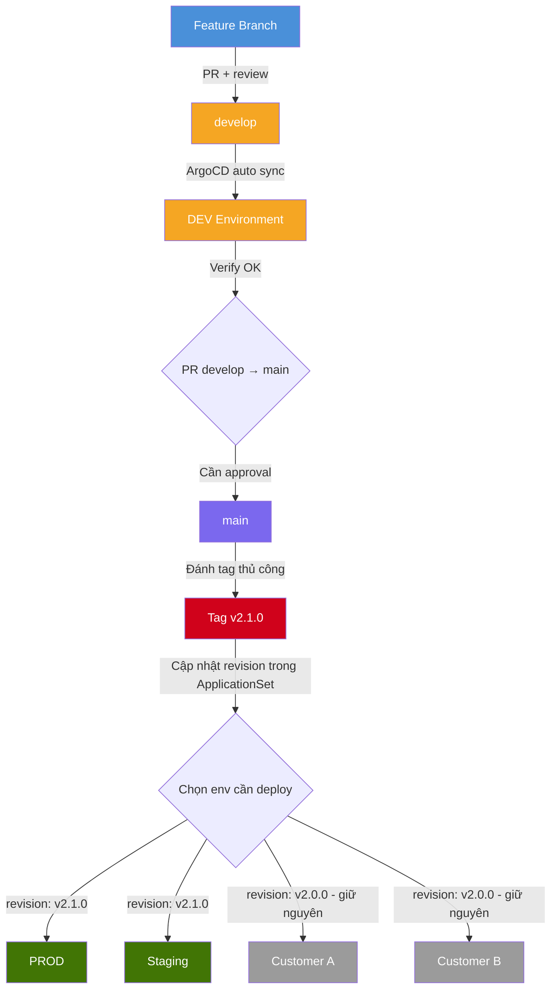
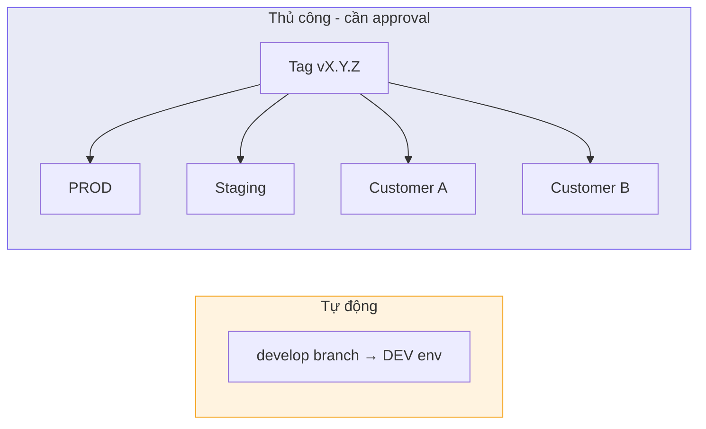
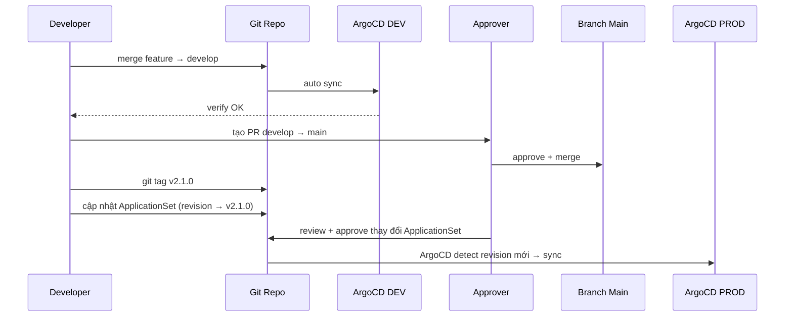
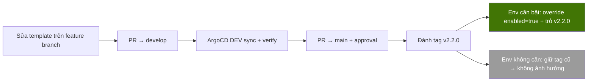

# GitOps CD for Self-Hosted Labs with ArgoCD ApplicationSet

Khi vận hành hệ thống Kubernetes trên môi trường lab hoặc self-hosted, một câu hỏi luôn đặt ra: làm sao để deploy an toàn, kiểm soát được từng môi trường, và scale dễ dàng khi số lượng môi trường sản xuất tăng lên — mà không over-engineer? Bài viết này chia sẻ một quy trình GitOps CD đã được áp dụng thực tế, xây dựng trên ArgoCD, Helm, và Git tagging.

---

## 1. Đặt vấn đề

CI đã xong — code được build, test, đóng image, push lên registry. Phần còn lại là CD: từ lúc có image mới đến khi nó chạy trên cluster. Nghe đơn giản, nhưng thực tế phát sinh hàng loạt bài toán.

**Deploy nhầm lên production.** Với flow đơn giản nhất — ArgoCD trỏ thẳng vào branch main, merge vào là sync ngay — chỉ cần một PR chưa verify kỹ là prod vỡ. Không có bước nào đứng giữa "code vào main" và "code chạy trên prod" để ai đó gật đầu xác nhận.

**Không thể giữ các env ở version khác nhau.** Khi có nhiều môi trường sản xuất (prod, staging, customer-a, customer-b), tất cả cùng trỏ vào branch main nghĩa là tất cả lên cùng version. Thực tế thì customer-a có thể chưa sẵn sàng lên version mới, hoặc cần giữ ổn định trong khi prod đã cần hotfix.

**Rollback phức tạp.** Revert commit trên main có thể gây conflict, đặc biệt khi nhiều feature đã merge chồng lên nhau. Cần một cách rollback nhanh, chắc chắn, không phụ thuộc vào lịch sử commit.

**Thay đổi Helm template ảnh hưởng mọi nơi.** Sửa một file trong `templates/` là tất cả env nhận thay đổi cùng lúc. Không có chỗ nào để test template mới trước khi nó lên production.

**Scale thủ công khi thêm env.** Mỗi môi trường mới cần tạo tay một ArgoCD Application riêng, gần như copy-paste từ cái cũ. 10 env = 10 file gần giống nhau, sửa một thứ phải sửa tất cả.

---

## 2. Giải pháp

Quy trình được xây dựng trên ba trụ cột: **branch isolation** để tách dev khỏi prod, **Git tag** để tạo immutable release point, và **ArgoCD ApplicationSet** để quản lý nhiều env từ một template duy nhất.

### Flow tổng thể



Nguyên tắc xuyên suốt: **develop tự động, main thủ công**. Develop được tự động hoá hoàn toàn để vòng lặp dev/test nhanh — merge vào develop là ArgoCD DEV sync ngay. Ngược lại, main giữ thủ công ở mọi bước: merge cần approval, đánh tag bằng tay với semantic version rõ ràng, cập nhật ApplicationSet cũng cần review. Mỗi lần deploy sản xuất đều có người chịu trách nhiệm.

### Cấu trúc Helm values

Áp dụng values inheritance để tránh duplicate config. `values.yaml` chứa 80–90% config mặc định, file per-env chỉ chứa phần khác biệt:

```
chart/
  templates/               ← chart template dùng chung
  values.yaml              ← base config (default cho mọi env)
  values-dev.yaml          ← delta cho DEV
  values-prod.yaml         ← delta cho PROD
  values-staging.yaml      ← delta cho Staging
  values-customer-a.yaml   ← delta cho Customer A
```

ArgoCD load values theo thứ tự `values.yaml` + `values-<env>.yaml` — Helm merge file sau ghi đè file trước. File per-env chỉ cần vài dòng:

```yaml
# values-prod.yaml — chỉ chứa delta
image:
  tag: "v2.1.0"
replicaCount: 3
resources:
  limits:
    cpu: "1"
    memory: 512Mi
```

### Phân loại môi trường



### Ưu điểm

**Immutable release.** Tag là immutable — v2.0.0 hôm nay giống hệt v2.0.0 tuần trước. Không ai lén commit thêm vào, không có "branch đã thay đổi từ lúc deploy". Biết chính xác production đang chạy cái gì.

**Selective deployment.** Mỗi env trỏ tag riêng. Prod lên v2.1.0, customer-a giữ v2.0.0, staging test v2.2.0-rc1 — hoàn toàn độc lập, không ai ảnh hưởng ai.

**Rollback trivial.** Đổi revision trong ApplicationSet về tag cũ là xong. Không revert commit, không cherry-pick, không conflict. Tag immutable nên trạng thái cũ chắc chắn vẫn nguyên vẹn.

**Template change an toàn.** Thay đổi Helm template chỉ nằm trên develop trước, ArgoCD DEV sync để verify. Env sản xuất chỉ nhận template mới khi được trỏ vào tag mới — không có chuyện sửa template là ảnh hưởng tất cả.

**Scale dễ dàng.** Thêm env mới = thêm một values file + một entry trong ApplicationSet. Không tạo tay Application, không copy-paste.

**Audit trail rõ ràng.** Tag name chính là version — nhìn ApplicationSet biết ngay mỗi env đang chạy gì. Không cần tra commit hash hay diff branch.

### Nhược điểm

**Nhiều tag.** Vì tag immutable, mỗi thay đổi config nhỏ (đổi replicas, sửa ingress) cũng cần tag mới. Giải pháp: dùng semantic versioning nhất quán — v2.0.0 → v2.0.1 cho patch, v2.1.0 cho feature.

**Quy trình dài hơn một bước.** So với "merge main = deploy ngay", giờ phải đánh tag rồi cập nhật ApplicationSet. Đây là trade-off có chủ đích: chậm hơn vài phút nhưng an toàn hơn rất nhiều.

**Values nằm trong tag.** ArgoCD lấy toàn bộ content tại thời điểm tag — bao gồm values file. Muốn đổi config cho một env mà chart không đổi vẫn phải tạo tag mới.

**ApplicationSet là điểm kiểm soát trung tâm.** Ai có quyền sửa revision trong ApplicationSet thực chất là có quyền deploy. Cần phân quyền rõ ràng.

---

## 3. Thực hiện

### 3.1. ApplicationSet

Một file duy nhất quản lý tất cả env:

```yaml
apiVersion: argoproj.io/v1alpha1
kind: ApplicationSet
metadata:
  name: myapp
  namespace: argocd
spec:
  generators:
    - list:
        elements:
          # DEV — trỏ branch, auto sync
          - env: dev
            revision: develop
            valuesFile: values-dev.yaml
            namespace: myapp-dev

          # Sản xuất — trỏ tag, manual control
          - env: staging
            revision: v2.1.0
            valuesFile: values-staging.yaml
            namespace: myapp-staging

          - env: prod
            revision: v2.1.0
            valuesFile: values-prod.yaml
            namespace: myapp-prod

          - env: customer-a
            revision: v2.0.0
            valuesFile: values-customer-a.yaml
            namespace: myapp-customer-a

          - env: customer-b
            revision: v2.0.3
            valuesFile: values-customer-b.yaml
            namespace: myapp-customer-b

  template:
    metadata:
      name: "myapp-{{env}}"
    spec:
      project: default
      source:
        repoURL: https://git.example.com/myapp.git
        targetRevision: "{{revision}}"
        path: chart
        helm:
          valueFiles:
            - values.yaml
            - "{{valuesFile}}"
      destination:
        server: https://kubernetes.default.svc
        namespace: "{{namespace}}"
      syncPolicy:
        automated:
          prune: true
          selfHeal: true
        syncOptions:
          - CreateNamespace=true
```

### 3.2. Deploy version mới



Thao tác cụ thể:

```bash
# 1. PR develop → main đã được approve và merge
# 2. Đánh tag
git checkout main
git tag v2.1.0
git push origin --tags

# 3. Sửa ApplicationSet — chỉ env cần lên
#    staging: v2.0.0 → v2.1.0
#    prod:    v2.0.0 → v2.1.0
#    customer-a: giữ nguyên v2.0.0
```

### 3.3. Hotfix

```bash
# Fix trên main, tag patch
git checkout main
# fix...
git commit -m "hotfix: fix critical bug"
git tag v2.1.1
git push origin main --tags
```

```yaml
# Chỉ lên prod, không đụng env khác
- env: prod
  revision: v2.1.1       # lên hotfix

- env: staging
  revision: v2.1.0       # test sau

- env: customer-a
  revision: v2.0.0       # không liên quan
```

### 3.4. Rollback

```yaml
# Prod lỗi ở v2.1.0 → quay về v2.0.0
- env: prod
  revision: v2.0.0
```

Không revert commit, không cherry-pick. Đổi revision là xong.

### 3.5. Thêm môi trường sản xuất mới

Hai bước duy nhất:

```yaml
# 1. Tạo values file — chart/values-customer-c.yaml
image:
  tag: "abc123"
replicaCount: 2
ingress:
  host: customer-c.example.com
```

```yaml
# 2. Thêm entry trong ApplicationSet
- env: customer-c
  revision: v2.0.0
  valuesFile: values-customer-c.yaml
  namespace: myapp-customer-c
```

### 3.6. Template change an toàn

Nguyên tắc: mọi field mới trong template phải có default an toàn.

```yaml
# templates/deployment.yaml
{{- if .Values.topologySpread.enabled }}
topologySpreadConstraints:
  ...
{{- end }}

# values.yaml (base)
topologySpread:
  enabled: false          # default TẮT — prod an toàn
```



### 3.7. Quy ước đặt tên tag

| Loại thay đổi | Format | Ví dụ |
|---|---|---|
| Feature mới / template change | vX.Y.0 | v2.1.0, v2.2.0 |
| Config change / patch nhỏ | vX.Y.Z | v2.0.1, v2.1.3 |
| Hotfix khẩn cấp | vX.Y.Z | v2.1.1 |

Semantic versioning giúp nhìn tag biết ngay mức độ thay đổi. Minor bump (v2.1.0 → v2.2.0) là có template mới, patch bump (v2.1.0 → v2.1.1) chỉ là config hoặc hotfix.

---

## 4. Kết luận

Quy trình này không phát minh ra điều gì mới — nó kết hợp những thứ đã có (Git branching, tagging, Helm values inheritance, ArgoCD ApplicationSet) thành một flow nhất quán, giải quyết đúng các bài toán thực tế của môi trường lab/self-hosted.

Ba lớp kiểm soát bổ sung cho nhau: branch isolation giữ dev không ảnh hưởng prod, tag tạo immutable release point để rollback chắc chắn, ApplicationSet cho phép mỗi env ở version riêng và scale bằng cách thêm entry. Develop tự động để nhanh, main thủ công để an toàn — mỗi lần deploy sản xuất đều có người chịu trách nhiệm.

Trade-off chính là nhiều tag hơn và chậm hơn vài phút so với auto sync từ branch. Nhưng với môi trường sản xuất, vài phút chủ động kiểm soát luôn rẻ hơn vài giờ khắc phục sự cố.