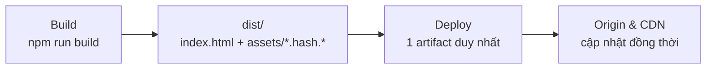
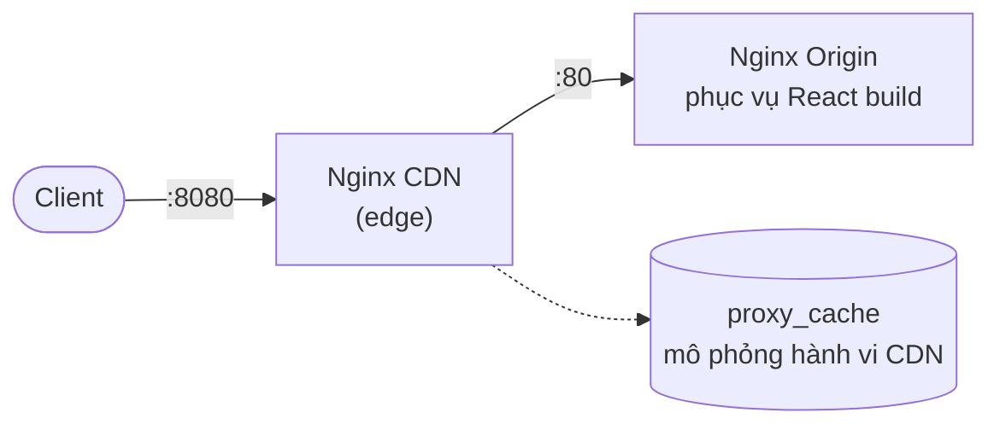

# SPA Cache Strategy & ChunkLoadError Prevention

## Vấn đề

### 1.1 Bối cảnh & Mục tiêu

- Đảm bảo người dùng luôn nhận được phiên bản giao diện mới nhất ngay sau mỗi lần triển khai (deploy).
- Tối ưu băng thông và giảm tải cho máy chủ/CDN thông qua cơ chế revalidation (304 Not Modified).
- Tận dụng cache dài hạn cho static assets (JS/CSS/Image) mà vẫn đảm bảo tính nhất quán giữa `index.html` và các bundle được tham chiếu.
- Không để lỗi tải chunk xảy ra ngay cả với những tab đã mở sẵn từ trước khi deploy — đây là use case dễ bị bỏ sót nếu chỉ nghĩ tới cache header.

**Phạm vi áp dụng:**
- File `index.html` (entry point của SPA)
- Các framework: React, Vue, Angular (và các SPA framework khác dùng cơ chế build hash tương tự)
- Môi trường triển khai: Nginx, CDN (CloudFront, Cloudflare, Fastly...), Object Storage (S3, GCS...)

Có **hai use case cụ thể** cần xử lý, và chúng đòi hỏi hai cơ chế phòng thủ hoàn toàn khác nhau — trình bày riêng dưới đây trước khi đi vào giải pháp ở Phần 2.

### 1.2 Hai use case cần xử lý

| | Use case 1 — `index.html` bị cache dài hạn | Use case 2 — Tab đã mở từ trước khi deploy |
|---|---|---|
| Kịch bản | Trình duyệt/CDN cache `index.html` quá lâu; sau deploy, `index.html` cũ vẫn trỏ tới asset (JS/CSS có hash) đã bị xoá khỏi server | Tab chạy SPA liên tục qua một lần deploy (không reload), rồi mới lazy-load (`React.lazy`/`import()`) một chunk chưa từng tải trong session |
| Request phát sinh khi nào | Trình duyệt tự gửi lại mỗi lần navigate/reload | Chỉ khi user thao tác tới đúng phần code chưa tải — URL chunk đã hard-code sẵn trong bundle cũ đang chạy trong bộ nhớ |
| Có ETag để revalidate không | Có | Không — chunk không còn tồn tại, không có gì để so sánh |
| Hậu quả | `ChunkLoadError`, `404`, giao diện không cập nhật | `Failed to fetch dynamically imported module` / `ChunkLoadError`, màn hình trắng nếu không có error boundary |

Hai use case này có cơ chế lỗi khác nhau hoàn toàn — một bên là vấn đề cache ở tầng HTTP, một bên là URL cứng trong JS đang chạy — nên không thể gộp chung một cách xử lý.

---

## Giải pháp

### 2.1 Giải pháp cho Use case 1: chiến lược cache 2 tầng

Áp dụng **hai chiến lược cache khác nhau** cho hai nhóm tài nguyên:

| Thành phần | Cache-Control | Lý do |
|---|---|---|
| `index.html` | `no-cache, must-revalidate` | Luôn kiểm tra lại với server trước khi dùng cache, đảm bảo không bao giờ dùng bản cũ mà không xác thực |
| JS/CSS có hash trong tên file | `public, max-age=31536000, immutable` | URL thay đổi theo hash → có thể cache "vĩnh viễn" mà không lo xung đột phiên bản |
| Images có hash | `public, max-age=31536000, immutable` | Tương tự JS/CSS |
| API response | Theo nghiệp vụ cụ thể | Không thuộc phạm vi tài liệu này |

> **Lưu ý quan trọng:** `no-cache` **không có nghĩa là không cache**. Theo đúng ngữ nghĩa HTTP, nó có nghĩa là trình duyệt/cache vẫn được phép lưu response nhưng **bắt buộc phải revalidate** (gửi kèm `If-None-Match`) với server trước khi sử dụng. Phần 3.1 sẽ chỉ ra một cache thực tế (Nginx `proxy_cache`) không tuân theo đúng ngữ nghĩa này — điều đáng biết trước khi tin tưởng tuyệt đối vào lý thuyết.

#### Cơ chế Revalidation cho `index.html`

Header phản hồi chuẩn:

```http
Cache-Control: no-cache, must-revalidate
ETag: "release-20260616-001"
```

**Bước 1 — Truy cập lần đầu:**

```http
HTTP/1.1 200 OK
Cache-Control: no-cache, must-revalidate
ETag: "release-20260616-001"
```

Trình duyệt lưu `index.html` vào cache cùng với ETag.

**Bước 2 — Các lần truy cập tiếp theo**, trình duyệt tự động gửi:

```http
GET /index.html HTTP/1.1
If-None-Match: "release-20260616-001"
```

**Bước 3a — Nếu nội dung chưa đổi:**

```http
HTTP/1.1 304 Not Modified
```

→ Trình duyệt dùng lại bản cache cục bộ, **không tải lại body**, tiết kiệm băng thông.

**Bước 3b — Nếu đã có bản deploy mới:**

```http
HTTP/1.1 200 OK
ETag: "release-20260616-002"
```

→ Trình duyệt tải `index.html` mới, và do đó luôn trỏ tới các asset đúng với bản build mới nhất.

#### Chiến lược cache cho Static Assets

Static assets bắt buộc phải được **build với content-hash trong tên file**:

```
main.a1b2c3.js
vendor.x7y8z9.js
style.d4e5f6.css
```

Cấu hình cache:

```http
Cache-Control: public, max-age=31536000, immutable
```

Vì mỗi lần nội dung file thay đổi, hash trong tên file cũng thay đổi → URL mới hoàn toàn → không xảy ra xung đột giữa cache cũ và bản mới. `immutable` báo cho trình duyệt biết không cần revalidate lại trong suốt thời gian sống của cache.

#### Quy trình triển khai (Deployment Flow)

Trong thực tế, `index.html` và assets hầu như luôn được deploy **cùng một cục** — một build artifact duy nhất (một Docker image, một lần `aws s3 sync` cả thư mục `dist/`, một bản build CI/CD) — chứ không tách thành các bước thủ công "upload assets trước, đợi xong mới update index.html".



#### Bảng tóm tắt cấu hình

| Thành phần | Cache-Control | Ghi chú |
|---|---|---|
| `index.html` | `no-cache, must-revalidate` | Kèm ETag tự động sinh theo release |
| JS/CSS có hash | `public, max-age=31536000, immutable` | Hash đổi → URL đổi → an toàn cache dài hạn |
| Images có hash | `public, max-age=31536000, immutable` | Tương tự JS/CSS |
| API response | Theo nghiệp vụ | Thường `no-store` hoặc cache ngắn tùy use case |

#### Hiện thực hoá: Nginx CDN + Nginx Origin bằng Docker

Đây là cách hiện thực hoá chiến lược trên bằng một mô hình 2 container:



- **Origin**: một image Docker build React app (Vite) bằng multi-stage build, Nginx origin chịu trách nhiệm set đúng `Cache-Control`/`ETag` cho từng loại file — chính là cấu hình vừa trình bày ở trên.
- **CDN (edge)**: một Nginx khác, dùng `proxy_cache` để cache lại response từ origin — mô phỏng hành vi CDN thật (CloudFront, Cloudflare): cache theo chính sách được cấu hình, tự lưu cache ở edge, trả `X-Cache-Status` để debug.

**Cấu trúc thư mục**

```
spa-caching/
├── docker-compose.yml
├── origin/
│   ├── Dockerfile
│   └── nginx.origin.conf
├── cdn/
│   └── nginx.cdn.conf
└── app/                # React app (Vite)
    ├── src/
    ├── package.json
    └── ...
```

**Origin: Docker image build React + Nginx**

`origin/Dockerfile`

```dockerfile
# Stage 1: build React app
FROM node:20-alpine AS build
WORKDIR /app
COPY app/package*.json ./
RUN npm install
COPY app/ .
RUN npm run build     # output ra /app/dist, cac bundle co hash: main.[hash].js...

# Stage 2: phuc vu bang Nginx
FROM nginx:1.27-alpine AS origin
COPY --from=build /app/dist /usr/share/nginx/html
COPY origin/nginx.origin.conf /etc/nginx/conf.d/default.conf
EXPOSE 80
```

> Dùng `npm install` thay vì `npm ci` vì repo demo chưa commit `package-lock.json`. Ở production nên commit lockfile và dùng `npm ci` để build reproducible.

`origin/nginx.origin.conf` — áp dụng đúng chính sách cache đã bàn ở trên:

```nginx
server {
    listen 80;
    server_name origin;
    root /usr/share/nginx/html;

    # index.html: luon phai revalidate, khong cache dai han
    location = /index.html {
        add_header Cache-Control "no-cache, must-revalidate" always;
        etag on;
        try_files $uri =404;
    }

    # Static assets co hash trong ten: cache 1 nam, immutable
    location ~* \.(js|css|png|jpg|jpeg|svg|woff2?)$ {
        add_header Cache-Control "public, max-age=31536000, immutable" always;
        try_files $uri =404;
    }

    # Fallback cho client-side routing
    location / {
        try_files $uri $uri/ /index.html;
    }
}
```

**CDN (edge): Nginx đóng vai proxy cache**

`cdn/nginx.cdn.conf` — đây là bản cấu hình cuối cùng, đã tách riêng `index.html` khỏi phần cache assets:

```nginx
proxy_cache_path /var/cache/nginx-cdn levels=1:2 keys_zone=cdn_cache:10m max_size=200m inactive=60m use_temp_path=off;

server {
    listen 80;
    server_name cdn-edge;

    # index.html luon mang Cache-Control: no-cache tu origin.
    # QUAN TRONG: nginx proxy_cache mac dinh coi "no-cache" nhu "khong luu"
    # (khac voi HTTP spec: no-cache nghia la "luu nhung phai revalidate
    # truoc khi dung") -> phai proxy_ignore_headers de ep nginx van cache
    # theo TTL tu chon, thay vi bo qua cache hoan toan.
    #
    # Micro-cache: TTL rat ngan (5s), ngan hon nhieu so voi assets (1h),
    # de hap thu traffic spike va giam so request don origin - doi lai
    # index.html co the "cham" toi da 5s so voi ban origin moi nhat.
    location = /index.html {
        proxy_pass http://origin:80;
        proxy_set_header Host $host;

        proxy_ignore_headers Cache-Control;
        proxy_cache cdn_cache;
        proxy_cache_key $scheme$request_method$host$request_uri;
        proxy_cache_valid 200 5s;
        proxy_cache_lock on;
        proxy_cache_use_stale error timeout updating;
        proxy_cache_background_update on;
        proxy_cache_revalidate on;

        add_header X-Cache-Status $upstream_cache_status always;
    }

    location / {
        proxy_pass http://origin:80;
        proxy_set_header Host $host;

        # Bat cache, dung chung key theo URI
        proxy_cache cdn_cache;
        proxy_cache_key $scheme$request_method$host$request_uri;

        # proxy_cache_valid la fallback khi origin khong set Cache-Control.
        # Voi assets immutable, gia tri nay thuc te khong con y nghia vi
        # max-age=31536000 tu origin da du dai.
        proxy_cache_valid 200 1h;
        proxy_cache_use_stale error timeout updating;

        # Cho phep CDN tu revalidate voi origin khi ban cache o edge stale
        proxy_cache_revalidate on;

        # Header debug de nhin thay HIT/MISS/BYPASS
        add_header X-Cache-Status $upstream_cache_status always;
    }
}
```

Lý do tách riêng `location = /index.html`: đây thực ra **sát với cách nhiều CDN thật cấu hình** hơn là cố nhồi mọi request vào một cache behavior duy nhất — HTML/entry point thường có chính sách TTL riêng, ngắn hơn hẳn static assets. Bản thiết kế ban đầu dùng chung một `location /` cho mọi thứ, và test thật đã lộ ra vì sao cách đó không hoạt động đúng như kỳ vọng — toàn bộ quá trình phát hiện, cộng với bằng chứng cho lựa chọn micro-cache 5s ở trên, nằm ở Phần 3.1.

`proxy_cache_lock on` đảm bảo khi nhiều request cùng lúc gặp `MISS`, chỉ một request được đi tới origin — các request còn lại chờ kết quả thay vì cùng dội vào origin. `proxy_cache_background_update on` giúp khi cache hết hạn (5s trôi qua), request đầu tiên vẫn được trả **ngay lập tức** từ bản cache cũ (đánh dấu `STALE`) trong khi Nginx âm thầm đi lấy bản mới ở background — client không phải chờ origin.

**`docker-compose.yml` — dựng cả 2 tầng cùng lúc**

```yaml
services:
  origin:
    build:
      context: .
      dockerfile: origin/Dockerfile
    container_name: origin
    expose:
      - "80"

  cdn:
    image: nginx:1.27-alpine
    container_name: cdn-edge
    depends_on:
      - origin
    ports:
      - "8080:80"
    volumes:
      - ./cdn/nginx.cdn.conf:/etc/nginx/conf.d/default.conf:ro
```

> Bỏ khóa `version: "3.9"` — Docker Compose bản mới (v2+) không cần khai báo version nữa và sẽ cảnh báo deprecated nếu có.

Chạy lên:

```bash
docker compose up --build -d
```

Client sẽ gọi vào `http://localhost:8080` (CDN), CDN gọi ngược vào origin qua network nội bộ Docker.

### 2.2 Giải pháp cho Use case 2: retry-once-then-reload phía client

Áp dụng đúng pattern trong bài dev.to: bọc `import()` động bằng một wrapper tự phát hiện lỗi tải chunk, tự `reload()` **đúng một lần** (đánh dấu bằng `sessionStorage` để không lặp vô hạn), và một Error Boundary làm lưới an toàn cuối cùng nếu retry vẫn thất bại.

**`app/src/lazyRetry.js`**

```javascript
// Adapted from https://dev.to/devin-rosario/fix-react-chunk-load-errors-fast-2025-guide-2j52
// Nguyen ban kiem tra error.name === 'ChunkLoadError' - do la ten loi cua Webpack.
// Vite (dung trong demo nay) khong nem loi do; that bai khi dong nhap module
// tra ve mot TypeError voi message "Failed to fetch dynamically imported module: ...".
export function lazyRetry(componentImport) {
  return new Promise((resolve, reject) => {
    const hasRefreshed = JSON.parse(
      window.sessionStorage.getItem('retry-lazy-refreshed') || 'false'
    )

    componentImport()
      .then((component) => {
        window.sessionStorage.setItem('retry-lazy-refreshed', 'false')
        resolve(component)
      })
      .catch((error) => {
        if (!hasRefreshed) {
          window.sessionStorage.setItem('retry-lazy-refreshed', 'true')
          window.location.reload()
          return
        }
        reject(error)
      })
  })
}
```

**`app/src/ChunkErrorBoundary.jsx`**

```jsx
import { Component } from 'react'

const CHUNK_ERROR_PATTERN = /Failed to fetch dynamically imported module|error loading dynamically imported module/i

export default class ChunkErrorBoundary extends Component {
  state = { hasError: false }

  static getDerivedStateFromError() {
    return { hasError: true }
  }

  componentDidCatch(error) {
    const isChunkError =
      error?.name === 'ChunkLoadError' || CHUNK_ERROR_PATTERN.test(error?.message || '')

    if (isChunkError) {
      const refreshed = sessionStorage.getItem('chunk-error-refreshed')
      if (!refreshed) {
        sessionStorage.setItem('chunk-error-refreshed', 'true')
        window.location.reload()
      }
    }
  }

  render() {
    if (this.state.hasError) {
      return <div id="chunk-error">Dang tai lai phien ban moi...</div>
    }
    return this.props.children
  }
}
```

**`app/src/App.jsx`** — nối hai lớp phòng thủ vào chỗ dùng `React.lazy`:

```jsx
import { lazy, Suspense, useState } from 'react'
import { lazyRetry } from './lazyRetry.js'
import ChunkErrorBoundary from './ChunkErrorBoundary.jsx'

const LazyPanel = lazy(() => lazyRetry(() => import('./LazyPanel.jsx')))

export default function App() {
  const [showPanel, setShowPanel] = useState(false)
  return (
    <div>
      <button onClick={() => setShowPanel(true)}>Load Panel</button>
      {showPanel && (
        <ChunkErrorBoundary>
          <Suspense fallback={<div>Loading panel...</div>}>
            <LazyPanel />
          </Suspense>
        </ChunkErrorBoundary>
      )}
    </div>
  )
}
```

Hai lớp phối hợp theo nguyên tắc **retry trong suốt trước, hiện lỗi sau**:

1. **Lần thất bại đầu tiên** (trường hợp phổ biến nhất — chunk cũ đã bị dọn sau deploy): `lazyRetry` bắt lỗi, set cờ, gọi `reload()` ngay — promise không bao giờ resolve/reject, nên React chưa kịp thấy lỗi gì cả. Người dùng thấy trang refresh một nhịp, không thấy màn hình lỗi.
2. **Lần thất bại thứ hai** (sau khi đã reload mà vẫn lỗi — nghĩa là deploy thật sự có vấn đề, không phải do race condition): `lazyRetry` reject thật, lỗi rơi vào `ChunkErrorBoundary`, boundary tự reload thêm đúng một lần nữa (cờ session riêng), rồi nếu vẫn lỗi thì dừng lại, hiện fallback UI thay vì màn hình trắng crash.

---

## Thực nghiệm

### 3.1 Thực nghiệm Use case 1: Docker (Nginx CDN + Nginx Origin)

Mô hình ở mục 2.1 đã được dựng và test thật bằng Docker Compose. Origin xử lý conditional GET đúng chuẩn ngay từ đầu (test trực tiếp, bỏ qua CDN):

```bash
$ curl -i http://origin:80/index.html -H 'If-None-Match: "6a7f5bcc-145"'
HTTP/1.1 304 Not Modified
Cache-Control: no-cache, must-revalidate
```

**Phát hiện khi test qua CDN:** bản thiết kế ban đầu dùng chung một `location /` cho mọi request. Với `index.html`, kết quả không giống lý thuyết "`proxy_cache` tôn trọng `Cache-Control` của origin": `X-Cache-Status` luôn là `MISS` (kể cả gọi lần 2), và gửi đúng `If-None-Match` vẫn nhận `200` full body thay vì `304`.

Nguyên nhân, xác nhận bằng cách đối chiếu với origin trực tiếp:

1. Nginx `proxy_cache` diễn giải `Cache-Control: no-cache` như `no-store` — không lưu gì vào cache zone, khác ngữ nghĩa RFC 7234 ("lưu nhưng phải revalidate"). `index.html` do đó không bao giờ có bản lưu ở edge.
2. Khi location bật `proxy_cache`, Nginx không forward `If-None-Match` của client lên origin — nó tự revalidate dựa trên bản *nó* lưu. Vì chưa từng lưu gì (điểm 1), không có gì để revalidate, nên chỉ lấy nguyên bản mới từ origin và trả `200` đầy đủ.

Test một asset **đã có trong cache** xác nhận cơ chế "tự trả `304` từ bản đã lưu" vẫn đúng khi có gì đó để so sánh:

```bash
$ curl -i http://localhost:8080/assets/index.4nv8o8qb.js -H 'If-None-Match: "6a7f5bcc-22dcb"'
HTTP/1.1 304 Not Modified
X-Cache-Status: HIT
```

**Cách sửa** (đã áp dụng ở mục 2.1): tách `index.html` ra một `location` riêng và ép nó cache theo TTL ngắn (5s) bằng `proxy_ignore_headers Cache-Control`, thay vì tắt hẳn cache — mục tiêu là giảm số request dội thẳng vào origin (micro-cache) thay vì bypass hoàn toàn. Lifecycle thật, đo bằng `sleep` giữa các lần gọi:

```bash
$ curl -i http://localhost:8080/index.html          # t=0s
X-Cache-Status: MISS
$ curl -i http://localhost:8080/index.html          # t=1s, t=3s
X-Cache-Status: HIT
$ curl -i http://localhost:8080/index.html          # t=6s — TTL 5s đã hết hạn
X-Cache-Status: STALE      # trả ngay bản cũ, client không phải chờ origin
$ curl -i http://localhost:8080/index.html          # t=6.5s
X-Cache-Status: HIT        # background update đã refresh xong
```

Đối chiếu access log của origin trong cùng khoảng thời gian: 5 request từ client nhưng origin chỉ ghi nhận 2 request thật — một `200` (fetch đầy đủ lúc `MISS`) và một `304` (revalidate rẻ nhờ `proxy_cache_revalidate`, không truyền lại body). Đúng mục tiêu giảm tải origin.

**Đánh đổi cần biết:** khác với cách bypass hoàn toàn (luôn fresh tuyệt đối), `index.html` giờ có thể "chậm" tối đa ~5s so với bản mới nhất sau khi redeploy. Test thật xác nhận: redeploy ngay sau khi vừa có 1 bản cache — 0.5s sau vẫn `HIT` với ETag **cũ**; đợi hết TTL (~6s) mới thấy asset hash mới xuất hiện. Đây là đánh đổi có chủ đích: bounded staleness vài giây, đổi lấy origin đỡ tải hẳn dưới traffic cao.

**Kịch bản test còn lại**, curl output thật, tất cả đúng kỳ vọng:

- **Asset có hash:** `MISS` lần đầu → `HIT` từ lần sau, không chạm origin.
- **Điểm bất ngờ với asset cũ sau redeploy:** gọi trực tiếp origin cho asset của bản build cũ → `404` (Dockerfile build "từ đầu", không cộng dồn file). Nhưng gọi cùng URL đó **qua CDN** → vẫn `200 HIT`, vì CDN đã cache nó từ trước khi origin bị thay. Đây là lưới an toàn giúp tab cũ không vỡ ngay lập tức — nhưng **có thời hạn**, giới hạn bởi `inactive=60m`/`max_size=200m` trong `proxy_cache_path`. Một khi cache CDN hết hạn, asset cũ 404 thật — đây cũng chính là điều kiện khiến use case 2 (mục 1.2) xảy ra trên thực tế.

**Tổng kết:**

| Lớp | Header quyết định | Kết quả test |
|---|---|---|
| CDN — `location = /index.html` | `proxy_ignore_headers`, `proxy_cache_valid 5s`, `proxy_cache_lock`, `proxy_cache_background_update` | `MISS` → `HIT` trong 5s → `STALE` (refresh nền) → `HIT`; `304` từ edge khi đã cache; origin chỉ thấy fetch thật hoặc revalidate rẻ |
| CDN — `location /` (assets) | `proxy_cache_valid`, `proxy_cache_revalidate` | `MISS` → `HIT`; `304` trả thẳng từ edge khi đã cache |
| `index.html` | `no-cache, must-revalidate` | Không bao giờ stale quá 5s ở CDN — đánh đổi có chủ đích để giảm tải origin |
| `assets/*.hash.js/css` | `public, max-age=31536000, immutable` | Sống sót qua deploy nhờ cache CDN, nhưng có giới hạn thời gian, không phải vĩnh viễn |

### 3.2 Thực nghiệm Use case 2: Playwright + Chromium headless

Toàn bộ luồng ở mục 2.2 được test bằng kịch bản: mở tab thật, **không đóng tab**, deploy một bản mới ở phía sau (đổi hash chunk, xoá sạch cache CDN), rồi mới thao tác trong tab cũ — đúng như tình huống thật ngoài đời.

**Bước 1 — dựng baseline chưa có fix, xác nhận hoạt động bình thường:**

```
TEST 1: baseline, click works normally (no redeploy)
PASS: lazy panel loaded -> Lazy panel loaded OK
```

**Bước 2 — mở tab, KHÔNG bấm gì, deploy bản mới ở phía sau (chunk cũ biến mất khỏi cả origin lẫn CDN), rồi mới bấm nút trong tab cũ:**

```
TEST 2: stale tab, redeploy BEFORE first click, NO client-side fix
lazy-panel present after click? false
network responses for LazyPanel chunk:
  "404 http://localhost:8080/assets/LazyPanel.KWD-Rdy5.js"
pageerror events:
  "Failed to fetch dynamically imported module: http://localhost:8080/assets/LazyPanel.KWD-Rdy5.js"
console error events:
  "TypeError: Failed to fetch dynamically imported module: http://localhost:8080/assets/LazyPanel.KWD-Rdy5.js"
```

Đúng như dự đoán: không có `lazyRetry`/`ChunkErrorBoundary`, lỗi rơi thẳng ra `pageerror` — trong React thật (không chỉ demo tối giản này), đây là điểm khiến cả cây component crash và màn hình trắng ra.

**Bước 3 — build lại với `lazyRetry` + `ChunkErrorBoundary`, lặp lại đúng kịch bản (mở tab, không bấm, deploy bản mới phía sau, rồi mới bấm):**

```
Redeploy done (vD). Clicking "Load Panel" for the FIRST time in the stale (vC) tab...
Navigation observed after click. URLs: [ 'http://localhost:8080/' ]
sessionStorage retry-lazy-refreshed after reload: true

Clicking "Load Panel" again post-reload (state was reset by full page reload)...
FINAL PANEL TEXT: Lazy panel loaded OK (vD, after self-heal)
sessionStorage retry-lazy-refreshed after success: false

Total top-level navigations observed after the redeploy click: 1
```

Đúng một lần `reload()` — không lặp vô hạn — và sau khi reload, trang nạp đúng bản mới nhất (`vD`), thao tác lại thành công. `sessionStorage` flag tự reset về `false` ngay khi lần tải thành công, sẵn sàng cho lần lỗi tiếp theo (nếu có) ở một deploy khác trong tương lai.

---

## Kết luận

Chiến lược cache cho SPA thực chất chỉ xoay quanh một nguyên tắc: **`index.html` là nguồn sự thật duy nhất, phải luôn được revalidate; còn static assets có hash thì được tin tưởng cache dài hạn**. Nhưng "revalidate" trên lý thuyết HTTP và "revalidate" trong một cache thực thi cụ thể (ở đây là Nginx `proxy_cache`) không phải lúc nào cũng khớp nhau y hệt — Phần 3.1 là ví dụ cụ thể cho thấy việc test bằng công cụ thật (Docker + curl) quan trọng hơn việc tin vào mô tả "tôn trọng Cache-Control" một cách chung chung.

Khi áp dụng đúng, chiến lược này mang lại lợi ích rõ ràng:

- **Luôn cập nhật đúng phiên bản:** Người dùng không bao giờ bị kẹt ở bản UI cũ sau deploy.
- **Không còn lỗi ChunkLoadError/404:** Vì `index.html` luôn trỏ đúng tới asset tương ứng với chính nó.
- **Tiết kiệm băng thông:** Nhờ cơ chế `304 Not Modified` khi nội dung `index.html` không đổi.
- **Hiệu năng tối ưu:** Static assets được cache dài hạn (1 năm), giảm tải server đáng kể.
- **Không cần xóa cache thủ công:** Người dùng không phải hard-refresh (Ctrl+Shift+R) để thấy bản mới.

Và dù cache header có đúng tuyệt đối, vẫn còn một khe hở mà không header nào vá được: **tab đã mở từ trước khi deploy**  **kết hợp** thêm một lớp phòng thủ khác ở tầng JavaScript runtime — retry khi lazy-load thất bại — bên cạnh chiến lược cache header, chứ không thể chỉ dựa vào một trong hai. Điều kiện nhận diện lỗi retry cũng phải khớp đúng bundler đang dùng.