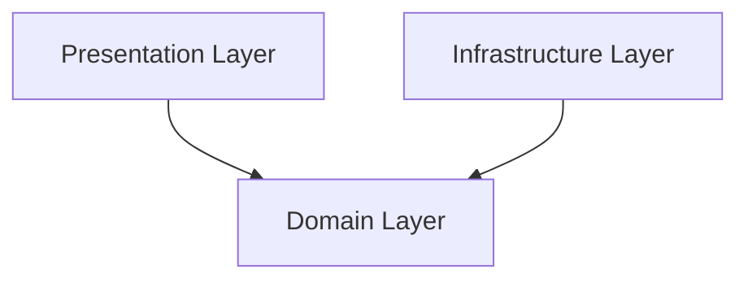

# Clean Architecture trong Frontend React

## 1. Mục tiêu

Trình bày kết quả của một **Proof of Concept (POC)** nhằm:

- Đánh giá khả năng áp dụng **Clean Architecture** cho Frontend (React / Next.js)
- Xác định cách tổ chức code **tách biệt rõ business logic và UI**
- Kiểm chứng hiệu quả của việc **tách mutation state và persistent state**
- Đề xuất một mô hình kiến trúc có thể **mở rộng và tái sử dụng** cho các feature liên quan đến Authentication

## 2. Phạm vi và đối tượng áp dụng

### 2.1 Phạm vi

- Feature: **Login**
- Nền tảng: **Next.js 15 + TypeScript**
- Trạng thái xác thực: **Client-side (POC)**

### 2.2 Đối tượng

- Frontend Engineer
- Tech Lead / Software Architect
- Nhóm phát triển đang cân nhắc áp dụng Clean Architecture cho FE

## 3. Tổng quan kiến trúc

### 3.1 Mô hình kiến trúc

POC sử dụng mô hình **3-layer** theo tinh thần Clean Architecture (dependency):

### 3.2 Nguyên tắc thiết kế chính

| Kỹ thuật | Vấn đề gặp phải | Cách giải quyết | Lợi ích |
| --- | --- | --- | --- |
| **Separation of Concerns** | UI, business, data access trộn lẫn | Tách Presentation / Use Case / Domain / Infrastructure | Code rõ ràng, dễ test, dễ bảo trì |
| **Dependency Inversion** | Business phụ thuộc framework, API | Phụ thuộc vào **interface**, inject implementation | Thay đổi hạ tầng không ảnh hưởng logic |
| **Use Case–centric Design** | Code tổ chức theo technical | Tổ chức theo **hành vi nghiệp vụ (Use Case)** | Bám sát nghiệp vụ, dễ đọc |
| **Framework-agnostic Domain Logic** | Logic bị lock vào React/Next | Domain không import framework | Tái sử dụng, độc lập công nghệ |

## 4. Các concept kỹ thuật được sử dụng

### 4.1 Clean Architecture

| Nội dung | Mô tả |
| --- | --- |
| Định nghĩa | Clean Architecture tổ chức hệ thống theo các vòng tròn phụ thuộc |
| Quy tắc phụ thuộc | Domain Layer không phụ thuộc Presentation hay Infrastructure |
| Hướng phụ thuộc | Dependency luôn hướng từ ngoài vào trong |
| Áp dụng trong POC | `LoginUseCase` không phụ thuộc React, Next.js |
|  | Repository được inject thông qua interface |

### 4.2 Use Case Pattern

| Nội dung | Mô tả |
| --- | --- |
| Khái niệm | Use Case đại diện cho một hành vi nghiệp vụ cụ thể |
| Use Case trong POC | `LoginUseCase.execute(credentials)` |
| Trách nhiệm | Validate dữ liệu đầu vào |
|  | Gọi Repository |
|  | Trả về `AuthSession` |

### 4.3 Dependency Injection qua React Context

| Nội dung | Mô tả |
| --- | --- |
| Cách tiếp cận | Sử dụng React Context như DI container nhẹ |
| Dependency được inject | `LoginUseCase` |
|  | `AuthStore` |
| Lợi ích | Dependency rõ ràng (explicit) |
|  | Dễ mock khi test |
|  | Không phụ thuộc DI framework bên ngoài |

### 4.4 Quản lý State theo vòng đời

| Loại State | Đặc điểm | Công cụ |
| --- | --- | --- |
| Temporary State | Ngắn hạn, gắn với request | TanStack Query |
| Persistent State | Lâu dài, dùng toàn app | Zustand |

### 4.5 Interface Segregation

| Nội dung | Mô tả |
| --- | --- |
| Nguyên tắc | Feature chỉ phụ thuộc vào interface tối thiểu cần thiết |
| Áp dụng trong Login | Login feature chỉ phụ thuộc `AuthStore` interface |
| Lợi ích | Giảm coupling với store implementation |
|  | Dễ thay đổi hoặc mở rộng store |

## 5. Phân tích từng Layer

### 5.1.1 Trách nhiệm

| Trách nhiệm | Mô tả |
| --- | --- |
| Render UI | Hiển thị giao diện người dùng (form login, message, layout) |
| Nhận input người dùng | Thu thập dữ liệu từ form (email, password, submit) |
| Hiển thị trạng thái | Xử lý và hiển thị loading, error, success |
| Kích hoạt Use Case | Gọi use case thông qua custom hook |

### 5.1.2 Công nghệ sử dụng

| Công nghệ | Vai trò |
| --- | --- |
| React Components | Xây dựng UI, tách nhỏ theo component |
| Custom Hooks | Đóng gói logic tương tác giữa UI và domain |
| TanStack Query | Quản lý lifecycle của async mutation |
| Zustand | Trạng thái global (auth state) |

### 5.1.3 Vai trò của TanStack Query

| Khía cạnh | Mô tả |
| --- | --- |
| Mutation lifecycle | Quản lý trạng thái `loading`, `success`, `error` của login |
| Tách biệt state | Logic request không bị trộn vào global store |
| Cải thiện UX | Loading/error độc lập theo từng form hoặc action |

## 5.2 Domain Layer

### 5.2.1 Trách nhiệm

| Trách nhiệm | Mô tả |
| --- | --- |
| Business rules | Chứa toàn bộ logic nghiệp vụ |
| Định nghĩa model | Khai báo entity, DTO, interface |
| Độc lập framework | Không phụ thuộc React, Next.js hay thư viện bên ngoài |

### 5.2.2 Thành phần chính

| Thành phần | Ví dụ | Mục đích |
| --- | --- | --- |
| Entity | `User`, `AuthSession` | Biểu diễn khái niệm cốt lõi của domain |
| DTO | `LoginCredentials` | Định dạng dữ liệu đầu vào cho use case |
| Use Case | `LoginUseCaseImpl` | Thực thi nghiệp vụ login |
| Interface | `LoginRepository` | Định nghĩa contract cho tầng hạ tầng |

### 5.2.3 Đặc điểm

| Đặc điểm | Ý nghĩa |
| --- | --- |
| Test độc lập | Có thể unit test không cần UI hay API |
| Tái sử dụng | Dùng lại cho web, mobile hoặc backend service |

## 5.3 Infrastructure Layer

### 5.3.1 Trách nhiệm

| Trách nhiệm | Mô tả |
| --- | --- |
| Kết nối bên ngoài | Làm việc với API, storage, service |
| Hiện thực Repository | Cài đặt các interface từ Domain Layer |

### 5.3.2 Ví dụ trong POC

| Thành phần | Vai trò |
| --- | --- |
| `LocalStorageAuthRepo` | Lưu session/auth info vào localStorage |
| Authenticate | Thực hiện xác thực và xử lý dữ liệu |
| Mapping | Chuyển dữ liệu raw sang domain entity |

### 5.3.3 Khả năng mở rộng

| Kịch bản | Tác động |
| --- | --- |
| Thay LocalStorage bằng REST API | Không ảnh hưởng Domain Layer |
| Thay REST bằng GraphQL | Chỉ thay Infrastructure |
| Mock repository để test | Không cần chỉnh sửa business logic |

## 6. Luồng xử lý nghiệp vụ (Login Flow)

1. Người dùng submit form login
2. `LoginForm` gọi `useLogin`
3. TanStack Query khởi chạy mutation
4. `LoginUseCase.execute()` được gọi
5. Use Case validate và gọi Repository
6. Trả về `AuthSession`
7. Mutation `onSuccess` cập nhật `authStore`
8. UI redirect người dùng

## 8. Đánh giá

| Nhóm | Nội dung | Mô tả |
| --- | --- | --- |
| Ưu điểm | Kiến trúc rõ ràng | Phân tách rõ các layer, dễ đọc, dễ bảo trì |
| Ưu điểm | Dễ mở rộng | Có thể thay đổi UI, API hoặc storage mà không ảnh hưởng business logic |
| Ưu điểm | Tăng khả năng test | Domain và use case có thể test độc lập |
| Ưu điểm | Giảm coupling | UI không phụ thuộc trực tiếp vào logic xử lý |
| Hạn chế | Tăng số lượng file | Cần nhiều folder và class/interface hơn |
| Hạn chế | Yêu cầu kiến thức kiến trúc | Dev cần hiểu Clean Architecture và Dependency Rule |
| Hạn chế | Không phù hợp dự án nhỏ | Dễ over-engineering với MVP hoặc app đơn giản |

## 9. Kết luận

POC cho thấy:

- Clean Architecture **có thể áp dụng hiệu quả cho Frontend**
- Việc tách mutation state và persistent state giúp code rõ ràng và UX tốt hơn
- Mô hình phù hợp cho các hệ thống có vòng đời dài và yêu cầu mở rộng