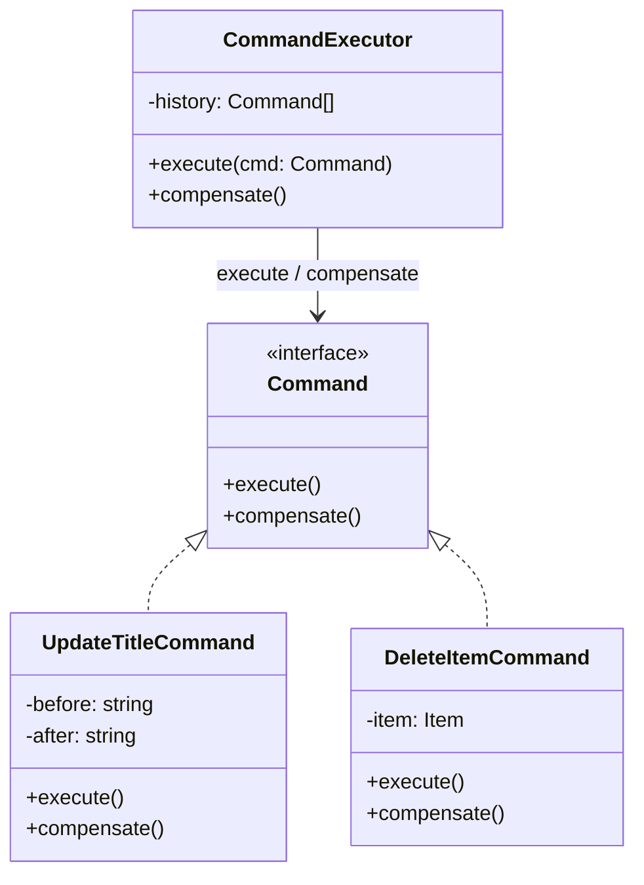

# Implementing Command and Compensation in Applications

## 1. Problem

Trong các ứng dụng frontend dạng editor hoặc CRUD-heavy UI, mỗi thao tác người dùng đều tạo ra một thay đổi mang ý nghĩa nghiệp vụ rõ ràng. Những thay đổi này thường xảy ra liên tục, có thứ tự và có thể ảnh hưởng lẫn nhau. Khi người dùng nhận ra thao tác vừa thực hiện là không mong muốn, hệ thống cần cung cấp khả năng quay về trạng thái trước đó một cách an toàn và dễ kiểm soát.

Nếu không có một cơ chế rõ ràng, việc “quay lại” rất dễ trở thành logic vá víu, nằm rải rác trong nhiều nơi của codebase. Điều này làm cho hành vi hệ thống khó dự đoán, khó mở rộng và khó đảm bảo tính nhất quán khi nghiệp vụ ngày càng phức tạp. Vì vậy, bài toán đặt ra không chỉ là quay lại kết quả trước đó, mà là phải **undo đúng ý nghĩa của hành động đã xảy ra**.


## 2. Solution

Giải pháp là mô hình hoá mỗi thao tác người dùng thành một **Command**, trong đó Command không chỉ biết cách thực thi hành động mà còn biết cách **bù trừ lại chính tác động của hành động đó**. Thay vì cố gắng điều khiển trạng thái, hệ thống chỉ cần điều phối các Command đã được thực thi theo đúng thứ tự.

Compensation được xem như một hành động nghiệp vụ hợp lệ, đại diện cho việc đảo ngược ý nghĩa của hành động ban đầu. Khi một Command được bù trừ, hệ thống không “quay ngược thời gian”, mà thực hiện một hành động khác để trung hoà tác động đã xảy ra. Cách tiếp cận này giúp đưa toàn bộ logic liên quan đến việc quay lại về đúng nơi: ngay trong hành động gây ra thay đổi.



## 3. Implement

Phần này hiện thực hoá trực tiếp thiết kế lớp đã được mô hình hoá.

Mỗi class trong sơ đồ đều có trách nhiệm rõ ràng và không chồng chéo.

Command đại diện cho hành động, CommandExecutor chịu trách nhiệm điều phối.

Việc bù trừ được thực hiện thông qua cơ chế cursor trên lịch sử command.


### 3.1. Command interface

`Command` là hợp đồng chung cho mọi hành động trong hệ thống.

Nó định nghĩa hai hành vi bắt buộc: thực thi và bù trừ.

```tsx
export interface Command {
  execute(): void;
  compensate(): void;
}
```

---

### 3.2. UpdateTitleCommand

Command này đại diện cho hành động cập nhật tiêu đề.

Nó lưu lại giá trị trước và sau để có thể bù trừ chính xác.

Logic thực thi và bù trừ luôn nằm trong cùng một class.

```tsx
export class UpdateTitleCommand implements Command {
  constructor(
    private readonly setState: (fn: any) => void,
    private readonly before: string,
    private readonly after: string,
  ) {}

  execute() {
    this.setState((s: any) => ({
      ...s,
      title: this.after,
    }));
  }

  compensate() {
    this.setState((s: any) => ({
      ...s,
      title: this.before,
    }));
  }
}
```

---

### 3.3. DeleteItemCommand

Command này đại diện cho hành động xoá một item.

Nó giữ lại item bị xoá để phục vụ cho việc bù trừ.

Compensation ở đây là thêm lại item đã bị xoá trước đó.

```tsx
export class DeleteItemCommand implements Command {
  constructor(
    private readonly setState: (fn: any) => void,
    private readonly item: { id: string; [key: string]: any },
  ) {}

  execute() {
    this.setState((s: any) => ({
      ...s,
      items: s.items.filter((i) => i.id !== this.item.id),
    }));
  }

  compensate() {
    this.setState((s: any) => ({
      ...s,
      items: [...s.items, this.item],
    }));
  }
}

```

---

### 3.4. CommandExecutor

`CommandExecutor` chịu trách nhiệm điều phối việc thực thi và bù trừ.

Nó quản lý một danh sách lịch sử các command đã chạy.

`cursor` xác định command hiện tại đã được thực thi tới đâu.

Executor không chứa logic nghiệp vụ.

```tsx
export class CommandExecutor {
  private history: Command[] = [];

  execute(cmd: Command) {
    cmd.execute();
    this.history.push(cmd);
  }

  compensate() {
    const cmd = this.history.pop();
    if (!cmd) return;

    cmd.compensate();
  }
}
```

---

### 3.5. Ví dụ sử dụng trong thực tế

Ví dụ dưới đây minh hoạ cách thiết kế được dùng trong UI.

### Khởi tạo executor

```tsx
const executor =newCommandExecutor()

```

---

### Thực thi hành động cập nhật tiêu đề

```tsx
function onUpdateTitle(before:string,after:string) {
const cmd =newUpdateTitleCommand(setState, before, after)
  executor.execute(cmd)
}

```

---

### Thực thi hành động xoá item

```tsx
function onDeleteItem(item:Item) {
const cmd =newDeleteItemCommand(setState, item)
  executor.execute(cmd)
}

```

### Bù trừ hành động gần nhất

```tsx
function onCompensate() {
  executor.compensate()
}
```

### 3.6. Luồng hoạt động tương ứng với thiết kế

- UI tạo Command từ hành động người dùng
- Executor gọi `execute()`
- Command được `push` vào stack
- Khi Undo:
    - `pop()` command cuối
    - Gọi `compensate()`

## 4. Conclusion

Thiết kế **Command + Compensation** cho phép mô hình hoá mỗi thao tác người dùng thành một hành động độc lập, có khả năng tự bù trừ. Mỗi hành động có vòng đời rõ ràng, tự chịu trách nhiệm cho việc thực thi và hoàn tác của chính nó.

Việc tách **Command** và **CommandExecutor** giúp đóng gói logic nghiệp vụ gọn trong từng hành động, giữ cho hệ thống dễ hiểu và dễ kiểm soát. Cách tiếp cận này giúp luồng xử lý nhất quán, mở rộng tự nhiên khi số lượng hành động tăng