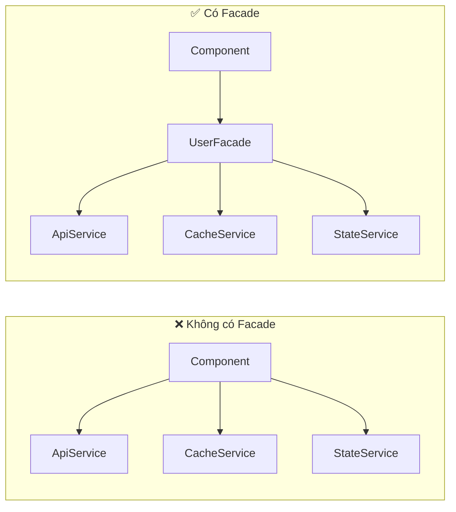

# Facade Pattern trong Angular


## I. Đặt vấn đề

Trong một Angular app thực tế, một tính năng đơn giản như "hiển thị danh sách user"
thường cần phối hợp nhiều thứ: gọi HTTP, cache kết quả, quản lý loading/error state,
xử lý race condition.

Nếu component tự xử lý tất cả:

```typescript
// ❌ Component biết quá nhiều
@Component({ ... })
export class UserListComponent implements OnInit {
  constructor(
    private api: UserApiService,
    private cache: UserCacheService,
    private state: UserStateService,
  ) {}

  ngOnInit() {
    const cached = this.cache.get<User[]>('users:all');
    if (cached) {
      this.state.setUsers(cached);
      return;
    }
    this.state.setLoading(true);
    this.api.fetchAll().subscribe(users => {
      this.cache.set('users:all', users);
      this.state.setUsers(users);
    });
  }
}
```

Component đang phải biết:
- Cache key là `'users:all'`
- Thứ tự: check cache → gọi API → cập nhật cache → cập nhật state
- Khi nào `setLoading`, khi nào `setUsers`

Đây là **tight coupling** — component đang gánh logic không thuộc về nó.

Về bản chất, component chỉ nên trả lời một câu hỏi: **"Dữ liệu này hiển thị lên
màn hình như thế nào?"**. Nhưng ở đây nó đang trả lời thêm những câu hoàn toàn khác:
"Dữ liệu lấy từ đâu?", "Cache bao lâu?", "Thứ tự các bước ra sao?". Đó là những
quyết định thuộc về tầng **orchestration**, không phải tầng **presentation**.

Hệ quả là khi bất kỳ chi tiết nào thay đổi — thêm retry khi API lỗi, đổi cache TTL,
gắn analytics tracking — ta buộc phải mở component ra sửa, dù UI không hề thay đổi.
Component trở thành nơi mọi thay đổi business logic đều chạm vào, và đó chính là dấu
hiệu rõ nhất của tight coupling: **thay đổi ở một concern bắt buộc phải sửa ở một
nơi không liên quan**


## II. Giải pháp — Facade Pattern

### Pattern là gì?

Facade là design pattern thuộc nhóm **Structural**. Ý tưởng cốt lõi:

> Tạo một class đứng trước các subsystem phức tạp, cung cấp một interface
> đơn giản, nhất quán cho phần còn lại của ứng dụng.



Component không cần biết có bao nhiêu subsystem, chúng hoạt động thế nào,
hay phối hợp với nhau theo thứ tự nào.

### Facade giải quyết vấn đề trên thế nào?

| Vấn đề | Không có Facade | Có Facade |
|---|---|---|
| Cache key | String literal rải rác ở component | Ẩn trong Facade |
| Thứ tự gọi API | Component tự điều phối | Facade xử lý |
| Thêm analytics | Sửa component | Sửa Facade, component không đổi |
| Đổi cache strategy | Sửa component | Sửa CacheService, component không đổi |
| Test UI | Phải mock 3 services | Chỉ mock 1 Facade |

---

## III. Thực hiện

### Cấu trúc

```
features/user-management/
├── services/           ← Các subsystems (internal, không expose ra ngoài)
│   ├── user-api.service.ts
│   ├── user-cache.service.ts
│   └── user-state.service.ts
├── facades/
│   └── user.facade.ts  ← THE FACADE — điểm tiếp xúc duy nhất
├── containers/
│   └── user-list/      ← Smart component, chỉ biết Facade
└── components/         ← Dumb components, không biết gì về services
```

**Quy tắc**: component chỉ được inject `UserFacade`. Không inject bất kỳ
service nào trong `services/` trực tiếp.

### Thiết kế Public API

Facade có hai phần rõ ràng: **state để đọc** và **actions để gọi**.

```typescript
@Injectable({ providedIn: 'root' })
export class UserFacade {
  // Subsystems — ẩn hoàn toàn với bên ngoài
  private readonly api   = inject(UserApiService);
  private readonly cache = inject(UserCacheService);
  private readonly state = inject(UserStateService);

  // ── State (component đọc) ────────────────────────────────────────────────
  readonly users:        Signal<User[]>;
  readonly selectedUser: Signal<User | null>;
  readonly loading:      Signal<boolean>;
  readonly error:        Signal<string | null>;

  // ── Actions (component gọi) ──────────────────────────────────────────────
  loadUsers(): void { ... }
  selectUser(id: number): void { ... }
  clearSelection(): void { ... }
  deleteUser(id: number): void { ... }
  refresh(): void { ... }
}
```

Toàn bộ phối hợp giữa Api + Cache + State nằm bên trong các method này.
Component không thấy, không biết, không cần quan tâm.

### Kết quả ở component

```typescript
// ✅ Toàn bộ logic component
@Component({ ... })
export class UserListComponent implements OnInit {
  readonly facade = inject(UserFacade);

  ngOnInit(): void {
    this.facade.loadUsers();
  }
}
```

```html
@if (facade.loading()) {
  <div class="loading">Đang tải...</div>
}

@for (user of facade.users(); track user.id) {
  <app-user-card
    [user]="user"
    [isSelected]="facade.selectedUser()?.id === user.id"
    (selected)="facade.selectUser($event.id)"
    (deleted)="facade.deleteUser($event.id)"
  />
}
```

---

## IV. Kết luận

Facade Pattern không phải là thêm một service vào đống service.
Nó là **ranh giới có chủ đích** giữa ba câu hỏi:

- **"What to show?"** — Subsystems (Api, Cache, State)
- **"What to do?"** — Facade (orchestration, public API)
- **"What to show?"** — Component (UI)

Khi ranh giới này rõ ràng, mỗi lớp thay đổi độc lập mà không ảnh hưởng lớp kia.

### Lợi ích

**Maintainability — Dễ bảo trì**
- Logic nghiệp vụ tập trung một chỗ. Thêm retry, đổi cache TTL, thêm analytics
  chỉ cần sửa Facade — component không đổi.
- Dễ trace bug: biết ngay cache sai thì vào `CacheService`, thứ tự sai thì vào
  `Facade`, UI sai thì vào component.

**Testability — Dễ kiểm thử**
- Test component chỉ cần mock **1 Facade** thay vì 3 services riêng lẻ.
- Test Facade độc lập với UI: kiểm tra đúng thứ tự gọi, đúng cache strategy mà
  không cần render bất kỳ template nào.

```typescript
// Mock gọn — component test chỉ quan tâm đến UI behavior
{ provide: UserFacade, useValue: mockFacade }
```

**Scalability — Dễ mở rộng**
- Thêm subsystem mới (analytics, logger, websocket) chỉ cần inject vào Facade,
  component không hay biết.
- Nhiều component dùng cùng một Facade mà không duplicate logic.

### Hạn chế

**Facade có thể trở thành God Object**
Khi feature phình to, Facade tích lũy quá nhiều method và inject quá nhiều
service. Dấu hiệu cần tách: Facade có > 10 method hoặc inject > 5 services.

```typescript
// ❌ Dấu hiệu Facade đang phình
export class UserFacade {
  private api         = inject(UserApiService);
  private cache       = inject(UserCacheService);
  private state       = inject(UserStateService);
  private analytics   = inject(AnalyticsService);
  private permissions = inject(PermissionService);
  private export      = inject(ExportService);
  // ... 15 methods
}

// ✅ Tách theo nhóm chức năng
export class UserQueryFacade  { ... } // đọc dữ liệu
export class UserCommandFacade { ... } // ghi dữ liệu
```

**Thêm một layer trung gian**
Mỗi thao tác phải đi qua Facade trước khi đến subsystem. Với feature đơn giản
(chỉ gọi một API, không có state phức tạp), layer này là overhead không cần thiết.

