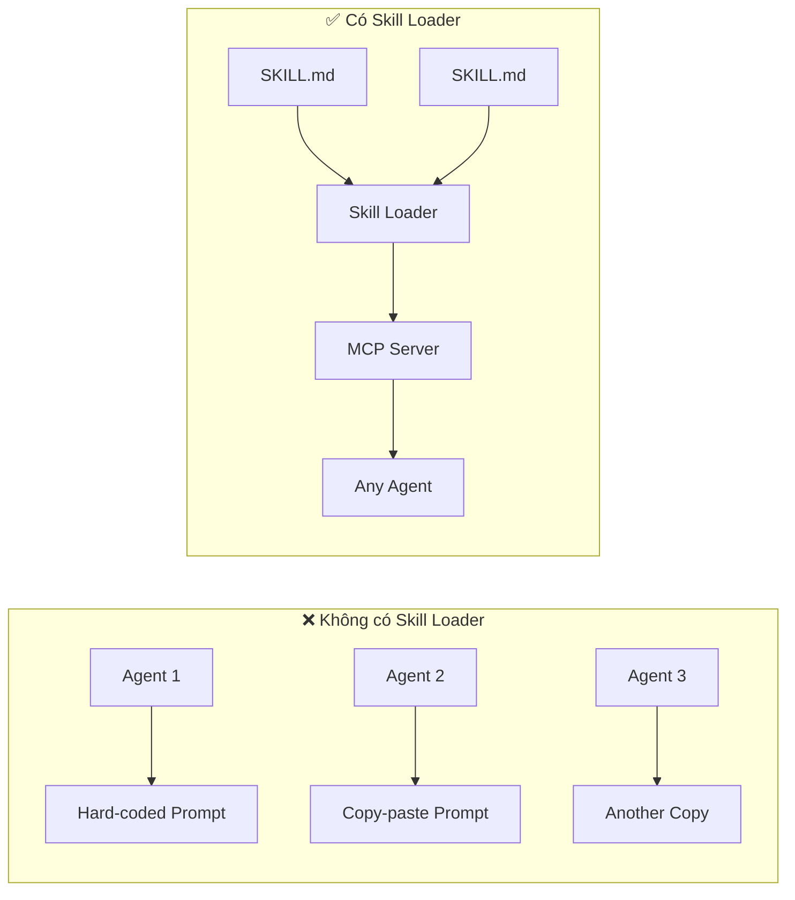
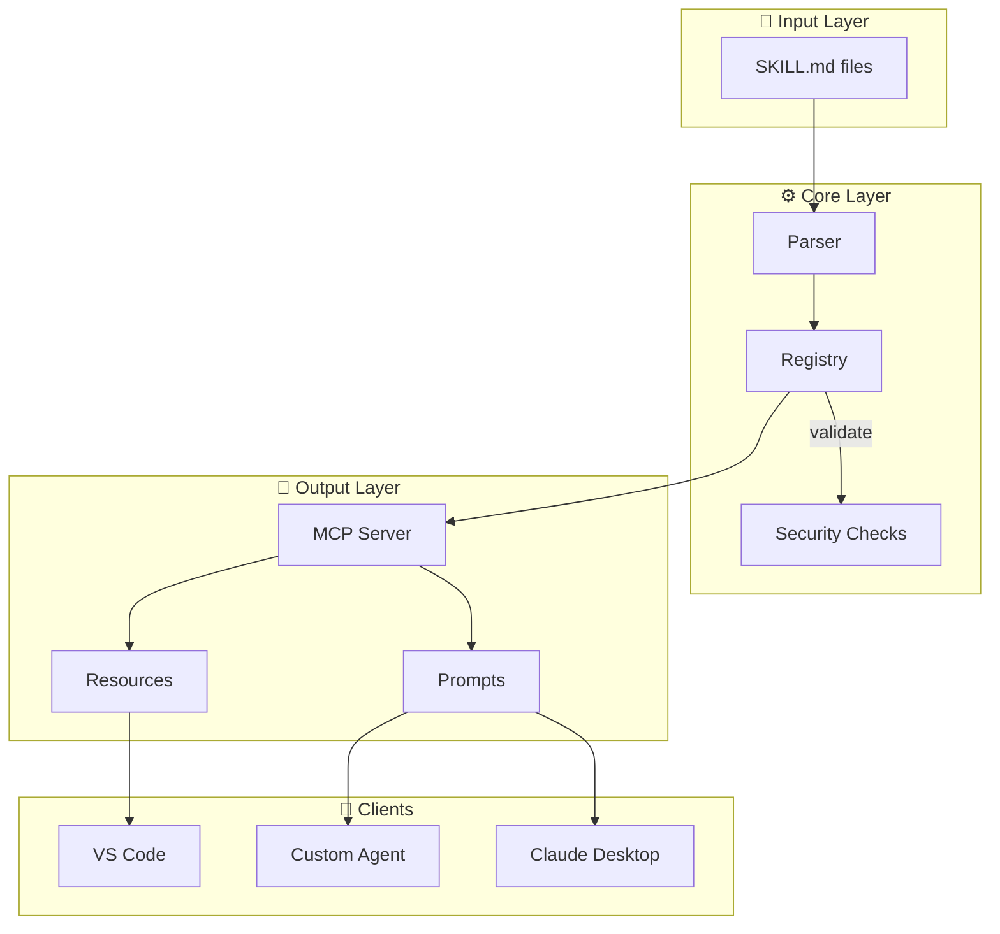
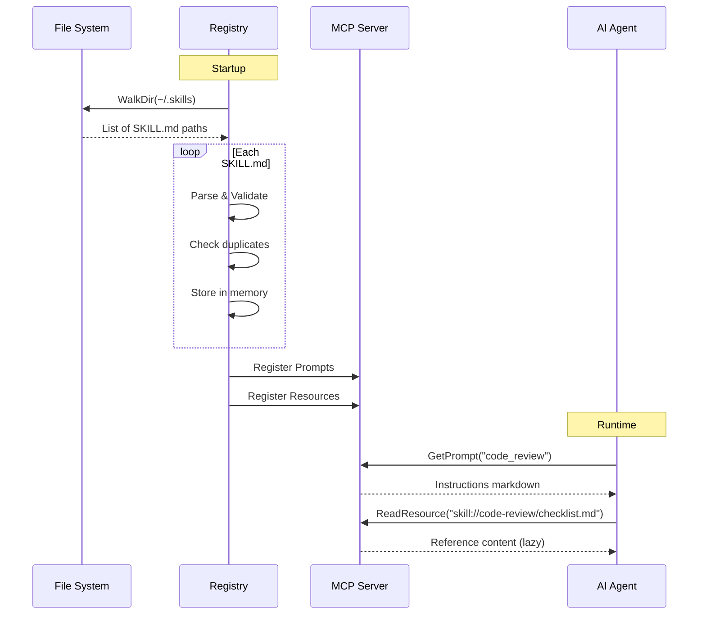
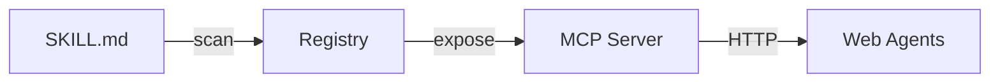

## 1. Đặt vấn đề

AI agents đang xuất hiện khắp nơi — từ code assistant trong IDE đến chatbot hỗ trợ khách hàng. Nhưng có một bài toán mà hầu như dự án nào cũng gặp: **làm thế nào để "dạy" agent cách thực hiện một tác vụ cụ thể mà không cần viết code?**

Hãy tưởng tượng ta có một agent cần biết cách review code, viết commit message đúng chuẩn, hay debug một lỗi phức tạp. Cách tiếp cận truyền thống thường như sau:

```go
// ❌ Hard-code mọi thứ vào system prompt
func buildSystemPrompt() string {
    return `You are a code review expert.
    When reviewing code: [200 dòng rules]
    When writing commits: [100 dòng rules]
    When debugging: [150 dòng rules]
    ...`
}
```

Vấn đề với cách này:

- **Không tái sử dụng** — mỗi agent copy-paste cùng một đoạn instructions
- **Khó bảo trì** — thay đổi một quy tắc phải sửa nhiều nơi
- **Không version control** — prompt nằm trong code, khó track history
- **Tốn token** — agent load toàn bộ dù chỉ cần một phần nhỏ

Thêm một ràng buộc: **Model Context Protocol (MCP)** đang nổi lên như giao thức chuẩn để AI agent giao tiếp với tools. Claude Desktop, VS Code, và nhiều AI client đều hỗ trợ MCP.

*Câu hỏi: Có cách nào quản lý "knowledge" của agent theo dạng file — version được, chia sẻ được, load động — và expose qua MCP không?*

---

## 2. Giải pháp

> **Ý tưởng cốt lõi:** Mỗi "skill" là một thư mục chứa file `SKILL.md`. Người viết skill chỉ cần biết Markdown — không cần code. Hệ thống tự scan, parse, và expose qua MCP.

Đây là pattern **Convention over Configuration**: đặt file đúng chỗ, mọi thứ tự động chạy.



| Vấn đề | Trước | Sau |
|--------|-------|-----|
| Tái sử dụng | Copy-paste | Một file, nhiều agents |
| Bảo trì | Sửa nhiều nơi | Sửa một `SKILL.md` |
| Token | Load toàn bộ | Lazy load qua Resource |
| Thêm skill | Sửa code, redeploy | Thêm file, rescan |

---

## 3. Thiết kế

### 3.1 Cấu trúc Skill

```
~/.skills/
├── code-review/
│   ├── SKILL.md           ← định nghĩa skill (bắt buộc)
│   └── checklist.md       ← tài liệu tham khảo (lazy load)
├── write-commit/
│   └── SKILL.md
└── debug-go/
    └── SKILL.md
```

File `SKILL.md` = YAML frontmatter + Markdown:

```markdown
---
name: code-review
description: Expert code review guidance
references:
  - checklist.md
---

# Code Review Skill
When reviewing code, follow these guidelines...
```

### 3.2 Kiến trúc tổng quan



### 3.3 Các thành phần chính

| Component | Trách nhiệm | Input | Output |
|-----------|-------------|-------|--------|
| **Parser** | Đọc SKILL.md, tách frontmatter/content | File path | Skill struct |
| **Registry** | Scan, lưu trữ, detect collision | Root dir | Map[name]Skill |
| **MCP Server** | Expose skills qua protocol | Registry | Prompts + Resources |

### 3.4 Luồng xử lý



### 3.5 MCP Exposure Model

Mỗi skill được expose theo 2 cách:

```
┌─────────────────────────────────────────────────────────┐
│  Skill: code-review                                     │
├─────────────────────────────────────────────────────────┤
│  📝 Prompt: "code_review"                               │
│     → Agent gọi để lấy instructions                     │
│     → Load ngay khi cần                                 │
├─────────────────────────────────────────────────────────┤
│  📎 Resource: "skill://code-review/checklist.md"        │
│     → Agent đọc khi cần thêm context                    │
│     → Lazy load, không tốn token trước                  │
└─────────────────────────────────────────────────────────┘
```

---

## 4. Kết luận

### Tổng kết kiến trúc



Thiết kế này theo nguyên tắc **Convention over Configuration**: đặt file đúng chỗ, system tự lo phần còn lại.

### Lợi ích

**Đơn giản cho người dùng — Simplicity**
- Chỉ cần biết Markdown để viết skill
- Không config, không registration thủ công
- Thêm skill = tạo thư mục + file

**Tích hợp chuẩn — Standards Compliance**
- MCP protocol — hoạt động với mọi MCP client
- File-based — git, backup, share dễ dàng

**Tiết kiệm tài nguyên — Efficiency**
- Lazy load references qua Resource
- Không nhồi nhét vào context window
