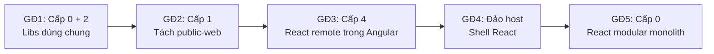

# Micro Frontend Levels for Migrating Angular 14 to React

## 1. Đặt vấn đề

Chuyển framework cho một ứng dụng lớn là trường hợp micro frontend thật sự đáng dùng, vì trong nhiều tháng hai framework buộc phải chạy song song. Viết lại toàn bộ một lần thường thất bại: tính năng bị đóng băng, bản mới mãi "sắp xong". Cách an toàn hơn là strangler fig: thay dần từng phần, sản phẩm vẫn chạy và vẫn ra bản mới.

Hệ thống trong bài là một ứng dụng quản trị lớn trên Angular 14 (webpack, Node 14) với hơn 20 module nghiệp vụ. Đăng nhập qua Keycloak SSO, token lưu trong localStorage; đa ngôn ngữ bằng ngx-translate. Nâng Angular lên bản mới là tốn công cho framework sắp bỏ, còn viết lại một lần thì quá rủi ro.

Migration vì vậy phải thỏa năm ràng buộc:

- Không dừng ra tính năng trong suốt quá trình chuyển.
- Angular và React chạy song song, kể cả trên cùng một màn hình.
- Người dùng chỉ đăng nhập một lần, phiên dùng chung cho cả hai.
- Trang public cần SEO, trang quản trị thì không.
- Mỗi module chuyển xong phải deploy và rollback được riêng.

## 2. Giải pháp

Giải pháp là dùng micro frontend như giàn giáo tạm thời: mỗi giai đoạn migration chọn cấp độ thấp nhất đủ dùng.

### Micro frontend là gì

Micro frontend chia một giao diện lớn thành nhiều phần do các team build và deploy độc lập, nhưng người dùng vẫn thấy một sản phẩm. Nó giải bài toán tổ chức; cái giá là độ phức tạp của hệ thống phân tán: trùng bundle, giao tiếp giữa các app, giao diện dễ lệch, khó debug.

Năm 2026, công nghệ đã trưởng thành (Module Federation 2.0 cho webpack, Rspack, Vite). Team nhỏ đã quay về modular monolith, tổ chức lớn vẫn dùng. Với migration, micro frontend chỉ là **công cụ tạm thời**: đủ lâu để hai framework chung sống, rồi gộp lại.

### Sáu cấp độ

Cấp càng cao càng độc lập nhưng chi phí vận hành càng lớn. Nguyên tắc: dùng cấp thấp nhất giải được vấn đề.

| Cấp | Cách làm | Ưu | Nhược | Dùng khi |
| --- | --- | --- | --- | --- |
| 0. Modular monolith | Một app, chia module có ranh giới trong monorepo | Rẻ nhất, không chi phí runtime | Không deploy độc lập, chỉ một framework | 1–3 team; làm nền cho cấp cao hơn |
| 1. Tách theo route | Gateway định tuyến theo path, mỗi app sở hữu một nhóm URL | Đơn giản, mỗi app tự chọn framework | Tải lại trang khi chuyển app | Phần ít qua lại, như trang public và trang quản trị |
| 2. Build-time | Mỗi phần là một package, build chung vào app chính | Type-safe, không lệch version | Đổi package phải deploy lại app chính | Chia sẻ code: UI kit, SDK, design system |
| 3. Iframe | Nhúng app bằng `<iframe>` | Cách ly tuyệt đối | URL, responsive, SEO kém; giao tiếp qua `postMessage` | Nhúng legacy hoặc hệ thống bên thứ ba |
| 4. Runtime | Host nạp code của remote lúc chạy | Deploy độc lập, nhiều framework trên một trang | Phức tạp nhất: dependency, router, state, CSS | Hai framework trên cùng màn hình, nhiều team release riêng |
| 5. Server/edge | Ghép mảnh HTML ở server hoặc CDN (SSI, ESI) | HTML đầy đủ, SEO tốt | Cần hạ tầng render phía server | Trang public nhiều nội dung |

Hệ thống thực tế thường kết hợp nhiều cấp. Migration này dùng cấp 0, 1, 2 và 4.

### Ba kỹ thuật của cấp 4

Ba kỹ thuật giải ba việc khác nhau nên thường được kết hợp:

- **Module Federation: tải và chia sẻ code.** Remote `expose` module và sinh `remoteEntry.js`; host nạp file này lúc chạy rồi lấy module. Dependency trong `shared` (như React) chỉ tải một lần. Bản 2.0 có runtime độc lập, manifest và plugin cho webpack, Rspack, Vite. Rủi ro: lệch version singleton, gắn với bundler, cache `remoteEntry.js` sai.
- **Web Components: đóng gói và cách ly.** Mỗi app thành một thẻ HTML (`customElements.define`); dữ liệu vào qua attribute/property, ra qua `CustomEvent`. Angular có sẵn `@angular/elements`. Không cần chung bundler, Shadow DOM cách ly CSS. Rủi ro: không chia sẻ dependency, Shadow DOM chặn luôn CSS global của host, SSR hạn chế.
- **single-spa: điều phối vòng đời theo URL.** Root config đăng ký app kèm điều kiện URL; mỗi app export `bootstrap`, `mount`, `unmount`; code tải qua import map. Hợp với nhiều app ngang hàng của nhiều team. Rủi ro: thêm một lớp phải vận hành, nhiều router cùng nghe URL, đưa app Angular có sẵn vào phải sửa bootstrap, zone.js và router.

```ts
// Module Federation: host nạp remote lúc chạy, không phụ thuộc framework của host
init({ name: 'shell', remotes: [{ name: 'settings', entry: '/remotes/settings/remoteEntry.js', type: 'module' }] });
const { mount } = await loadRemote('settings/mount');
```

| Tiêu chí | Module Federation | Web Components | single-spa |
| --- | --- | --- | --- |
| Phụ thuộc bundler | Có | Không | Không |
| Chia sẻ dependency | Có sẵn | Không | Tự làm qua import map |
| Cách ly CSS | Không | Có (Shadow DOM) | Không |
| Độ phức tạp thêm | Trung bình | Thấp | Cao |
| Sửa app Angular 14 có sẵn | Ít | Ít, khi Angular là phía được nhúng | Nhiều |

**Lựa chọn cho migration:** dùng Module Federation ở giai đoạn 3, với hợp đồng `mount(el, ctx)` mượn tư tưởng lifecycle của single-spa nhưng không dùng framework này. Web Components là phương án dự phòng, và dùng để nhúng màn Angular còn sót khi đảo host (tắt Shadow DOM để giữ theme chung). Không dùng single-spa vì chỉ có hai framework và một host rõ ràng.

### Lộ trình: mỗi giai đoạn một cấp độ

Migration đi qua năm giai đoạn và kết thúc bằng việc quay về cấp 0.



| Giai đoạn | Cấp | Việc chính | Điểm mấu chốt |
| --- | --- | --- | --- |
| 1. Nền móng | 0 + 2 | Tách `auth-core`, `api-client`, `config`, `i18n` thành lib TypeScript thuần; Angular dùng qua package build sẵn | Không app nào tự viết cứng key hay logic refresh; mọi giai đoạn sau dựa vào bước này |
| 2. Tách phần public | 1 | Landing, login, SSO callback thành `public-web` (Vite + React); gateway: `/` về public-web, `/app/*` về Angular | Bắt buộc cùng origin vì token ở localStorage; trang marketing prerender để có SEO |
| 3. React trong Angular | 4 | Viết lại từng module thành React remote, nhúng vào route của shell Angular | Angular làm host (ngược lại dễ xung đột zone.js); chỉ giao tiếp qua `mount(el, ctx)`; module nhỏ trước, module lớn chuyển theo route con |
| 4. Đảo host | 4 | Viết lại layout, menu, guard bằng React; màn Angular còn sót nhúng dạng Web Component | Chỉ làm khi phần lớn module đã là React |
| 5. Trạng thái đích | 0 | Gộp các remote về một app React modular monolith | Chỉ giữ nhiều remote nếu có nhiều team cần release độc lập |

## 3. Thực hiện

Giải pháp được kiểm chứng bằng một POC chạy trên Angular 14.2 thật, với các công nghệ sau:

| Thành phần | Công nghệ |
| --- | --- |
| public-web | Vite, React 18, React Router v7, prerender bằng `renderToString`, react-helmet-async |
| React remote | Vite + `@module-federation/vite` (MF 2.0), TanStack Query/Table, React Hook Form + Zod, react-i18next |
| Shell Angular 14 | `@module-federation/runtime`, `ReactRemoteHostComponent`, `AuthInterceptor` mới |
| Libs dùng chung | `auth-core`, `api-client`, `config`, `i18n` (TypeScript thuần), đóng gói thành `@cls/shared` |
| Monorepo | pnpm workspace |
| Hạ tầng và kiểm thử | Gateway nginx cùng origin, mock API, Playwright e2e |

### Năm vấn đề kỹ thuật và cách giải

Những vấn đề dưới đây xuất hiện khi dựng POC thật. Phần lớn không nằm trong tài liệu hướng dẫn Module Federation.

#### 1. Hai router cùng giành URL

Nếu Angular router và React Router cùng nghe sự kiện `popstate`, nút back/forward sẽ chạy lung tung.

**Cách giải: host sở hữu history.** Remote dùng memory router, không đụng vào URL trình duyệt. Khi điều hướng nội bộ, remote gọi `ctx.navigate(url)` để Angular router đổi URL. Sau mỗi `NavigationEnd`, host gọi `update({ path })` để remote đồng bộ theo.

```ts
export function mount(el: HTMLElement, ctx: {
  basePath: string;                 // '/app/settings'
  path: string;                     // '/new', '/MAX_UPLOAD_MB'
  navigate: (url: string) => void;  // gọi Angular router
  lang: 'vi' | 'en';
}): { update(ctx): void; unmount(): void };
```

#### 2. zone.js kích hoạt change detection vô ích

Mọi sự kiện React bên trong NgZone sẽ khiến Angular chạy change detection cho toàn app. Wrapper phải gọi `mount` trong `ngZone.runOutsideAngular()`. Chỉ khi remote gọi `navigate` thì mới quay lại zone bằng `ngZone.run()`.

#### 3. Refresh token chạy đua

Trên cùng một trang, interceptor Angular và api-client React có thể cùng nhận 401 và cùng gửi refresh. Nếu refresh token chỉ dùng được một lần, request thứ hai sẽ thất bại và đá người dùng ra màn đăng nhập.

**Cách giải: single-flight.** Chỉ một request refresh được gửi, các request khác chờ cùng một promise. Vì Angular và remote mỗi bên bundle một bản `auth-core` riêng, promise đó phải đặt trên `window`, không đặt trong biến của module.

#### 4. Node và TypeScript không đội trời chung

Angular 14 chạy trên Node 14/16 và TypeScript 4.7. Vite bản mới cần Node 20+. Nx bản hỗ trợ Angular 14 thì quá cũ so với Vite.

**Cách giải:** dùng pnpm workspace thay Nx và để Angular đứng ngoài workspace. Libs được bundle thành một package ES2019 kèm `.d.ts` để Angular cài như package thường. Khi cài runtime MF vào Angular 14, cần bật `skipLibCheck` và ghim `@types/node` về bản 16.

#### 5. CSS và cache

Trong giai đoạn chuyển, remote React dùng lại CSS global của host, không tự mang CSS global. Làm lại thiết kế để sau khi chuyển xong, tránh giao diện lệch nhau.

Về cache: `remoteEntry.js`, `mf-manifest.json`, `index.html` và `env.js` phải để `no-cache`. File có hash trong `/assets/` thì cache một năm. Làm sai chỗ này, người dùng sẽ chạy remote cũ sau khi đã deploy bản mới.

### Kết quả POC

POC là một lát cắt dọc: public-web, một React remote cho một module cấu hình, các lib dùng chung, mock API và gateway cùng origin. Kiểm thử chạy bằng Playwright trên Chromium headless. **Rủi ro lớn nhất, host webpack của Angular 14 nạp remote ESM từ Vite, đã được kiểm chứng là chạy được.**

| Kịch bản | Host giả lập | Angular 14.2 thật |
| --- | --- | --- |
| Deep link vào remote sau khi đăng nhập | Pass | Pass |
| Remote điều hướng → URL của host đổi | Pass | Pass |
| Back/forward | Pass | Pass |
| Wrapper dùng lại khi đổi route con, unmount khi rời route | Pass | Pass |
| Không có lỗi JS runtime | Pass | Pass |

Kích thước remote sau gzip: khoảng 99 KB cho code module, 63 KB cho React, 7 KB cho `remoteEntry.js`.

## 4. Kết luận

Micro frontend không phải đích đến, mà là giàn giáo. Trong một migration từ Angular 14 sang React, mỗi giai đoạn dùng đúng cấp độ nó cần: cấp 0 và 2 để chia sẻ logic, cấp 1 để tách phần public, cấp 4 để hai framework chung sống trên một màn hình. Khi Angular biến mất, giàn giáo được tháo đi và hệ thống quay về cấp 0.

Việc quan trọng nhất không phải chọn công cụ federation, mà là giữ các hợp đồng thật nhỏ: một hàm `mount`, một bộ lib auth dùng chung, và một quy ước ai sở hữu URL. Làm đúng ba thứ đó, phần còn lại chỉ là chuyển từng module một.

### Khi nào không nên làm như vậy

Cách tiếp cận này chỉ đáng khi app đủ lớn để không viết lại một lần được. Với app vài chục màn hình và một team, viết lại trong một nhánh riêng thường rẻ hơn.

Những sai lầm thường gặp:

- **Nhảy thẳng lên cấp 4.** Chưa tách libs dùng chung đã dựng Module Federation. Kết quả là logic auth bị chép hai nơi và lệch nhau.
- **Tách theo subdomain.** Mất khả năng dùng chung localStorage, phải làm lại toàn bộ cơ chế phiên.
- **Nâng framework cũ trước khi bỏ.** Tốn công cho code sắp xóa.
- **Chia sẻ state hay component giữa hai framework.** Tạo ra phụ thuộc chéo, đúng thứ mà micro frontend muốn tránh.
- **Làm lại thiết kế trong lúc chuyển.** Phạm vi phình ra và giao diện lệch nhau giữa phần cũ và phần mới.
- **Giữ micro frontend mãi sau khi xong.** Nếu không có nhiều team cần release độc lập, hãy gộp về modular monolith.
- **Không có e2e.** Playwright là lưới an toàn duy nhất để biết mỗi module chuyển xong không làm hỏng luồng đăng nhập, điều hướng và phân quyền.