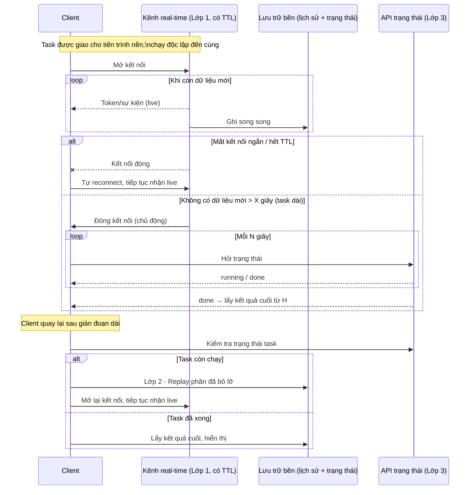

# **Long-Running Task for Chat AI**

## **1. Vấn đề**

Một request chat thông thường: gửi → chờ vài giây → nhận trả lời. Nhưng với các tác vụ AI phức tạp (gọi tool, tra cứu dữ liệu, suy luận nhiều bước), thời gian xử lý có thể kéo dài hàng chục giây đến vài phút.

Trong khoảng thời gian đó, nhiều thứ có thể xảy ra:

- Người dùng đóng tab, mất mạng, hoặc chuyển sang chat khác.
- Kết nối real-time bị ngắt **âm thầm** — không có thông báo lỗi nào cả.
- Khi quay lại, người dùng cần thấy đúng kết quả, không thiếu không lặp.

Nếu hệ thống chỉ dựa vào "một kết nối sống suốt từ đầu đến cuối" để truyền kết quả, thì bất kỳ gián đoạn nào cũng làm mất dữ liệu hoặc khiến UI bị "treo" mãi ở trạng thái đang chạy.

## **2. Tư duy giải quyết: tách thực thi khỏi quan sát**

Nguyên tắc cốt lõi: **việc thực thi task** và **việc client quan sát kết quả** là hai mối quan tâm hoàn toàn độc lập, không ràng buộc lẫn nhau về vòng đời.

- **Thực thi (execution)**: task được giao cho một tiến trình nền (worker), chạy đến khi hoàn tất hoặc lỗi, độc lập với việc có client nào đang kết nối hay không.
- **Quan sát (observation)**: client là một bên ngoài cuộc, có thể kết nối, mất kết nối, hoặc rời đi bất cứ lúc nào. Mỗi lần kết nối lại, client chỉ cần trả lời một câu hỏi duy nhất: *task đang ở trạng thái nào, phần dữ liệu nào đã nhận được, và còn thiếu phần nào?*

Việc tách bạch này cho phép thiết kế quan sát theo nhiều lớp (tiered observation), ưu tiên lớp có độ trễ thấp/chi phí thấp, và dùng các lớp chậm hơn nhưng bền hơn làm lưới đỡ:

1. **Theo dõi trực tiếp (real-time)** — kênh đẩy dữ liệu tức thời, độ trễ thấp nhất, nhưng không đảm bảo bền.
2. **Lấy lại lịch sử (replay)** — khi quay lại sau một khoảng dài, lấy phần dữ liệu đã sinh ra trong lúc vắng mặt từ nơi lưu trữ bền.
3. **Hỏi trạng thái định kỳ (polling)** — lưới an toàn cuối cùng, phát hiện task đã xong dù kênh real-time đã chết mà không báo.

Ba lớp trên giải quyết trục thứ nhất (đúng/đủ dữ liệu). Trục thứ hai — chi phí giữ kết nối — cần một cơ chế riêng:

### **Tối ưu connection cho task dài: giới hạn TTL + downgrade sang polling**

Một kết nối SSE/WebSocket mở suốt nhiều phút cho một task dài sẽ chiếm goroutine/thread + buffer ở server, dễ bị proxy/load balancer chủ động cắt âm thầm sau một ngưỡng timeout cố định, và nếu có hàng trăm task dài chạy đồng thời thì số kết nối mở song song tăng tuyến tính theo số task — dù phần lớn thời gian không có dữ liệu để gửi.

Thay vì giữ kết nối real-time "chờ chết" cho đến khi proxy cắt hoặc task xong, hệ thống cần **chủ động giới hạn thời gian sống của kết nối real-time và chuyển hẳn sang polling khi task được xác định là "dài"**. Hai cơ chế phối hợp:

- **Giới hạn thời gian SSE (connection TTL)**: server tự đóng kết nối SSE sau một khoảng cố định (ví dụ ngắn hơn timeout của proxy phía trước), trước khi proxy cắt một cách âm thầm. Việc đóng này là **chủ động, có báo hiệu** — client biết để xử lý tiếp (chuyển sang replay/polling), khác hẳn với bị cắt giữa đường.
- **Downgrade sang polling khi task dài**: nếu không có dữ liệu mới trong một khoảng X (ví dụ 30s), thay vì cố giữ kết nối real-time, client **đóng hẳn kết nối** và chuyển sang hỏi trạng thái định kỳ (lớp 3) với chu kỳ thưa (vài giây) cho đến khi task xong. Điều này đánh đổi độ trễ vài giây — hoàn toàn chấp nhận được vì lúc này tốc độ không còn là ưu tiên — để đổi lấy: số kết nối mở đồng thời giảm từ "1 SSE cho mỗi task dài" xuống gần 0, chỉ còn các request HTTP ngắn, rời rạc.

Hệ quả: **số lượng task dài chạy song song không còn kéo theo số lượng kết nối real-time mở song song** — đây là phần quan trọng để hệ thống scale tốt khi tỉ lệ task dài tăng lên. Mỗi lớp, kể cả lớp real-time, đều có một giới hạn rõ ràng thay vì giữ mãi — chi phí vận hành ở điều kiện bình thường gần như bằng 0, và bị chặn trên ở điều kiện task dài nhờ polling thưa.

## **3.Pattern: LRO (Long-Running Operation)**

Cách tiếp cận trên có thể nhìn dưới một khung quen thuộc hơn: pattern **LRO** cho API (ví dụ Google API design guide). Ý tưởng gốc rất đơn giản — gói toàn bộ trạng thái của một tác vụ chạy lâu vào **một "operation resource"**:

- `id`: định danh duy nhất của tác vụ.
- `done`: cờ cho biết tác vụ đã xong hay chưa.
- `result` / `error`: kết quả cuối cùng, chỉ có khi `done = true`.

Client không "giữ kết nối" tới tác vụ, mà liên tục hỏi resource này (`GET /operations/{id}`) cho đến khi `done = true`, rồi đọc `result`. Đây thực chất chính là **lớp 3 (polling)** ở trên — và trong LRO thuần, đó là lớp *duy nhất*.

Ba lớp ở mục 2 có thể coi là **mở rộng của một operation resource** để phù hợp với chat AI — nơi người dùng cần thấy nội dung sinh ra *trong khi* tác vụ đang chạy, không chỉ kết quả cuối:

- **`id` của operation** = ID của task/chat. Một ID xuyên suốt cả 3 lớp (kênh real-time, nơi lưu lịch sử, API trạng thái) — nhờ vậy client có thể chuyển từ lớp này sang lớp khác mà không cần ánh xạ ID.
- **`done` + `result`** = chính là **lớp 3**. API trạng thái trả về `running: true/false`; khi `false`, `result` được đọc từ nơi lưu trữ bền.
- **Lớp 1 (real-time) và lớp 2 (replay)** = phần "thêm vào" so với LRO gốc, để client thấy dữ liệu trung gian (token, sự kiện) trước khi `done = true`.

Điểm quan trọng khi thiết kế: vì lớp 3 chính là "operation resource chuẩn", nó nên là **nguồn sự thật cuối cùng** — độc lập hoàn toàn với việc kênh real-time có đang sống hay không. Lớp 1 và 2 chỉ có nhiệm vụ tối ưu độ trễ và trải nghiệm "xem trực tiếp"; chúng không được phép là điều kiện duy nhất để client biết tác vụ đã xong. Nói cách khác: **lớp 3 không phải "phương án dự phòng yếu hơn" của lớp 1 — nó là lớp xác thực, còn lớp 1/2 là lớp trải nghiệm**.

Khung này cũng cho thấy pattern 3 lớp tổng quát hơn "chat AI": bất kỳ hệ thống nào đã có một LRO API kiểu `operations/{id}` đều có thể thêm lớp real-time + replay theo đúng cách trên mà không cần đổi thiết kế resource gốc.

## **4. Sơ đồ luồng tổng quan**

## **5. Đánh giá tổng quan**

**Ưu điểm:**

- Mỗi lớp giải quyết đúng một loại gián đoạn (ngắn / dài / âm thầm), không lớp nào "ôm" hết trách nhiệm.
- Hệ thống "tự lành" — client không cần biết trước mình sẽ mất kết nối kiểu gì, cứ theo trình tự 3 lớp là đủ.
- Việc chủ động đặt TTL cho kênh real-time và downgrade sang polling khi task dài giúp **số kết nối mở đồng thời không tăng theo số task dài** — yếu tố quyết định để hệ thống scale tốt, tránh tình trạng goroutine/buffer bị chiếm giữ vô thời hạn hoặc bị proxy cắt âm thầm.
- Có thể tái sử dụng cho mọi loại tác vụ chạy lâu (không chỉ chat AI): export file, render, batch job...

**Đánh đổi cần lưu ý:**

- Lớp lưu trữ bền (replay/poll dựa vào) phải ghi **toàn bộ** dữ liệu trung gian — chi phí lưu trữ và write throughput tăng theo lưu lượng, cần cân nhắc TTL hợp lý.
- Polling theo từng client/tab có thể nhân bản tải nếu nhiều tab cùng theo dõi một task — nên gom lại ở mức session.
- Downgrade sang polling đánh đổi độ trễ vài giây để giảm tải kết nối — cần chọn ngưỡng X (thời gian im lặng trước khi downgrade) và chu kỳ polling hợp lý, tránh quá nhạy (downgrade ngay cả khi task vẫn đang "nhanh" nhưng tạm chững).
- Độ phức tạp state trên client tăng đáng kể (phải nhớ: đang xem trực tiếp / đã hết TTL / đang replay / đang poll / đã rời đi) — cần thiết kế state machine rõ ràng để tránh leak hoặc trùng lặp xử lý.

## **6. Kết luận**

Long-running task trong chat AI không phải vấn đề "stream bị đứt" đơn lẻ, mà là vấn đề **thiết kế quan hệ giữa task chạy ngầm và client theo dõi, đồng thời kiểm soát chi phí giữ kết nối**. Giải pháp 3 lớp (real-time có TTL → replay → polling thưa khi task dài) là một pattern tổng quát: đơn giản về nguyên lý nhưng đòi hỏi kỷ luật khi triển khai — mọi dữ liệu trung gian phải có nơi lưu bền, mọi điểm chuyển trạng thái ở client phải được dọn dẹp đúng cách, và mọi kênh real-time phải có giới hạn thời gian sống rõ ràng, chủ động đóng và downgrade sang polling trước khi bị cắt âm thầm. Khi làm đúng, người dùng có cảm giác hệ thống "luôn đúng" dù mạng có chập chờn, còn hệ thống thì không phải đánh đổi khả năng mở rộng để có được điều đó.