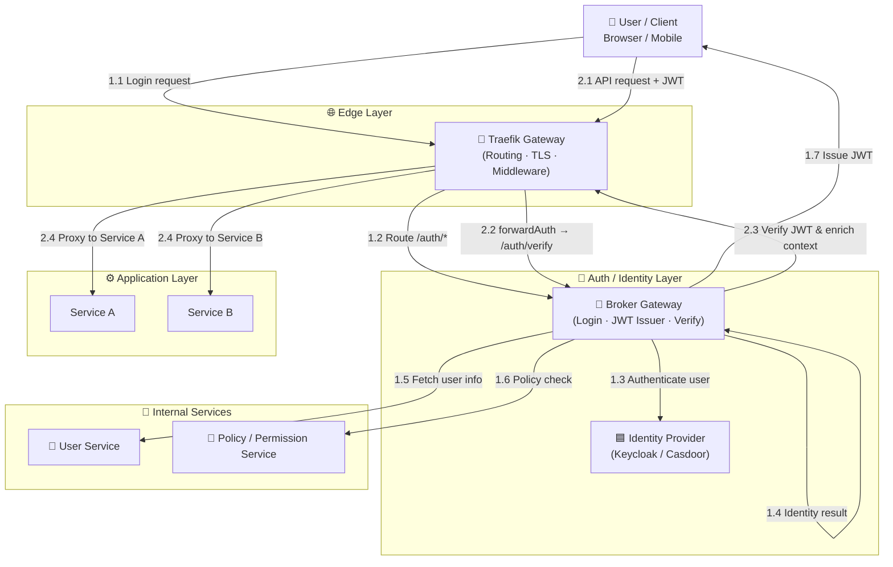

# Designing a Centralized Authentication System with an API Gateway and Identity Broker

## Đặt vấn đề

Trong các hệ thống hiện đại, đặc biệt là hệ thống phân tán và microservices, bài toán xác thực và phân quyền ngày càng trở nên phức tạp. Nhiều hệ thống để mỗi dịch vụ tự xử lý xác thực, dẫn đến logic trùng lặp và khó bảo trì. Ở chiều ngược lại, việc để client phụ thuộc trực tiếp vào hệ thống xác thực bên ngoài lại gây ra rủi ro khóa chặt vào công cụ cụ thể.

Vấn đề cốt lõi nằm ở việc thiếu ranh giới rõ ràng giữa xác thực người dùng, quản lý danh tính nội bộ và kiểm soát truy cập API. Khi các trách nhiệm này bị trộn lẫn, hệ thống khó mở rộng, khó thay đổi và khó áp dụng các nguyên tắc bảo mật hiện đại như Zero Trust. Do đó, cần một cách tiếp cận kiến trúc giúp tách bạch trách nhiệm, giảm phụ thuộc công cụ và đảm bảo an toàn lâu dài.

## Giải pháp thiết kế

### 2.1 Định hướng kiến trúc

Giải pháp được xây dựng theo định hướng **xác thực tập trung và tách bạch trách nhiệm**, trong đó bảo mật được đưa lên ranh giới hệ thống thay vì phân tán trong từng dịch vụ. Mục tiêu chính là giảm sự phụ thuộc giữa các thành phần, tránh khóa chặt vào công cụ cụ thể và đảm bảo khả năng mở rộng lâu dài.


### 2.2 Phân tầng và ranh giới hệ thống

Kiến trúc được tổ chức thành các tầng logic rõ ràng:

- **Edge Layer**
    
    Là ranh giới tiếp xúc với bên ngoài, chịu trách nhiệm kiểm soát truy cập, thực thi chính sách bảo mật ở mức hạ tầng và bảo vệ hệ thống nội bộ.
    
- **Security / Broker Layer**
    
    Đóng vai trò trung tâm trong việc xử lý xác thực, phát hành danh tính và kiểm soát quyền truy cập. Tầng này đóng vai trò lớp đệm giữa hệ thống nội bộ và các hệ thống danh tính bên ngoài.
    
- **Identity Layer**
    
    Chịu trách nhiệm xác minh danh tính người dùng, độc lập với routing, nghiệp vụ và chính sách truy cập nội bộ.
    
- **Application Layer**
    
    Tập trung xử lý logic nghiệp vụ, không tham gia vào các quyết định liên quan đến xác thực hay danh tính.
    

Việc xác định rõ ranh giới giúp hệ thống dễ hiểu, dễ bảo trì và giảm coupling giữa các thành phần.

### 2.3 Design Concept

| Design Concept | Ý nghĩa trong kiến trúc |
| --- | --- |
| **Single Responsibility Principle (SRP)** | Mỗi thành phần chỉ đảm nhiệm một trách nhiệm: Gateway xử lý routing & enforcement, Broker xử lý xác thực và token, IdP quản lý danh tính, Backend tập trung nghiệp vụ |
| **Separation of Concerns (SoC)** | Tách rõ network, security, identity và business logic; tránh backend xử lý OAuth hay gateway xử lý login flow |
| **Identity Broker / IdP Facade** | Broker che giấu IdP thật khỏi client & backend, cho phép thay đổi hoặc bổ sung IdP mà không ảnh hưởng hệ thống |
| **Authenticate as Early as Possible** | Xác thực request ngay tại tầng gateway trước khi vào hệ thống nội bộ, giảm rủi ro bảo mật và tải cho backend |
| **Open–Closed Principle (OCP)** | Mở rộng IdP, auth rule, claim structure mà không cần sửa client hay backend |

## Implementation

Phần này trình bày cách hiện thực kiến trúc bằng các công cụ phổ biến trong thực tế, bám sát sơ đồ tổng thể đã mô tả.


## 3.1 Edge Layer – API Gateway

**Công cụ ví dụ**

- Traefik (Ingress / API Gateway)
- Nginx / Envoy (tương đương)

**Vai trò**

- Entry point duy nhất của hệ thống
- Routing request
- Terminate TLS
- Enforce authentication

**Cách hiện thực với Traefik**

- Sử dụng `IngressRoute` hoặc `HTTPRouter`
- Route:
    - `/auth/*` → Broker Gateway
    - `/api/*` → Backend services
- Dùng **forwardAuth middleware**:
    - Mọi API request được gọi sang `/auth/verify`
    - Chỉ cho phép request hợp lệ đi tiếp

👉 Traefik lúc này đóng vai trò **Policy Enforcement Point (PEP)**

👉 Không xử lý login, không verify JWT cục bộ


## 3.2 Auth / Security Layer – Broker Gateway

**Công cụ ví dụ**

- Custom service (Node.js / Java Spring Boot / Go)
- Có thể dùng OAuth2 Proxy làm nền tảng mở rộng

**Vai trò**

- Login endpoint
- Verify JWT
- Issue JWT cho hệ thống
- Làm IdP Facade

**Endpoints điển hình**

```
POST   /auth/login
POST   /auth/verify
POST   /auth/refresh

```

**Khi login**

- Nhận request từ Gateway
- Gọi sang Identity Provider
- Lấy user info từ User Service
- Gọi Policy Service để resolve permission
- Issue JWT (access + refresh)

**Khi verify**

- Verify signature + expiry
- Validate claim
- Enrich context:
    - user_id
    - roles
    - permissions
- Trả header về cho Gateway

👉 Broker = **Security Control Plane + Identity Facade**


## 3.3 Identity Provider – Quản lý danh tính

**Công cụ ví dụ**

- Keycloak
- Casdoor
- Auth0 / Azure AD (enterprise)

**Vai trò**

- Xác thực danh tính người dùng
- Hỗ trợ:
    - Username / Password
    - SSO
    - Social login

**Nguyên tắc**

- IdP **không expose trực tiếp ra ngoài**
- Client **không nói chuyện trực tiếp với IdP**
- Chỉ Broker Gateway làm việc với IdP qua OAuth2 / OIDC

👉 Dễ thay:

- Keycloak ↔ Casdoor
- On-prem ↔ Cloud


## 3.4 Internal Services – User & Policy

### User Service

**Công cụ ví dụ**

- Spring Boot / NestJS
- Database nội bộ

**Chức năng**

- Profile người dùng
- Mapping user với domain nội bộ
- Trạng thái (active / blocked)

### Policy / Permission Service

**Công cụ ví dụ**

- Custom RBAC / ABAC service
- OPA (Open Policy Agent)

**Chức năng**

- Resolve quyền
- Áp rule theo:
    - role
    - resource
    - context

👉 **Chỉ Broker gọi các service này**

👉 Backend không gọi để check permission


## 3.5 Application Layer – Backend Services

**Công cụ ví dụ**

- Spring Boot
- Node.js / NestJS
- Go services

**Nguyên tắc**

- Không xử lý OAuth / JWT
- Không gọi IdP
- Không check permission phức tạp

**Backend nhận**

- Header từ Gateway:

```
X-User-Id
X-User-Roles
X-User-Permissions

```

👉 Backend **security-agnostic**

👉 Chỉ tập trung business logic



## Kết luận

Bài viết đã tiếp cận bài toán xác thực và phân quyền từ góc nhìn kiến trúc, thay vì bắt đầu từ công cụ hay framework cụ thể. Bằng cách **đưa xác thực lên ranh giới hệ thống**, tách bạch rõ ràng giữa gateway, lớp bảo mật, hệ thống danh tính và backend nghiệp vụ, kiến trúc giúp giảm đáng kể độ phức tạp và rủi ro bảo mật trong hệ thống phân tán.

Việc sử dụng **Identity Broker** như một lớp trung gian cho phép hệ thống linh hoạt trong việc thay đổi hoặc mở rộng nhà cung cấp danh tính, đồng thời tránh phụ thuộc chặt vào một giải pháp xác thực duy nhất. Backend trở nên đơn giản hơn khi không cần xử lý OAuth hay JWT, từ đó tập trung hoàn toàn vào logic nghiệp vụ.

Kiến trúc này không nhằm thay thế các công cụ xác thực hiện có, mà cung cấp một **khung tư duy thiết kế** giúp sử dụng chúng đúng chỗ, đúng vai trò. Khi hệ thống phát triển về quy mô, số lượng dịch vụ và yêu cầu bảo mật, cách tiếp cận này cho phép mở rộng một cách có kiểm soát mà không làm xáo trộn toàn bộ kiến trúc.

Cuối cùng, giá trị lớn nhất của giải pháp không nằm ở việc chọn đúng công cụ, mà ở việc **đặt đúng ranh giới kiến trúc ngay từ đầu** — nền tảng quan trọng để xây dựng các hệ thống an toàn, linh hoạt và bền vững trong dài hạn.