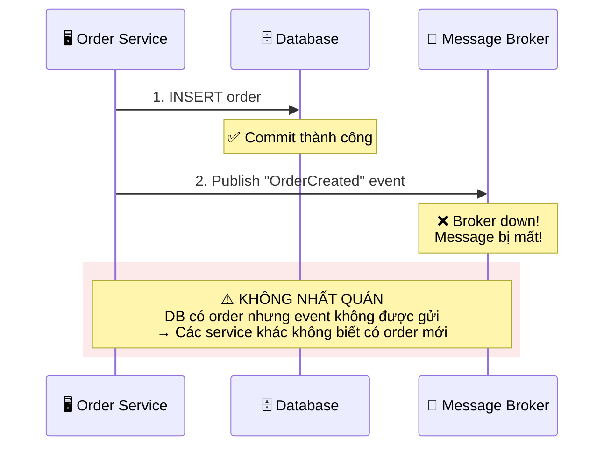
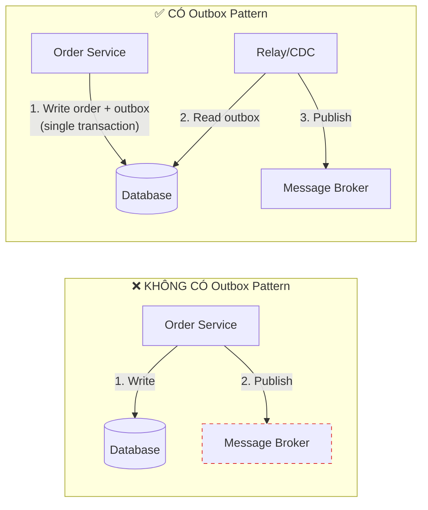
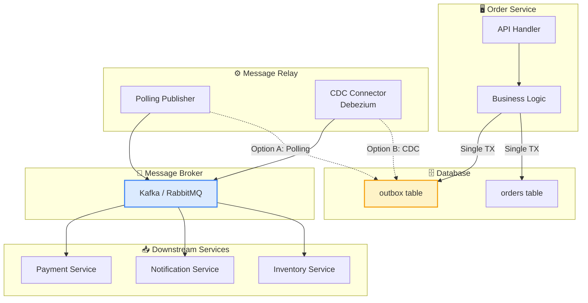
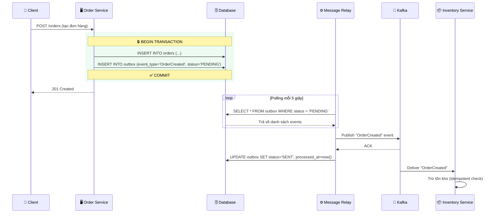
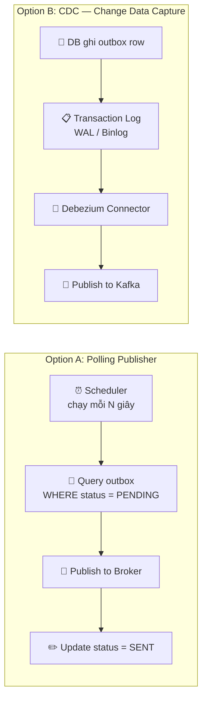

# Transactional Outbox Pattern — Giải pháp đảm bảo tính nhất quán dữ liệu trong Microservices

---

## 1. Đặt vấn đề — Dual Write Problem

### Bối cảnh

Trong kiến trúc **Microservices**, một nghiệp vụ thường yêu cầu đồng thời hai thao tác:

- **Ghi dữ liệu vào database** (ví dụ: tạo đơn hàng).
- **Gửi event/message đến Message Broker** (Kafka, RabbitMQ…) để các service khác xử lý tiếp (ví dụ: gửi email xác nhận, trừ tồn kho…).

Vấn đề nằm ở chỗ: hai thao tác này **không nằm trong cùng một transaction**. Database có transaction riêng, Message Broker có transaction riêng. Không có cơ chế atomic nào đảm bảo cả hai cùng thành công hoặc cùng thất bại.

Đây chính là **Dual Write Problem** — kẻ thù thầm lặng trong mọi hệ thống phân tán.

### Minh họa vấn đề

### Các kịch bản thất bại

| Kịch bản | Mô tả | Hậu quả |
| --- | --- | --- |
| **Broker lỗi** | DB ghi thành công, Broker không nhận được message | Downstream services mất event, dữ liệu bất đồng bộ |
| **Service crash** | DB ghi thành công, service crash trước khi publish | Event mãi mãi bị mất, không có cách retry |
| **Network partition** | DB ghi thành công, mạng đến Broker bị đứt | Message timeout, không chắc đã gửi hay chưa |
| **Publish trước DB** | Message được gửi nhưng DB rollback | Service khác nhận event "ảo" — dữ liệu phantom |

> **💡 Lưu ý:** Ngay cả khi bạn đặt publish message *trước* commit database, vấn đề vẫn tồn tại — chỉ là theo chiều ngược lại. Không có thứ tự nào giải quyết được vấn đề này nếu không thay đổi cách tiếp cận.
> 

---

## 2. Giải pháp — Outbox Pattern là gì?

### Ý tưởng cốt lõi

Outbox Pattern biến **hai bước riêng biệt** thành **một bước atomic duy nhất** bằng cách:

> **Thay vì publish message trực tiếp đến Broker, ta ghi message vào một bảng `outbox` trong cùng database, trong cùng một transaction với dữ liệu nghiệp vụ.** Sau đó, một tiến trình riêng biệt sẽ đọc bảng `outbox` và publish message đến Broker.
> 

Vì cả dữ liệu nghiệp vụ và message đều được ghi vào **cùng một database**, ta có thể tận dụng **ACID transaction** của database để đảm bảo tính atomic.

### So sánh: Trước vs Sau khi áp dụng

### Tại sao Outbox Pattern hoạt động?

Outbox Pattern hoạt động dựa trên một nguyên tắc đơn giản nhưng mạnh mẽ:

- **Atomic write:** Dữ liệu nghiệp vụ và outbox message được ghi trong cùng một DB transaction. Nếu transaction rollback → cả hai đều rollback. Nếu commit → cả hai đều tồn tại.
- **Guaranteed delivery:** Một tiến trình riêng (Polling Publisher hoặc CDC) liên tục quét bảng outbox và publish message. Nếu Broker down, message vẫn nằm trong outbox, chờ được gửi lại.
- **At-least-once semantics:** Message sẽ được gửi *ít nhất một lần*. Consumer phía nhận cần xử lý idempotent.

---

## 3. Thiết kế hệ thống (Design)

### 3.1 Kiến trúc tổng quan

### 3.3 Luồng xử lý chi tiết

### 3.4 Hai chiến lược đọc Outbox

| Tiêu chí | Polling Publisher | CDC (Debezium) |
| --- | --- | --- |
| **Độ trễ** | Cao (phụ thuộc polling interval) | Gần real-time |
| **Tải lên DB** | Cao (query liên tục) | Thấp (đọc từ WAL/binlog) |
| **Độ phức tạp** | Thấp — dễ implement | Cao — cần setup Debezium, Kafka Connect |
| **Phù hợp** | Hệ thống nhỏ, traffic thấp | Hệ thống lớn, yêu cầu latency thấp |
| **Rủi ro** | Duplicate nếu crash giữa publish và update | Cần quản lý offset Kafka Connect |

---

## 5. Kết luận

Outbox Pattern là một giải pháp **đơn giản nhưng hiệu quả** để giải quyết Dual Write Problem — một trong những thách thức phổ biến nhất khi xây dựng hệ thống Microservices.

Thay vì cố gắng thực hiện hai thao tác phân tán một cách atomic (điều bất khả thi nếu không có distributed transaction), Outbox Pattern **tận dụng ACID transaction** của database sẵn có để đảm bảo tính nhất quán, sau đó dùng một relay process riêng biệt để đưa message đến Broker.

Outbox Pattern không loại bỏ hoàn toàn failure, nhưng nó biến failure thành thứ có thể **phát hiện, retry và phục hồi** — và đó chính là điều quan trọng nhất khi xây dựng hệ thống đáng tin cậy.