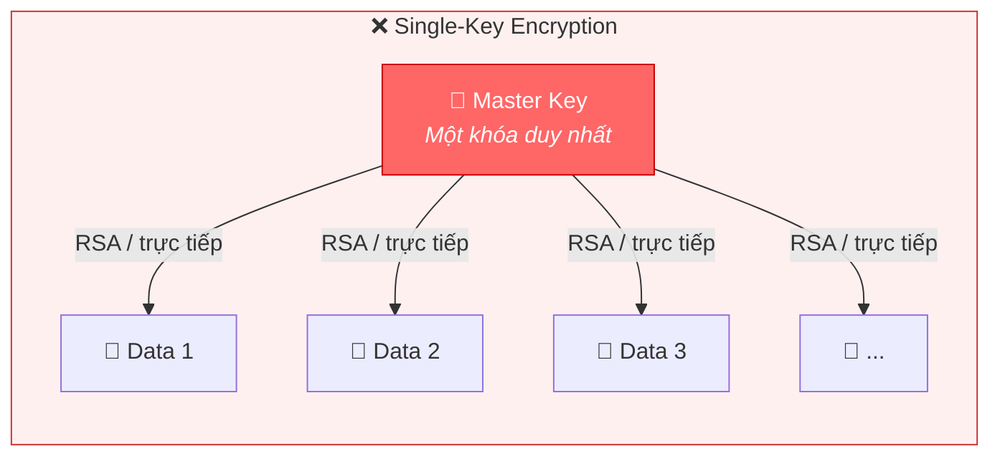
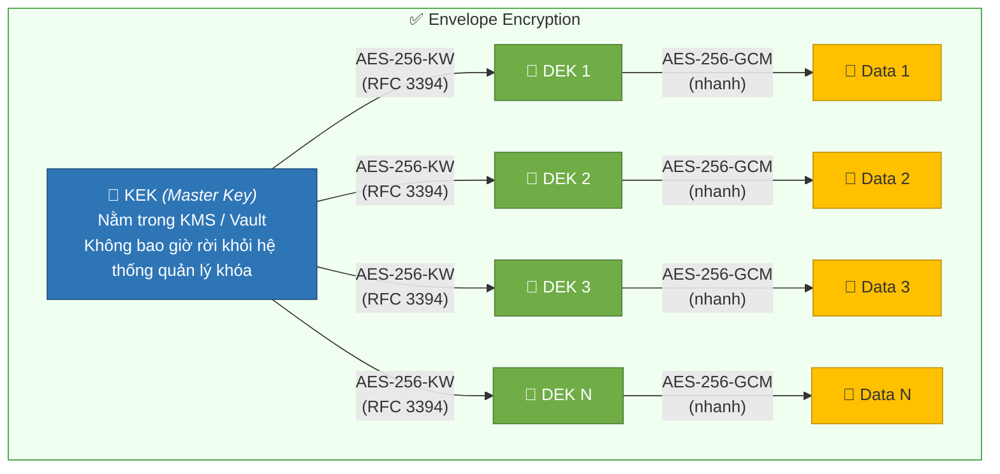
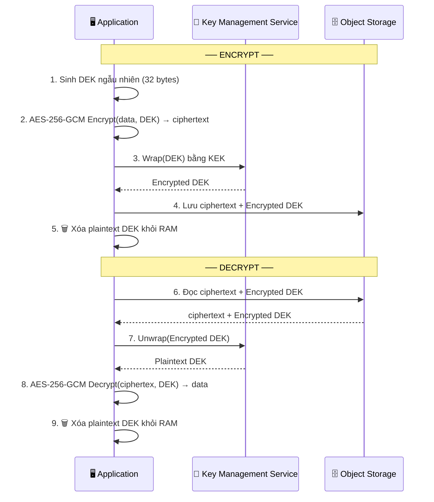

# Envelope Encryption

## 1. Đặt vấn đề

Trong kiến trúc hệ thống hiện đại, mã hóa dữ liệu (encryption at rest, encryption in transit) không còn là lựa chọn — nó là yêu cầu bắt buộc. Tuy nhiên, khi khối lượng dữ liệu tăng lên hàng terabyte, thậm chí petabyte, một câu hỏi kỹ thuật trọng yếu xuất hiện: **làm thế nào để mã hóa hiệu quả mà vẫn đảm bảo an toàn cho khóa mã?**

Hãy hình dung tình huống: bạn vận hành một hệ thống lưu trữ hàng triệu file trên object storage hoặc một cụm database chứa hàng tỷ bản ghi. Nếu sử dụng một khóa duy nhất (master key) để mã hóa trực tiếp toàn bộ dữ liệu, bạn đối mặt với ba vấn đề nghiêm trọng:

**Thứ nhất, hiệu năng.** Các thuật toán mã hóa bất đối xứng (RSA, ECC) cung cấp mức bảo mật cao nhưng cực kỳ chậm khi xử lý dữ liệu lớn. 

**Thứ hai, blast radius.** Nếu master key bị lộ, toàn bộ dữ liệu trong hệ thống đều bị compromise. Không có cơ chế cách ly thiệt hại, một sự cố nhỏ biến thành thảm họa toàn diện.

**Thứ ba, key rotation.** Khi cần xoay khóa (key rotation) — một thực hành bảo mật bắt buộc theo các chuẩn như PCI-DSS, HIPAA — bạn phải giải mã rồi mã hóa lại toàn bộ dữ liệu. Với hệ thống petabyte-scale, việc này đòi hỏi thời gian downtime không thể chấp nhận được và chi phí tính toán khổng lồ.

Mô hình dưới đây minh họa rõ điểm yếu của cách tiếp cận single-key truyền thống

Khi master key bị lộ → toàn bộ Data 1, 2, 3... N đều bị compromise. Khi cần rotation → phải giải mã và mã hóa lại toàn bộ N terabyte. Rõ ràng, mô hình này không mở rộng được.

---

## 2. Giải pháp: Envelope Encryption

Envelope Encryption (mã hóa phong bì) là mô hình phân tầng khóa, trong đó dữ liệu không bao giờ được mã hóa trực tiếp bằng master key. Thay vào đó, quy trình hoạt động theo nguyên tắc **"dùng khóa để mã hóa khóa"**.

### 2.1. Kiến trúc phân tầng

Mô hình bao gồm hai lớp khóa:

**Data Encryption Key (DEK)** — khóa đối xứng (AES-256) được sinh ngẫu nhiên cho **mỗi** đối tượng dữ liệu. DEK thực hiện việc mã hóa/giải mã dữ liệu thực tế. Do là khóa đối xứng, DEK xử lý dữ liệu lớn với tốc độ rất cao.

**Key Encryption Key (KEK)** — khóa cấp cao hơn, được quản lý bởi dịch vụ chuyên biệt (KMS). KEK chỉ làm một việc duy nhất: mã hóa (wrap) và giải mã (unwrap) các DEK. Vì DEK chỉ là 32 bytes, thao tác này diễn ra gần như tức thì.

### 2.2. Luồng Encrypt / Decrypt

### 2.3. Lợi ích

**Hiệu năng** — Dữ liệu lớn được mã hóa bằng AES-256 (symmetric), nhanh gấp hàng nghìn lần so với RSA. KEK chỉ xử lý 32 bytes DEK nên không tạo bottleneck.

**Blast radius** — Mỗi object có DEK riêng. Nếu một DEK bị lộ, chỉ object tương ứng bị ảnh hưởng. Master key vẫn an toàn trong KMS.

**Key rotation** — Đây là lợi thế lớn nhất. Nhờ phân tầng, key rotation **không bao giờ chạm vào dữ liệu gốc**. Ciphertext giữ nguyên 100%.

---

## 3. Kết luận

Envelope Encryption không phải là một ý tưởng mới — nó đã là tiêu chuẩn ngành từ nhiều năm. AWS S3 SSE, Google Cloud Storage, Azure Blob Storage đều sử dụng mô hình này bên dưới.

Bản chất của Envelope Encryption là phân tách hai mối quan tâm: **hiệu năng** (AES symmetric cho dữ liệu lớn) và **bảo mật khóa** (KMS/Vault quản lý KEK, key master không bao giờ rời khỏi hệ thống chuyên dụng). Sự phân tách này cho phép mỗi lớp tối ưu cho đúng mục tiêu của nó.